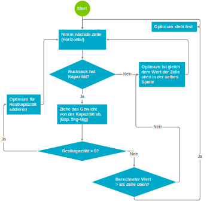
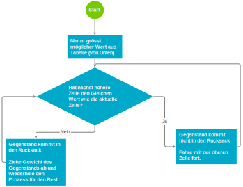

# Dynamic Programming

Die Idee von Dynamic Programming (Design-Paradigma) ist es, ein Problem in einfache Sub-Probleme zu zerlegen. Im Gegensatz zu Divide-And-Conquer sind die Sub-Probleme voneinander **nicht unabhängig**!

* Die Probleme werden dadurch übersichtlicher
* Die Subprobleme können optimiert werden.
* Die Suchprobleme überlappen sich - sind also nicht unabhängig wodurch nicht immer alles von Grund auf neu Berechnet werden muss.

## Rucksack Problem (Knapsack-Problem)

* Ansatz mit Brute force: ➪ $$O(2^n)$$ (ist *nicht* Fakultät, da die Position keine Rolle spielt)
* Ansatz Greedy: Nimm wiederholend den Gegenstand mi grössten Verhältnis von Wert/Gewicht ➪ Kann misslingen → bsp. Wechselgeld

Mit Dynamischer Programmierung

* Zerlegung in Subprobleme ("Was ist der grösstmögliche Wert für die ersten beiden Gegenstände 1/1 und 4/3 bei einer Gewichtslimite von 3 kg ?")
* Die Tabelle lässt sich in O(gegenstände * gewichte) aufbauen!

Ein Dieb möchte eine möglicht hohe ausbeute bei seinem Raub machen. Er hat 4 Gegenstände zur Auswahl - alle zusammen sind aber zu schwer. Er hat nur für 5 kg Platz in seinem Rucksack. Welche Gegenstände muss er wählen, um einen maximalen Wert zu klauen?

Dafür wird eine Tabelle erstellt. Dabei stehen die möglichen Rucksackkapazitäten in den Spalten (1kg, 2kg, 3kg usw.) und die Gegenstände in den Zeilen. Die Gegenstände müssen nicht sortiert sein.

| Gegenstände<br>Wert/kg | 1kg | 2kg | 3kg | 4kg | 5kg |
|---------|-----|-----|-----|-----|-----|
| -       | ?   | ?   | ?   | ?   | ?   |
| 1/1     | ?   | ?   | ?   | ?   | ?   |
| 4/3     | ?   | ?   | ?   | ?   | ?   |
| 5/4     | ?   | ?   | ?   | ?   | ?   |
| 1/2     | ?   | ?   | ?   | ?   | ?   |

Die Tabelle kann nun mit einem Einfachen algorithmus aufebaut werden:


: Ablauf, um den Inhalt einer neuen Zelle zu finden

| Gegenstände<br>Wert/kg | 1kg | 2kg | 3kg | 4kg | 5kg |
|---------|-----|-----|-----|-----|-----|
| -       | 0   | 0   | 0   | 0   | 0   |
| 1/1     | 1   | 1   | 1   | 1   | 1   |
| 4/3     | 1   | 1   | 4   | 5   | 5   |
| 5/4     | 1   | 1   | 4   | 5   | 6   |
| 1/2     | 1   | 1   | 4   | 5   | 6   |


Damit steht der höchst mögliche Wert fest - nicht aber welche Gegenstände effektiv geklaut werden müssen. Dies kann nun relativ einfach aufgelöst werden:


: Ablauf zum finden der zu klauenden Gegenstände

## Subsequenzen

* Subsequenzen ≠ Substring - sondern eine Teilsequenz
* Beispiel `ABCDEFGHIJK`:  `ACEGIJK` und `DFGHK` sind gültige Subsequenzen - nicht aber `DAGH`(Rangordnung stimmt nicht)
* Anwendungsfall: Diff (VCS)

LCS
Longest Common Subsequence
: Für zwei Strings X und Y soll die länst mögliche Subsequenz, welche sowohl in X als auch in Y enthalten ist gefunden werden.

### Lösung mit Brute-Force

* Suche alle möglichen Subsequenzen von X
* Filtern, aller Subsequenzen, welche auch für Y Subsequenzen sind.
* Längste Subsequenz ist das Resultat

➪ Hat eine exponentielle Laufzeit ($$O(2^n)$$)!

### Lösung mit dynamischer Programmierung

* Dynamischer Programmierung, also mit Rückgriff auf vorgegangenes Problem
* Für Strings ist das Einfacher im Gegensatz zum Rucksackproblem, weil Wert immer 1.
* Hat Laufzeit $$O(nm)$$

Beispiel:

```
String X:
a b c d f g h j q z

String Y:
a b c d e f g i j k r x y z

LCS:
a b c d f g  j  z

DIFF:
e   h i   q   k r x y
    +   - +   -   + + + +
```

Vorgehen Auslesen:

* Die Lösung ist in L[n,m] enthalten
* Die gesuchte Subsequenz kann von der L-Tabelle ausgelesen werden:
    *  beginne am Ende: $$i=m-1$$, $$j=n-1$$
        * wenn Zeichen für i und j gleich
            * füge L[i,j] in LCS ein
            * Šwechsle auf Position L[i-1, j-1]
        * sonst
            * folge der Kolonne oder Reihe mit dem selben Wert

```java
// Rekusive Suche nach allen möglichen LCS
public List<String> findAll() {
  List<String> result = new LinkedList<>();
  StringBuilder lcs = new StringBuilder();

  Set<String> set = find(xStr.length(), yStr.length());

  List<String> l = new ArrayList<>(set);
  l.sort((o1, o2) -> o1.compareTo(o2));
  return l;
}

private Set<String> find(int x, int y){
    Set<String> allLcs = new HashSet<String>();

    // Base Case
    if(x == 0|| y == 0){
      allLcs.add("");
      return allLcs;
    }

    // Jump first (if possible)
    boolean jump = xStr.charAt(x-1) == yStr.charAt(y-1);
    if (jump) {
      Set<String> results = find(x-1, y-1);
      for (String result : results){
        allLcs.add(result + xStr.charAt(x-1));
      }
    }

    // Go further up (if possible)
    if(tableL[x][y] == tableL[x][y-1]){
      Set<String> results = find(x, y-1);
      allLcs.addAll(results);
    }

    // Go further left (if possible)
    if (tableL[x][y] == tableL[x-1][y]){
      Set<String> results = find(x-1, y);
      allLcs.addAll(results);
    }

    // Must jump (if not already done)
    if(!jump  && tableL[x][y] != tableL[x-1][y] && tableL[x][y] != tableL[x][y-1]){
      Set<String> results = find(x-1, y-1);
      for (String result : results){
        allLcs.add(result + xStr.charAt(x-1));
      }
    }
    return allLcs;
}
/**
* Calculates the L-Table.
* @param xStr First string (vertical axis of L-Table).
* @param yStr Second string (horizontal axis of L-Table).
* @return The calculated L-Table.
*/
public int[][] calculateTable(final String xStr, final String yStr) {

    this.xStr = xStr;
    this.yStr = yStr;

    tableL = new int[xStr.length()+1][yStr.length()+1];
    for(int y=1; y <= yStr.length(); y++){
      for(int x = 1; x <= xStr.length(); x++){
        if(xStr.charAt(x-1) == yStr.charAt(y-1)){
          tableL[x][y] = tableL[x-1][y-1]+1;
        }else{
          tableL[x][y] = Math.max(tableL[x-1][y], tableL[x][y-1]);
        }

      }
    }
    return tableL;
}

/**
* Prints the L-Table (see 'Session-Log').
*/
public void printTable() {
    System.out.print("      ");
    for(int x = 0; x < xStr.length(); x++){
      System.out.print("  " + xStr.charAt(x));
    }
    System.out.println();

    for(int y=0; y < tableL[0].length; y++){
      if(y > 0){
        System.out.print("  " + yStr.charAt(y-1));
      }else{
        System.out.print("   ");
      }
      for(int x = 0; x < tableL.length; x++){
        System.out.print("  " + tableL[x][y]);
      }
      System.out.println();
    }
}
```

Bei Grossen Daten ist Rekursion keine Option - das Laufzeitstack zu klein. Darum könnte das mit einem separaten stack implementiert werden.

!!! seealso

    [PDF-Annimation des LCS Algorithmus](https://www.hni.uni-paderborn.de/fileadmin/Fachgruppen/Algorithmen/Lehre/Vorlesungsarchiv/SS2007/Folien_09_-_DuA_SS_2007.pdf)
