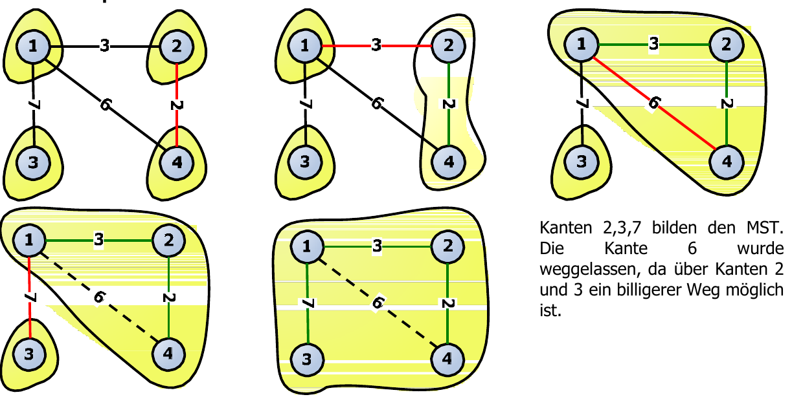

# Graphen

## Allgemein

Ein Graph besteht aus einem Set von **Vertizes** (=Node) und einer Liste von Vertizes-Paaren, den **Kanten** (=Edge). Sowohl die Vertizes als auch die Kanten können Nutzdaten speichern.

Einsatzgebiete

* Elektronische Schaltungen
* Transport-Netzwerke
* Computer-Netzwerke
* Datenbanken
* UML
* Garbage Collection
* ...

### Begriffe

gerichtete Kanten
: Ein geordnetes Paar von Vertizes (u,v), wobei u dem _Ursprung_ und v dem _Ziel_ entspricht.

ungerichtete Kanten
: Ein ungeordnetes Vertizes-Paar

gerichtete Graph
: alle Kanten sind erichtet

ungerichtete Graph
: alle Kanten sind ungerichtet

Gerichtete und ungerichtete Kanten könnten in einem Graph gemischt werden (Bsp. UML Klassendiagramm) - ist aber für AD2 aber nicht relevant.


End-Vertizes
: = Endpunkte. `U` und `V` sind Endpunkte der Kante `a`

Inzident
: = enden. `a`, `b` und `d` sind inzident in V

Adjazent
: = benachbart. `U` und `V` sind adjazent

Grad
Degree
: Anzahl inzidenter Kanten - `X` besitzt Grad 5. Egal ob gerichtete Kanten oder nicht - dann gibt es zusäzlich die Attribyute incomming/outgoing.

Parallele Kanten
: `h` und `i` sind paralelle Kanten

Schleife
: `j` ist eine Schleife

Pfad
: Sequenz von abwechselnden Vertizes und Kanten. **Beginnt** und **endet** mit einem **Vertex**. Beispiel `P=(U,c,W,e,X,g,Y,f,W,d,V)`

Einfacher Pfad
: Ein Pfad, so dass alle Vertizes und Kanten unterschiedlich sind.  Beispiel `P=(V,b,X,h,Z)`

(Einfacher) Zyklus
: Analog zu Pfad, wobei der Zyklus im Ausgangsvertex endet. Das Letzte Element in der Sequenz ist eine Kante. Beispiel `Z=(V,b,X,e,W,c,U,a)`

Subgraph
: Ein Subgraph S eines Graphen G ist ein Graph, so die Kanten und Vertizes von S eine Teilmenge der Kanten respektive Vertizes von G sind.

Spanning Subgraph
: Ein spanning (aufspannender) Subgraph A des Graphen G ist ein Subgraph, welcher alle Vertizes von G enthält.

Verbundener Graph
Connectivity
: Ein Graph ist verbunden, wenn zwischen **jedem Paar** ein Pfad besteht!


Baum
: Ein Verbundener ungerichteter Graph ohne Zykeln. Hat kein Root wie beim _Wurzelbaum_ da irelevant.


Wald
: Ein Wald ist ein ungerichteter Graph ohne Zyklen

Aufgespannter Baum
Spanning Tree
: Ein aufspannender Subgraph (also alle Vertizes, aber nur Teilmenge der Kanten), welcher auch ein Baum ist.

Anzahl Vretizes mit $$n$$, Anzahl Kanten mit $$m$$


### Eigenschaften

* Summe der Grade aller Vertizes ist immer 2m: $$\sum_v deg(v)=2m$$
* In einem ungerichteten, einfachen Graphen gilt: $$m \le n (n-1)/2$$

### Implementations-Varianten

#### Kanten-Listen Struktur

Diese Struktur nutzt zwei Sequenzen - eine für die Vertizes und eine für die Kanten. Diese muss eine eigene Datenstruktur sein, da ein Backlink in die Datenstruktur vorhanden ist. Dies ermöglicht ein effizientes löschen.

Vorsicht: Die Vertizes haben **keine** Referenzen auf die Kanten!

<figure>
    
    <figcaption>Schema Kanten-Listen Struktur. Obere LinkedList (gelb: u, v, w, z) sind die Knoten im Graph, die Untere die Kanten (blau: a,b,c,d) </figcaption>
</figure>

#### Adjazenz-Listen Struktur
Die Adjazenz-Listen Struktur ist analog zur Kanten-Listen Struktur, wobei es zustzlich für jeden Knoten eine Listen (Sequenz) von Kanten gibt.

<figure>
    
</figure>

#### Adjazenz-Matrix Struktur
Bei der Adjazenz-Matrix Struktur gibt es auch zwei Sequenzen - eine mit den Vertizes und eine mit den Kanten. Die Vertex Objekte haben zusätzlich einen Index.
Dieser wird in einer Matrix wird die "Verkabelung" abgelegt - bsp. Vertex mit Index `0` und Vertex mit Index `1` sind über die Kante `a` Verbunden.

<figure>
    
    <figcaption></figcaption>
</figure>

### Performance (Graphen)

|                       | Kanten Liste | Adjazenz Liste | Adjazenz Matrix |
|-----------------------|---------|-------------------------|---------|
| space                 | $$n+m$$ | $$n+m$$                 | $$n^2$$ |
| `incidentEdges(v)`    | $$m$$   | $$deg(v)$$              | $$n$$   |
| `areAdjacent (v, w)`  | $$m$$   | $$min(deg(v), deg(w))$$ | 1       |
| `insertVertex(o)`     | 1       | 1                       | $$n^2$$ |
| `insertEdge(v, w, o)` | 1       | 1                       | 1       |
| `removeVertex(v)`     | $$m$$   | $$deg(v)$$              | $$n^2$$ |
| `removeEdge(e)`       | 1       | 1                       | 1       |

$$n$$ Anzahl Vertizes

$$m$$ Anzahl Kanten

Die Back-References in die Datenstruktur sowohl in der Adjazenz Liste als auch in der Adjazenz Matrix sind essentiel um gute Performance zu erreichen. Dies war auch schon in AD1 beim Heap der Fall.

## Depth-First Search (DFS)

Depth-First Search ist eine **Technik für die Traversierung** eines Graphen:

* Besucht alle Vertizes und Kanten
* Bestimmt, ob der Graph verbunden ist
* Findet die verbundenen Komponenten eines Graphen
* Berechnet einen aufgespannten Wald eines Graphen
* **Rekursiv**

Wenn es einen Pfad gibt, dann findet die Tiefensuche diesen garantiert, wobei dies nicht der Kürzeste sein muss!

Der Algorithmus verwendet verschiedene Labels, welche er auf den Vertizes und den Kanten setzt. Dies kann effizient mit bsp. einer Hash-Map implementiert werden.

Um den Algorithmus bsp. auf Papier auszuführen muss eine klare sortierung der Kanten/Vertizes beim Aufruf der Methoden `vertices`, `edges` und `incidentEdges`  definiert werden - bsp. aufsteigend sortiert.

**Vorgehen:** Graph aufzeichen, Labels hinzufügen und durch den Code steppen.

```
Algorithm DFS(G)
        Input graph G
        Output labeling of the edges of G
            as discovery edges and
            back edges
    for all u ∈ G.vertices()
        setLabel(u, UNEXPLORED)
    for all e ∈ G.edges()
        setLabel(e, UNEXPLORED)
    for all v ∈ G.vertices()
        if getLabel(v) = UNEXPLORED
            DFS(G, v)

Algorithm DFS(G, v)
        Input graph G and a start vertex v of G
        Output labeling of the edges of G
            in the connected component of v
            as discovery edges and back edges
    setLabel(v, VISITED)
    for all e ∈ G.incidentEdges(v)
        if getLabel(e) = UNEXPLORED
            w ← opposite(v,e)
            if getLabel(w) = UNEXPLORED
                setLabel(e, DISCOVERY)
                DFS(G, w)
            else
                setLabel(e, BACK)
```

Das Ergebniss ist ein aufgespannter Baum. Die Kanten mit dem Label `Back` sind Zykeln ("im Baum zurückschauen") - also die "ausgeblendeten" Kanten.


Im Gegensatz zum BFS können mit dem DFS Biconnected Komponenten gefunden werden, also ob 2 Teilgrahen nur über genau einen Vertex verbunden sind.

### Performance DFS

* Setzen von Kanten/Vertex-Labels $$O(1)$$. (Mit Hash-Tabelle)
* Jeder Vertex wird 2x markiert (`unexpored`/`visited`)
* Jede Kante wird 2x markiert (`unexplored`, `discovery`/`back`)
* Methode `incidentEdges()` wird je Vertex 1x aufgerufen
* Mit _Adjazenzlisten-Struktur_ $$O(n+m)$$( _Adjazenzmatrix-Struktur_ wäre $$O(n^2)$$)

### Pfade finden
Mit einer adaptierung des "normalen" DFS Algorithmus kann ein Pfad (bsp. Labyrinth) gesucht werden.

Um diese Aufgabe auf Papier zu lösen am besten den Stack aufzeichnen werden.

```
Algorithm pathDFS(G, v, z)
    setLabel(v, VISITED)
    S.push(v)
    if v = z
        finish: result is S.elements()
    for all e ∈ G.incidentEdges(v)
        if getLabel(e) = UNEXPLORED
            w ← opposite(v,e)
            if getLabel(w) = UNEXPLORED
                setLabel(e, DISCOVERY)
                S.push(e)
                pathDFS(G, w, z)
                S.pop() // Popt Edge
            else
                setLabel(e, BACK)
    S.pop()     // Popt Vertex!
```

### Zyklen finden
Mit einer adaptierung des "normalen" DFS Algorithmus können Zykeln gefunden werden.

Um diese Aufgabe auf Papier zu lösen am besten den Stack aufzeichnen werden.

```
Algorithm cycleDFS(G, v)
    setLabel(v, VISITED)
    S.push(v)
    for all e ∈ G.incidentEdges(v)
        if getLabel(e) = UNEXPLORED
            w ← opposite(v,e)
            S.push(e)
            if getLabel(w) = UNEXPLORED
                setLabel(e, DISCOVERY)
                cycleDFS(G, w)
                S.pop()
            else
                T ← new empty stack
                repeat
                    o ← S.pop()
                    T.push(o)
                until o = w     // Only take all elements, that actually ARE in the cycle!
                finish: result is T.elements()
    S.pop()
```

## Breadth-First Search (BFS)
Depth-First Search ist eine **Technik für die Traversierung** eines Graphen:

* Besucht alle Vertizes und Kanten (wie DFS)
* Bestimmt, ob der Graph verbunden ist (wie DFS)
* Findet die verbundenen Komponenten eines Graphen (wie DFS)
* Berechnet einen aufgespannten Wald eines Graphen (wie DFS)
* **Iterativ** - arbeitet mit Listen.

Im Gegensatz zu DFS findet die BFS den kürzesten Pfad!


Für jeden Vertex v in L gilt:

* der Pfad in _aufgespannten Baum_ von s nach v besitzt i Kanten.
* jeder Pfad von s nach v _im Graph_ besitzt mindestens i Kanten.

**Vorgehen:** Graph aufzeichen: Root zu oberst, dann alle Kindknoten usw.

```
Algorithm BFS(G)
        Input graph G
        Output labeling of the edges
        and partition of the
        vertices of G
    for all u ∈ G.vertices()
        setLabel(u, UNEXPLORED)
    for all e ∈ G.edges()
        setLabel(e, UNEXPLORED)
    for all v ∈ G.vertices()
        if getLabel(v) = UNEXPLORED
            BFS(G, v)

Algorithm BFS(G, s) // s is final
    L{0} ← new empty sequence   // L[0] = new List()
    L{0}.insertLast(s)
    setLabel(s, VISITED)
    i←0

    while ¬ L{i}.isEmpty()
        L{i+1} ← new empty sequence
        for all v ∈ L{i}.elements()
            for all e ∈ G.incidentEdges(v)
                if getLabel(e) = UNEXPLORED
                    w ← opposite(v,e)
                    if getLabel(w) = UNEXPLORED
                        setLabel(e, DISCOVERY)
                        setLabel(w, VISITED)
                        L{i+1}.insertLast(w)
                    else
                        setLabel(e, CROSS)
        i ← i +1
```
Im Gegensatz zu DFS nicht *back* sonder *cross-edge*.
Sequenz kann queue sein.

Anzahl der Listen = "Längster kürzester Pfad"

### Performance BFS
Identisch zu DFS!

* Setzen von Kanten/Vertex-Labels $$O(1)$$. (Mit Hash-Tabelle)
* Jeder Vertex wird 2x markiert (`unexpored`/`visited`)
* Jede Kante wird 2x markiert (`unexplored`, `discovery`/`cross`)
* * Jeder Vertex wird einmal in eine Sequenz eingetragen.
* Methode `incidentEdges()` wird je Vertex 1x aufgerufen
* Mit _Adjazenzlisten-Struktur_ $$O(n+m)$$

### Anwendung

* bestimmen der verbundenen Komponenten in einem Graph
* bestimmen eines aufspannenden Waldes in einem Graph
* bestimmen eines einfachen Zyklus in einem Graph
* bestimmen, ob ein Graph ein Wald ist.
* Mit zwei Vertizes eines Graph G: finden eines Pfades in G zwischen den beiden Vertizes mit **minimaler Anzahl Kanten** oder bestimmen, **ob** ein solcher **Pfad existiert**.

## Digraphs

Digraphs = Directed Graphs = Gerichteter Graph.
In AD2 arbeiten wir nur mit Graphen, wo **alle** Kanten gerichtet sind.

Eine mögliche Anwendungen ist u.a. Task Scheduling: Ein Task muss nach einem Anderen ausgführt werden - vgl. Systemd startup. Ein Anderes Beispiel ist eine Vererbungsstruktur in OO-Sprachen (Zykeln erkennen).

### Eigenschaften
* In einem ungerichteten, einfachen Graphen gilt: $$m \le n(n-1)$$ - kann also im Gegensatz zum ungerichteten Graphen Doppelt so viele Kanten haben (`/2` fällt weg).
* Tiefensuche kennt nebst `discovery`, `back` und `cross` auch `forward` - eine Verbindung zu einem Nachfolger im Baum.
* Der aufgebaute DFS-Baum ist je nach Anfangsknoten **unterschiedlich**!

<figure>
    
    <figcaption>Neu cross (D → C) und back (C → A) und forward (A → D)</figcaption>
</figure>

Bei einem Digraph ergibt sich ein wesentlich anderer Tree (Bsp. mit DFS) im vergleich zum ungerichteten Graph.

Erreichbarkeit
: Vertizes im DFS Baum vom Wurzelknoten v sind durch gerichtete Pfade erreichbar.

### Implementierung
Adjazenzliste neu mit 2 Listen: Einmal für Incomming und einmal für Outgoing.

### Strong Connectivity

Strong Connectivity
: In einem Graphen sind von jedem Vertex aus alle anderen Vertizes erreichbar - es ist also bei bsp. DFS egal, welcher Anfangsknoten genommen wird.

Strong connected component
: Ein Subgraph, der Streng verbunden ist.

* 1x Teifensuche ab irgend einem Knoten
* Wenn alle Vertizes besucht wurden: Neuer Graph "erstellen" mit gleichen Vertizes aber umgekehrten Kanten - sonst nicht strong connected!
* Wenn alle Vertizes besucht wurden: Graph ist Strong connected (sonst nicht)

Laufzeit $$O(n+m)$$

NB: "Wenn alle Vertizes besucht werden" ("Wenn es keine nicht besuchten Vertizes gibt") kann in der for schleife der `DFS(G)` Methode evaluiert werden.

### Transitiver Abschluss / Floyd Warshall
Transitiver Abschluss von G ist ein Graph G*, der _zusätzlich direkte Verbindungen_ zu allen Knoten hat, die transitiv erreichbar sind.

**Ist nichts anderes als eine Performance Verbesserung** bei der Nutzung.

Berechnung mit Floyd-Warshall: Idee Wenn vi und vk und vk und vj verbunden sind, so verbinde vi und vj (Dynamische Programmierung)

Laufzeit:  $$O(n^3)$$ (FALLS: `areAdjacent` mit $$O(1)$$ läuft!). Dies ist nicht weniger Effizient als DFS im gerichteten Graph - das Ergebnis ist aber eine sehr effiziente Struktur $$(O(n(n+m))$$ mit m durch n ausgedrückt →  $$O(n(n+(n^2))) = O(n^3)$$

```
Algorithm FloydWarshall(G)
    Input digraph
    G Output transitive closure G* of G
    idx ← 1
    v ← new Random access sequence - eg. Array or ArrayList
    for all v ∈ G.vertices()
        v{i} = v
        idx ← idx+1
    G{0} ← G
    for k ← 1 to n do       # n = Anzahl Vertizes
        G{k} ← G{k−1}
        for i ← 1 to n (i ≠ k) do
            if G{k−1}.areAdjacent(v{i}, v{k})
                for j ← 1 to n (j ≠ i, k) do
                  if G{k−1}.areAdjacent(v{k}, v{j}) ∧ ¬G{k}.areAdjacent(v{i}, v{j})
                     G{k}.insertDirectedEdge(v{i}, v{j} , k)
    return G{n}
```
'denote v as vi' -> Damit Random access ist (Bsp. in Array abfüllen)
n = Anzahl Vertizes

areAdjacent = DIREKT BENACHBART!

**Vorgehen**: Vertex k festlegen. Suche 2 Vertizes, die über K verbunden sind, aber keine Direkte Verbindung besteht.

Alternativ: Papierpfeile i, k, k → Kann sofort abbrechen, wenn 1. Bedinung nicht erfüllt. Check: Keine Gegenpfeile in Gegenrichtung.

1. Gibt es Verbindung von I nach K? Nein -> i++
2. Gibt es Verbindung von K nach J? Nein -> j++
3. Gibt es **KEINE** Verbindung von I nach J? Nein -> j++
4. Verbindung von I nach J Einfügen. -> j++


### DAGs & topologische Ordnung

DAG
Directed Acyclic Graph
: Gerichteter Graph ohne Zykeln =  Gute Situation (Bsp. OO Vererbung: Wenn Zyklus → CompileError)

Topologische Ordnung
: Vertizes Nummeriern, so dass die Zahl der Startvertizes kleiner als die Endvertizes sind. Oft sind mehrere Lösungen möglich.

Bsp. Buildtools wie Make, Maven usw. müssen topoligische Ordnung haben.

**Vorgehen** DFS durch Vertizes durchiterieren. Sobald ein Aufruf von topolocicalDFS abgeschlossen ist, sprich alle `outgoingEdges` abgeklappert wurden, bekommt der Vertex die Nummer n. Anschliessend n--;

```
Algorithm topologicalDFS(G)
    Input dag G
    Output topological ordering of G
    n ← G.numVertices()
    for all u ∈ G.vertices()
        setLabel(u, UNEXPLORED)
    for all e ∈ G.edges()
        setLabel(e, UNEXPLORED)
    for all v ∈ G.vertices()
        if getLabel(v) = UNEXPLORED
            topologicalDFS(G, v)

Algorithm topologicalDFS(G, v)
    Input graph G and a start vertex v of G
    Output labeling of the vertices of G
        in the connected component of v
    setLabel(v, VISITED)
    for all e ∈ G.outgoingEdges(v)
        if getLabel(e) = UNEXPLORED
            w ← opposite(v,e)
            if getLabel(w) = UNEXPLORED
                setLabel(e, DISCOVERY)
                topologicalDFS(G, w)
            else
                {e is a forward or cross edge}

    Label v with topological number n    <- HIER
    n←n-1
```
Laufzeit $$O(n+m)$$

!!! seealso

    Beispiel Folie 26ff

```
tsort << END
heredoc> A C
heredoc> B C
heredoc> B D
heredoc> C D
heredoc> D E
heredoc> END
A
B
C
D
E
```

## Shortes Path Trees SPT
Für den Shortest Path hat der Graph zusätzlich einen numerischer Wert, das **Gewicht**, auf der Kante (beispielswiese Distanz, Zeit, Kosten usw.).

Ziel: Finden des Weg mit dem kleinsten totalen Gewicht zwischen zwei Vertizes. Bsp. für SBB Fahrplan: Jeder Knoten bedeutet umsteigen: Dann kann mit BFS die Anzahl Umstiege optimiert werden - nicht aber die Zeit. Mit SPT wird die Fahrzeit minimiert.

### Eigenschaften

* Ein **Teilweg** eines kürzesten Weges **ist selbst auch ein kürzester Weg**
* Es existiert ein Baum von kürzesten Wegen von einem Start-Vertex zu allen anderen Vertizes.

Distanz
: Die Länge des kürzesten Pfad zwischen Start und Zeilvertex.

Gewicht
: Summe aller Kanten im SPT

###  Dijkstra’s Algorithmus
Der Dijkstra’s Algorithmus berechnet die Distanzen zu _allen_ Vertizes von _einem Start-Vertex_ `s` aus.

Annahmen:

* Graph ist verbunden
* Kanten sind **ungerichtet**
* Gewichte sind **nicht negativ**

Idee: Bilden einer **Wolke** von Vertizes, in welche nach und nach alle Vertizes eingefügt werden.

1. Suche nach Vertex u ausserhalb der Wolke, der die kleinste Distanz `d(u)` ab Root hat.
2. Aktualiseren aller Distanzen der Nachbar-Vertizes von u

Es gitl: Was in der Wolke ist muss zwingend Gelten und darf keine Änderungen erfahren

Dijkstra’s Algorithmus ist ist Greedy - immer kleinster Wert. Darum geht Dijkstra **nicht mit negativ gewichteten Kanten**. (S. Bellmann-Ford)

Entspannung
Relaxation
: Kosten all derern Nachbar-Vertizes von `u` aktualisieren, die neu kleiner sind, falls der Pfad über `u` führt.

```
Algorithm DijkstraDistances(G, s)
    Q ← neue Heap-basierte Priority Queue
    for all v ∈ G.vertices()
       if v = s
           setDistance(v, 0)
       else
           setDistance(v, ∞)
       l ← Q.insert(getDistance(v), v)
       setLocator(v,l)
       setParent(v, null)
    while ¬Q.isEmpty()
        u ← Q.removeMin().getValue()
        for all e ∈ G.incidentEdges(u)
            // Hier erfolgt die effektive relexation von Kante e
            z ← G.opposite(u,e)
            r ← getDistance(u) + weight(e)
            if r < getDistance(z)
                setDistance(z,r)
                setParent(z, e)
                Q.replaceKey(getLocator(z),r)
```

Der Tree kann über Parent abgefragt werden.

Dijkstra funktioniert, weil die Distanz immer, denn ...

* ..solange der Vorgehende Knoten der kürzeste Pfad ist
* und d(aktuell) >= d(vorhergehend)...

...kann der neue Pfad nicht falsch sein.

**Schritt für Schritt Wolke aufzeichnen und Priorität angeben. Immer mit Vertex mit kleinsten Kosten fortfahren.** (Siehe Übungsserie 13)

Nutzung von Adaptabe Priority queue (Recap: Priority kann sich ändern und retourniert Locator, also Link in Datenstruktur) wobei Key = Distanz und Element = Vertex.

Java Implementation:

```java
public void distances(AdjacencyListGraph<V, E> graph, Vertex<V> s) {

	AdaptablePriorityQueue<Integer, Vertex<V>> apq = new HeapAdaptablePriorityQueueGVS<>();
	Map<Vertex<V>, Integer> distances = new LinkedHashMapGVS<>();
	Map<Vertex<V>, Entry<Integer, Vertex<V>>> locators = new LinkedHashMap<>();
	Map<Vertex<V>, Edge<E>> parents = new LinkedHashMapGVS<>();
	gvs.set(apq, distances, parents);

	for (Vertex<V> v : graph.vertices()) {
		if (v == s) {
			distances.put(v, 0);
		} else {
			distances.put(v, Integer.MAX_VALUE);
		}
		Entry<Integer, Vertex<V>> l = apq.insert(distances.get(v), v);
		locators.put(v, l);
		parents.put(v, null);
	}

	while (!apq.isEmpty()) {
		AdjacencyListGraph<V, E>.MyVertex<V> u =
            (AdjacencyListGraph<V, E>.MyVertex<V>) (apq.removeMin().getValue());
		for (Edge e : u.incidentEdges()) {
			// RELAX
			Vertex z = graph.opposite(u, e);
			int r = distances.get(u) + (Integer)(e.get(WEIGHT));
			if (r < distances.get(z)){
				distances.put(z, r);
				apq.replaceKey(locators.get(z), r);
				parents.put(z, e);
			}
		}

	}
}
```

#### Performance Dijkstra

* `incidentEdges` für jeden Vertex:  $$O(n)$$
* Setzen/Lesen des Distanz- und Locator-Label eines Vertex z-Mail: $$O(deg(z))$$ (Annahme: Setzen $$O(1)$$)
* Jeder Vertex wird 1x in PQ eingefügt und 1x gelöscht - braucht jeweils $$O(log\ n)$$ - also $$2 \cdot O(log\ n) = O(log\ n)$$
* Der Schlüssel in der PQ wird max. `deg(w)` mal geändert - und das dauert jeweils $$O(log\ n)$$

Da gilt $$\sum_v deg(v) = 2m$$ gilt  → $$O((n+m)\ log\ n)$$

Wei der Graph verbunden ist: $$O(m\ log\ n)$$

## Bellman-Ford (nicht im Buch)

* Ist Wesentlich langsamer als Dijkstra
* Funktioniert auch mit negativen Gewichten
* Vorsicht: es wird NICHT über incidentEdges iteriert - sodern über alle **Kanten**
    * Darum s. Nummerierung F15. (Annahme: Reihenfolge von edges...)
    * ist erst am Schluss gültig (während bei Dijkstra alles in der Wolke OK ist.)

```
Algorithm BellmanFord(G, s)
    for all v ∈ G.vertices()
        if v = s
            setDistance(v, 0)
        else
            setDistance(v, ∞)
        for i ← 1 to n-1 do
            for each e ∈ G.edges()
            // relax edge e
            u ← G.origin(e)
            z ← G.opposite(u,e)
            r ← getDistance(u) + weight(e)
            if r < getDistance(z)
                setDistance(z,r)
```

<figure>
    
    <figcaption></figcaption>
</figure>

## DAG basierte Distanz
* DAG = gerichteter Graph ohne Zyklen (Directed acyclic Graph)
* basiert auf topologischer sortierung

```
Algorithm DagDistances(G, s)
    for all v ∈ G.vertices()
        if v = s
            setDistance(v, 0)
        else
            setDistance(v, ∞)
    Perform a topological sort of the vertices
    for u ← 1 to n do
        for each e ∈ G.outEdges(u) // in topologischer Reihenfolge
            // relax edge e
            z ← G.opposite(u,e)
            r ← getDistance(u) + weight(e)
            if r < getDistance(z)
                setDistance(z,r)
```

<figure>
    
    <figcaption></figcaption>
</figure>

## Minimum Spanning Trees

* Aufgespannter Subgraph, der ein aufgespannter Baum ist, mit minimalem Gewicht (Summe aller Kanten im MST)
    * Subgraph = also alle Vertizes, aber nur Teilmenge der Kanten
    * Baum = Ein Verbundener ungerichteter Graph ohne Zykeln (Root nicht relevant)
* "Kabel durchziehen, so dass die Kabellänge minimal ist"
* Schlaufen-Eigenschaft und Ableitungs-Eingeschaft sind "Beweis", dass es sich um einen Spanning Tree handelt
    * Schlaufen-Eigenschaft: Man kann keine Kante mit einer Anderen Ersetzen und erhält damit ein kleineres Gewicht
    * Aufteilungs-Eigenschaft: Aufteilen des Vertex in 2 Teilmengen. Die Kante mit dem kleinsten Gewicht muss die beiden Mengen verbinden.

### Kuskal

1. Jeder Vertex ist in einem Set.
2. Suche Kante mit kleinstem Gewicht
3. Falls beide Vertizes noch nicht im Gleichen Set: Vereine die Sets der beiden Vertizes. Sonst überspringen.

<figure>
    
    <figcaption></figcaption>
</figure>

Hat Laufzeit von $$O(m\ log\ n)$$.

### PrimJarnik
Leicht modifizierter Dijkstra (Vertex Gewicht = Gewicht der "leichtesten" Kante und nicht wie bei Dijkstra (Distanz + Gewicht)).

Einsatz bei hoher Vermaschung Prim-Jarnick sonst Kruskal.


Hat Laufzeit $$O(m\ log\ n)$$.
