Search Trees
=============
.. _schema-bst:

Binary-Search
-------------
**Binäre Suche** -> bei jedem Schritt die Anzahl der Kandidaten halbieren

Beispiel ``find(7)`` in einer Array-Basierten Multimap:

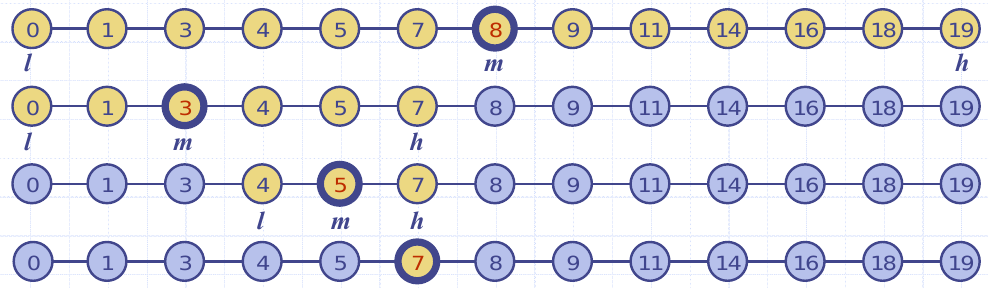

Varianten
..........

* Implementierung mittels **sortierten Sequenz**
    * ``find`` benötigt ``O(log n)``
    * ``insert`` benötigt ``O(n)``
    * ``remove`` benötigt ``O(n)``
    * => Nur bei kleinen Multimaps praktikabel, da shifting nötig (teuer)
* **Binary-Search-Tree** (Siehe unten)
    * Mit "Placeholders" (Guards/Sentinels)
    * Mit null

.. warning::

    * Entscheidende Frage bei der Implementierung: Null-Terminiert oder mit Guards?
    * Map oder Multimap?

Binary-Search-Trees
--------------------
* Binärbäume kennen wir schon von AD1 (beispielsweise Heap)

.. image:: images/u_v_w.png

* **key(u) ≤ key(v) ≤ key(w)**
    * Keys welche im linken Subtree sind, sind **kleiner gleich** root
    * Keys welche im rechten Subtree sind, sind **grösser** als root
* **Inorder-Traversierung** gibt sortierte Reihenfolge aus
* Externe Knoten speichern keine Daten
* Die Blattknoten sind als "Placeholders" implementiert ("Guards" / "Sentinels")

.. seealso::

    * Data Structures & Algorithms in Java - Sexth Edition, Seite 425.
    * `Interactive Binary-Search-Tree visualization 1 <https://www.cs.usfca.edu/~galles/visualization/BST.html>`_
    * `Interactive Binary-Search-Tree visualization 2 <http://visualgo.net/bst>`_

Suche
......

* Ist der Key k gleich den key des Knotens => Suche beendet.
* Ist der Key k kleiner als der key des Knotens => Linker Subtree
* Ist der Key k grösser als der key des Knotens => Rechter Subtree
* Ist der Knoten ein Blattknoten, so wurde der Eintrag nicht gefunden
* Performance: ``O(h)``, wobei h die höhe ist.
    * ist der Baum balanciert: ``O(log n)``
    * Worst case: ``O(n)`` (entartet, wie bei LinkedList)

.. warning::

    Achte auf Grenzwerte! Wird bei bsp. 911 nach links fortgefahren, so kann kein Wert >= 911 vorkommen!

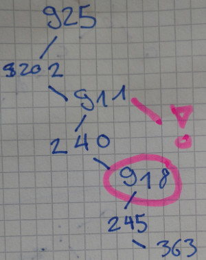

.. literalinclude:: code/MinimalBinaryTree.java
    :language: java
    :lines: 1-9

Einfügen
........

#. Suche nach den Key.
#. Falls der Key existiert, ersetze den Wert oder bei Multimap: suche weiter.
#. Wenn man in einem Blattknoten endet: In einen internen Knoten umwandeln.

.. literalinclude:: code/MinimalBinaryTree.java
    :language: java
    :lines: 11-23

Löschen
.......

Es gibt 3 mögliche Szenarien:

* Der zu löschende Knoten hat **zwei Blattkinder**
* Der zu löschende Knoten hat **ein Blattkind**
* Der zu löschende Knoten hat **keine Blattkinder**

Vorsicht:

-> Anhand von Grafik #11 nachspielen
-> #19/#20

#. Suche nach dem Key
#. Falls Knoten p gefunden:
    * max. 1 Blattkind: "Ersetze" den gefundenen Konten durch diesen Kindknoten (oder einen der Sentinels, falls nur externe Kindknoten)
    * Genau 2 Blattkinder:
        * Suche den grössten Knoten r im Subtree (immer rechts!)
        * Ersetze p mit r und r mit dessen linken Kindknoten (r hat ja keinen rechten Kindknoten)

Die Knoten werden nicht effektiv umgehängt - nur deren Werte!

.. literalinclude:: code/MinimalBinaryTree.java
    :language: java
    :lines: 25-60

Ausgabe inorder
................

.. literalinclude:: code/MinimalBinaryTree.java
    :language: java
    :lines: 62-68

ALV-Tree
---------
Performance von Binary-Search-Trees ist nicht immer ideal. Die Einfüge-Reihenfolge
ist entscheidend.

Ein ALV-Tree hat die gleichen eigenschaften wie ein Binary-Tree ("extends BinaryTree") aber die zusätzliche
Eigenschaft, dass sich **die Höhe der Kinder von v höchstens um 1 unterscheiden**. Dadurch wird im Worst-Case
eine logarithmische Laufzeit garantiert.

Ein AVL-Tree ist "balanciert", wenn:

* ``b(k) = Höhe(links) – Höhe(rechts)``
* es muss gelten: ``b(k)`` ist ``–1``, ``0`` oder ``+1``

Höhenbeweis
...........

Es ist zu beweisen, ob ein Baum garantiert die komplexität O(log(n)) aufweist.

Maximale höhe eines gültigen Baums? bsp. mit 4 Nodes = 3?
Minimale Anzahl Knoten m_min mit Höhe h? bsp. h=3 -> 4 ("inverse problem")

Arbeiten mit dem Baum mit einer minimalen Anzahl Konten für eine Höhe h. In der Beweisführung ist angenommen, dass der linke Subtree grösser
als der Rechte ist (wäre natürlich vertauschbar!)

1. Aufteilen eines Baums in 3 Teilbäume:

    * ganzer Baum - hat höhe ``h``
    * linker subtree - hat höhe ``(h-1)``
    * rechter subtree - hat höhe ``(h-2)``

2. `=> n(h) = 1 + n(h-1) + n(h-2)`
3. n(h) kann um zu Vereinfachen wie folgt angenähert werden:

   `n(h) > 2n(h-2) // Annähern!`

4. Der Schritt kann analog mit dem  linken und dem rechten Subtree durchgeführt werden:

   `n(h-2) = 1 + n(h-3) + n(h-4)`

   `n(h-2) > 2n(h-4)`

   `=> n(h) >  4n(h-4)`

   `n(h-4) = 1 + n(h-5) + n(h-6)`

   `n(h-4) > 2n(h-6)`

   `=> n(h) > 8n(h-6)`

5. Allgemein kann also die minimale Anzahl konten wie folgt definiert werden:

    `=> n(h) > (2^i)n(h-2i)`

6. Es muss nun ein Base Case gefunden werden um den Beweis abzuschliessen:

    `n_min (h=1) = 1`

    `n_min (h=2) = 2`

7. `i` muss nun so gewählt werden, dass wir in einen der Base Cases kommen:

    `i := h-2i = (1 | 2)`

    `=> h = (1|2) + 2i`

    `Bsp. i = 1  : h=3|4`

    `Bsp. i = 2  : h=5|6`

    `Bsp. i = 3  : h=7|8`

    `...`

    `=> i = ⌈h/2⌉ - 1`

    `=> n > 2^(⌈h/2⌉ - 1) * (1|2)`

8. Uns interessiert nun die O-Notation - Konstante können also weggelassen werden - auch der Celiling-Operator

    `=> n > 2^((h/2) - 1) | log()`

    `log(n) > (h/2)-1`

    `h < 2 * log(n) + 2`

    `=> h ϵ O(log(n))`

Einfügen
.........

Beim Einfügen kann ``-2 ≤ b(x) ≤ 2`` gelten - was eine Verletzung der AVL-Balance ist!

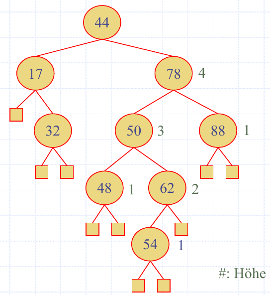

Man kann 4 generell mögliche Fälle unterscheiden

#. Einfügen in den linken Teilbaum des linken Sohnes
#. Einfügen in den rechten Teilbaum des linken Sohnes
#. Einfügen in den linken Teilbaum des rechten Sohnes
#. Einfügen in den rechten Teilbaum des rechten Sohnes

Vorgehen zur Wiederherstellung der AVL-Balance:

Trinode Umstrukturierung
''''''''''''''''''''''''

"Search and Repair" Strategie.

#. Wandere von neu eingefügten Knoten aus aufwärts und Prüfe bei jedem Koten, ob ALV_Balance verletzt wird
#. Tritt eine Verletzung ein, muss der Baum rotiert werden.
   Die betroffenen Knoten müssenn nun so umgehängt werden, dass die **Inorder Reihenfolge** gleich bleibt.

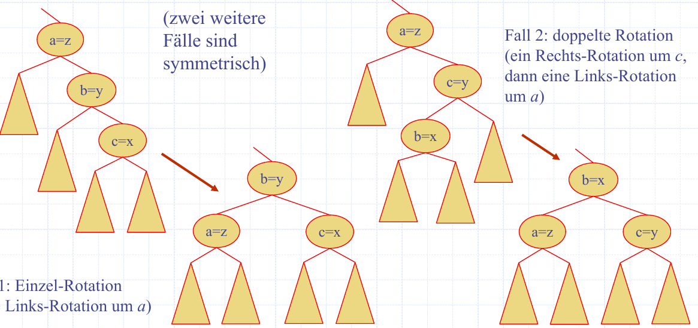

**CHECK: INORDER Reihenfolge vergleichen**

Sobald das einmal gemacht wurde ist die ALV-Eingeschaft wiederhergestellt, denn
eine grössere Differenz als 2 ist je Einfügeoperation nicht möglich.

.. seealso::

    Vorlesungsfolien `D_11_3_ALVTrees` #11, #15, #16.

Cut/Link Restrukturierungs-Algorithmus
'''''''''''''''''''''''''''''''''''''''

Vorteil: Keine Fallunterscheidung

Nachteil: Komplexer

Methode `restructure(x)` wird mit dem neu Angefügten Knoten x aufgerufen.

1. z, y, x und T0, T1, T2, T3 festlegen

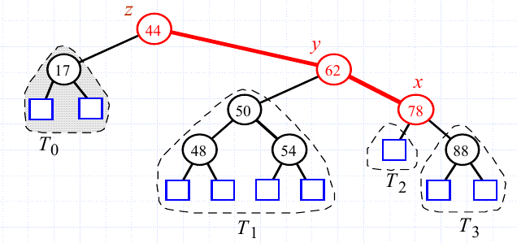

2. Die Sieben Teile gemäss inorder Reihenfolge nummerieren

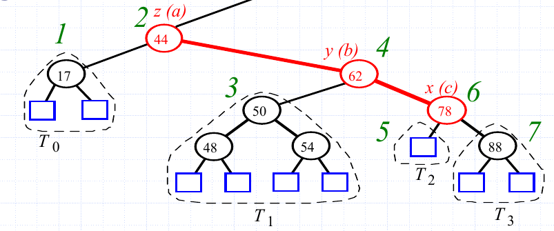

3. ensprechend der inorder Reihenfolge in ein Array abfüllen

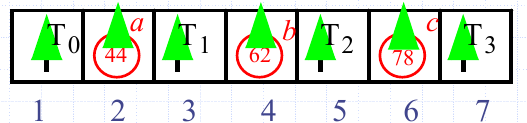

4. Schrittweise neuer Baum a der Mitte des Arrays aufbauen:  #25/#26

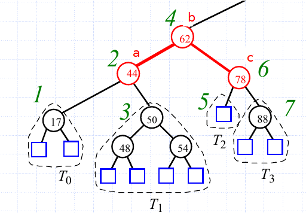

Löschen
.......

Löschen kann mit hilfe der Methode `restructure(x)` vom Cut/Link Restrukturierungs-Algorithmus
implementiert werden:

#. Lösche das Kind k
#. Prüfe Tree von unten nach oben - sobald unbalanciert:
#. z ist der Unbalanciert Knoten - y das Kind von z mit der grösseren Höhe und x das kind von
   y mit der grösseren Höhe.
#. Rufe restructure(x) auf
#. Zurück zu Schritt 2.
#. Falls komplett balanciert - fertig!

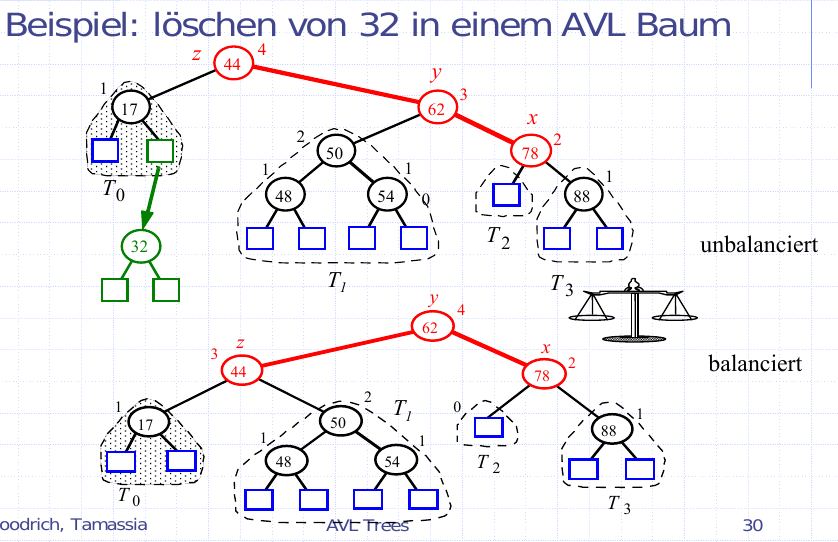

.. todo::

    * Einbinden von Beispielscode

Laufzeitverhalten
.................

(Eine einzelne Restrukturierung braucht konstante Zeit - also O(1))

* `find`:  O(log n), da die Höhe des Bausm O(log n) ist und keine Restrukturierung notwendig ist.
* `insert`: O(log n), da find gebraucht wird (O(log n)) und anschliessend ein Restrukturierung stattfindet (O(log n))
* `delete`: O(log n), analog insert

Splay-Tree
-----------
Strukturierung (sortierung) analog zum sortierten Binärbaum (oben).

Multimap - gleiche Keys können aber weit auseinander im Tree liegen.

Nach jedem Zugriff auf ein Konten soll dieser zur Root werden.

.. todo::

    Recap Doppel-Rotation

Suche
.....
#. Suche abwärts bis zum gesuchten Entry oder ein externer Konten (wie gehabt)
#. Rotation: mit der ``splay``-Operation

- bei Rotation ändert sich die Struktur des Baumes oberhalb x nicht

zig(links) zag(rechts) immer von unten aus lesen!

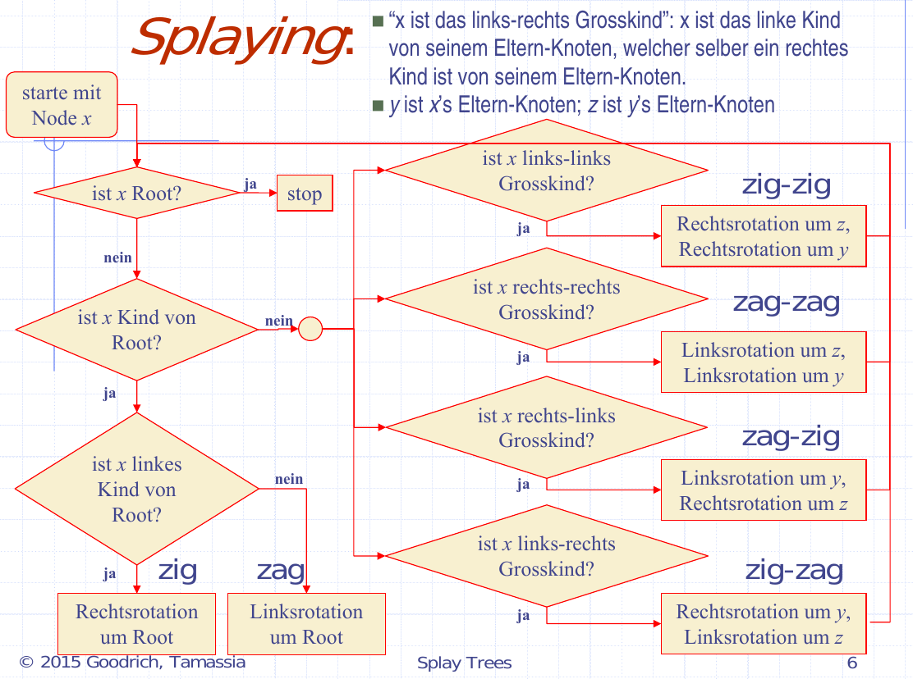

Wenn externer Knoten -> splay() mit dessen Parent!

Vorgehen:

#. X, Y, Z notieren
#. Splaying gemäss flow-chart durchführen
#. Rotationen einzeln durchführen

Löschen
.......
Ersetze v durch Inorder-Nachfolger. Lösche z.
splay(u) mit dem tiefsten zugegriffenen internen Knoten durchführen

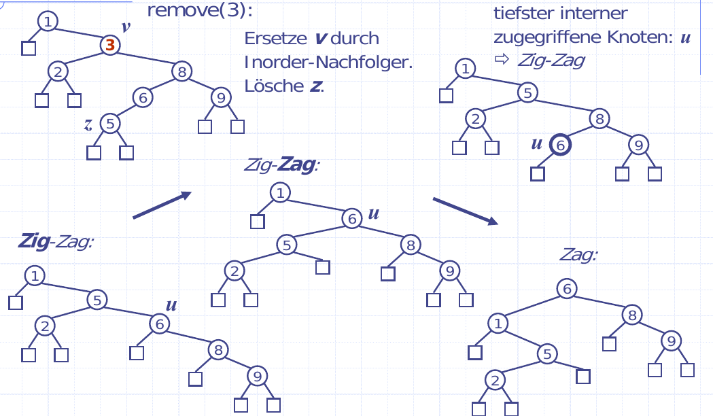

Insert
......
Benutze den neuen Knoten bei welchem der Entry eingefügt/ersetzt wurde
für die Splay-Methode.

Performance
...........
"Dinge die oft gesucht werden nahe in die Root"

Kosten: O(h): Worst-Case: O(n), wenn h=n (LinkedList)\
              Durchschnittlich O(log n)
