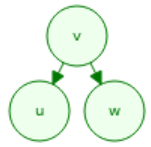

Search Trees
=============
.. _schema-bst:

Binary-Search
-------------
**Binäre Suche** -> bei jedem Schritt die Anzahl der Kandidaten halbieren

Beispiel ``find(7)`` in einer Array-Basierten Multimap:

.. image:: images/binary-search-array.png

Varianten
..........

* Implementierung mittels **sortierten Sequenz**
    * ``find`` benötigt ``O(log n)``
    * ``insert`` benötigt ``O(n)``
    * ``remove`` benötigt ``O(n)``
    * => Nur bei kleinen Multimaps praktikabel, da shifting nötig (teuer)
* **Binary-Search-Tree** (Siehe unten)
    * Mit "Placeholders" (Sentinels)
    * Mit null

Binary-Search-Trees
--------------------
* Binärbäume kennen wir schon von AD1 (beispielsweise Heap)

* **key(u) ≤ key(v) ≤ key(w)**
    * Keys welche im linken Subtree sind, sind kleiner gleich root
    * Keys welche im rechten Subtree sind, sind grösser als root
* **Inorder-Traversierung** gibt sortierte Reihenfolge aus
* Externe Knoten speichern keine Daten
* Die Blattknoten sind als "Placeholders" implementiert ("Sentinels")

.. seealso::

    * Data Structures & Algorithms in Java - Sexth Edition, Seite 425.
    * `Interactive Binary-Search-Tree visualization <https://www.cs.usfca.edu/~galles/visualization/BST.html>`_

Suche
......

* Ist der Key k gleich den key des Knotens => Suche beendet.
* Ist der Key k kleiner als der key des Knotens => Linker Subtree
* Ist der Key k grösser als der key des Knotens => Rechter Subtree
* Ist der Knoten ein Blattknoten, so wurde der Eintrag nicht gefunden
* Performance: ``O(h)``, wobei h die höhe ist.
    * ist der Baum balanciert: ``O(log n)``
    * Worst case: ``O(n)``

.. warning::

    Achte auf Grenzwerte! Wird bei bsp. 911 nach links fortgefahren, so kann kein Wert >= 911 vorkommen!

.. image:: images/broken_binary_tree.jpg

.. code:: java

     public Node treeSearch(Node subTreeRoot, K key){
       if (subTreeRoot.isExternal()){
         // unsuccesful search
         return subTreeRoot;
       } else if (key.equals(subTreeRoot.getKey())){
         // successful search
         return subTreeRoot;
       }else if (key < subTreeRoot.getKey()){
         // recur on left subtree
         return treeSearch(key.getLeft(), k);
       }else{
         // recur on right subtree
         return treeSearch(key.getRight(), k);
       }
     }

Einfügen
........

#. Suche nach den Key.
#. Falls der Key existiert, ersetze den Wert oder bei Multimap: suche weiter.
#. Wenn man in einem Blattknoten endet: In einen internen Knoten umwandeln.

.. code:: java

     public Node insert(Node subTreeRoot, K key, V value){
       Node p = treeSearch(subTreeRoot, k);
       if(key.equals(p.getKey())){
           // Falls ein Wert nur einmal vorkommen darf:
           p.setValue(v);
           // Falls ein Wert mehrfach vorkommen darf, suche weiter
           // bis in man in einem Blattknoten endet
           treeSearch(p.getLeft(), k, v)
       }else {
           // externer knoten "expandieren", sprich in einen internen Knoten umwandeln.
           expandExternal(p, k, v);
           // hier eventuell "selbst organisiern", um balance wiederherzustellen
           // wobei ein eifacher Search-Tree das nicht tut.
       }
     }

Löschen
.......

#. Suche nach dem Key
#. Falls Knoten p gefunden:
    * max. 1 interner Kindknoten: Ersetze den gefundenen Konten durch diesen Kindknoten (oder einen der Sentinels, falls nur externe Kindknoten)
    * 2 interne Kindknoten:
        * Suche den grössten Knoten r im Subtree (immer rechts!)
        * Ersetze p mit r und r mit dessen linken Kindknoten (r hat ja keinen rechten Kindknoten)

.. code:: java

    public Node delete(Node subTreeRoot, k){
        Node p = treeSearch(subTreeRoot, k);
        if (p.isExternal()){
            // Key nicht gefunden
            return;
        }
        if (p.getRight().isInternal() && p.getLeft().isInternal()){
            // TODO: beide Kinder sind interne knoten:

        } else if(p.getRight().isInternal()){
            // ersetze p mit p.getRight()
            // TODO: OK?
            q = p.getRight()
            p.setKey(q.getKey())
            p.setValue(q.getValue())
            q.toExternal()
        } else if(p.getLeft().isInternal()) {
            // ersetze p mit p.getLeft()
            // TODO: OK?
            q = p.getLeft()
            p.setKey(q.getKey())
            p.setValue(q.getValue())
            q.toExternal()
        }else{
            // Hat keine interne kindknoten => ersetze p mit "Sentinel"
            // TODO: OK?
            p.toExternal()
        }
    }

Ausgabe inorder
................

.. code:: java

    String inorder(Node subTreeRoot) {
        if (p == null) {
            return "";
        }
        return inorder(p.getLeft()) + "(" + p.toString() + ")" + inorder(p.getRight());
    }

ALV-Tree
---------

Splay-Tree
-----------
