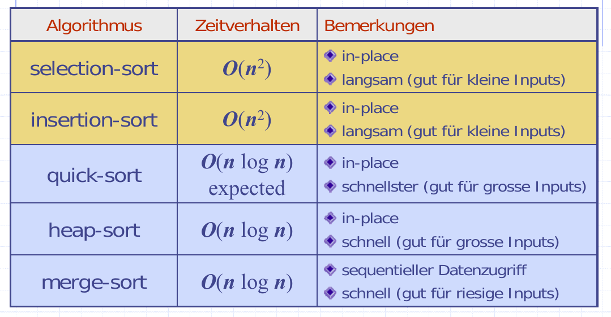
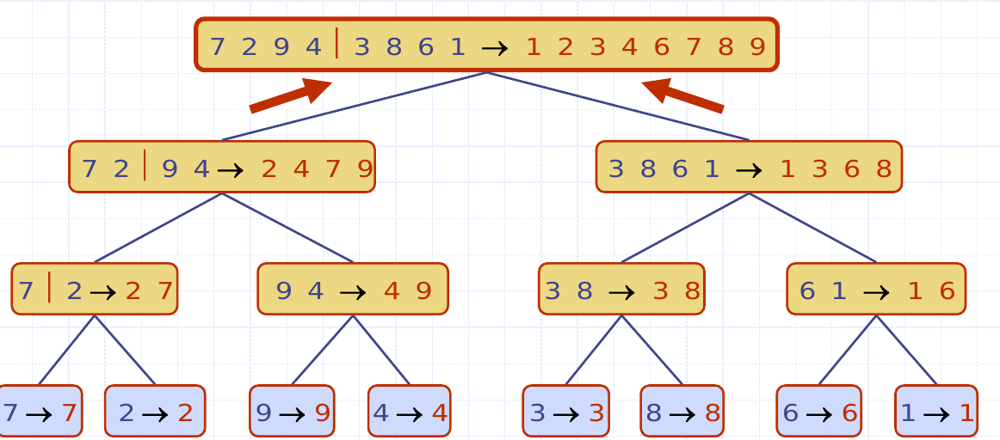
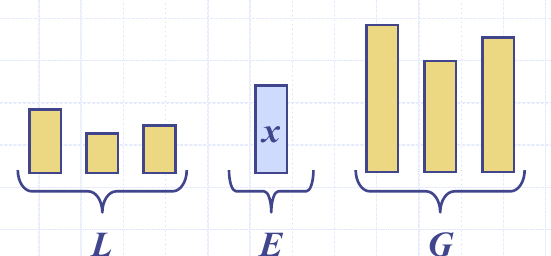
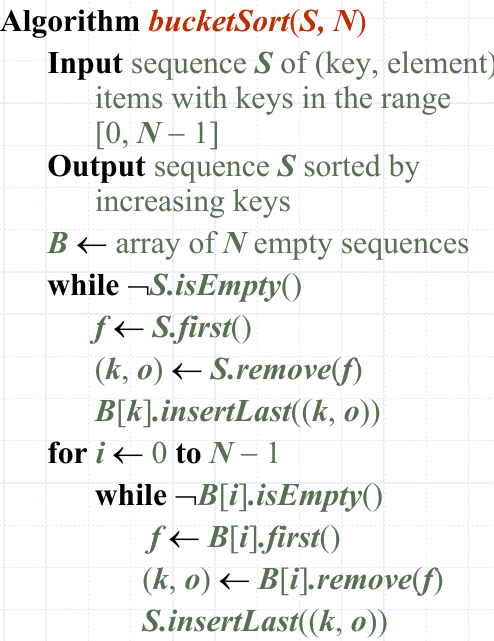

# Sorting



Stabile Sortierungseigenschaft
: Die relative Ordnung von zwei Elementen mit dem selben Schlüssel werden durch den Algorithmus **nicht verändert**.

## Merge-Sort

Divide
: Teile Input-Daten in zwei Teilmengen auf

Recur
: Wiederholen mit s1 bzw. s2: Verankerung, sobald inputgrösse 1 oder 0 ist.

conquery
: Lösungen von s1 und s2 vereinen

* Nutzt **Comparator**
* Laufzeit: ``O(n log n)``
* Auch Nicht-Rekursiv möglich (Im Array - in und out wird vertauscht)
* Halbiert immer → immer garantierter balancierter baum


: Rekursion als Baum dargestellt


```java
/*
 * Copyright 2014, Michael T. Goodrich, Roberto Tamassia, Michael H. Goldwasser
 * (GPL Licensed) - via Data Structures and Algorithms in Java, Sixth Edition
 */
class MergeSort {
  public static <K> void merge(Queue<K> S1, Queue<K> S2, Queue<K> S,
                                                        Comparator<K> comp) {
    while (!S1.isEmpty() && !S2.isEmpty()) {
      if (comp.compare(S1.first(), S2.first()) < 0)
        S.enqueue(S1.dequeue());           // take next element from S1
      else
        S.enqueue(S2.dequeue());           // take next element from S2
    }
    while (!S1.isEmpty())
      S.enqueue(S1.dequeue());             // move any elements that remain in S1
    while (!S2.isEmpty())
      S.enqueue(S2.dequeue());             // move any elements that remain in S2
  }
  public static <K> void mergeSort(Queue<K> S, Comparator<K> comp) {
    int n = S.size();
    if (n < 2) return;                     // queue is trivially sorted
    // divide
    Queue<K> S1 = new LinkedQueue<>();     // (or any queue implementation)
    Queue<K> S2 = new LinkedQueue<>();
    while (S1.size() < n/2)
      S1.enqueue(S.dequeue());             // move the first n/2 elements to S1
    while (!S.isEmpty())
      S2.enqueue(S.dequeue());             // move remaining elements to S2
    // conquer (with recursion)
    mergeSort(S1, comp);                   // sort first half
    mergeSort(S2, comp);                   // sort second half
    // merge results
    merge(S1, S2, S, comp);                // merge sorted halves back into original
  }
}
```

## Quick-Sort
* Auch Grundprinzip *Divide-and-Conquer*
* x ist pivot - im Idealfall der Median
* E →  equal sequenz
* L →  Less sqeuenz
* G →  greater sequenz



* gut inplace sortierbar
* Kann auch als Baum dargestellt werden
* Inline Quicksort ist *nicht* stabil
* Laufzeit ist proportional zur Summe - im Worst-Case:

\[
    n+(n-1)+...+2+1 = \sum_{i=0}^n i = \frac{n^2 + n}{2} \Rightarrow O(n^2)
\]

Good call
: Die Länge von `L` und `G` sind beide kleiner als $$\frac{3s}{4}$$

Bad call
: Die Länge von `L` oder `G`  ist länger als $$\frac{3s}{4}$$

Ein Aufruf ist mit einer Wahrscheinlichkeit von $$\frac{1}{2}$$ ein "Good Call".
**Somit ist die erwartete totale Laufzeit des Quick-Sort** $$O(n \cdot log(n))$$

Gute Pivot wahl:

* Median wäre ideal - aber aufwändig zu berechnen
* Mögliche lösung: Median der letzten d elemente (wobei d >= 3) - statistische Stichprobe
* Ein element möglichst am Anfang/Ende als Pivot zu wählen ist keine gute idee

```java
/*
 * Copyright 2014, Michael T. Goodrich, Roberto Tamassia, Michael H. Goldwasser
 * (GPL Licensed) - via Data Structures and Algorithms in Java, Sixth Edition
 */
 class QuickSort {

   /** Quick-sort contents of a queue. */
   public static <K> void quickSort(Queue<K> S, Comparator<K> comp) {
     int n = S.size();
     if (n < 2) return;                       // queue is trivially sorted
     // divide
     K pivot = S.first();                     // using first as arbitrary pivot
     Queue<K> L = new LinkedQueue<>();
     Queue<K> E = new LinkedQueue<>();
     Queue<K> G = new LinkedQueue<>();
     while (!S.isEmpty()) {                   // divide original into L, E, and G
       K element = S.dequeue();
       int c = comp.compare(element, pivot);
       if (c < 0)                             // element is less than pivot
         L.enqueue(element);
       else if (c == 0)                       // element is equal to pivot
         E.enqueue(element);
       else                                   // element is greater than pivot
         G.enqueue(element);
     }
     // conquer
     quickSort(L, comp);                      // sort elements less than pivot
     quickSort(G, comp);                      // sort elements greater than pivot
     // concatenate results
     while (!L.isEmpty())
       S.enqueue(L.dequeue());
     while (!E.isEmpty())
       S.enqueue(E.dequeue());
     while (!G.isEmpty())
       S.enqueue(G.dequeue());
   }

   /** Quick-sort contents in-place. */
   public static <K> void quickSortInPlace(K[] S, Comparator<K> comp) {
     quickSortInPlace(S, comp, 0, S.length-1);
   }

   /** Sort the subarray S[a..b] inclusive. */
   private static <K> void quickSortInPlace(K[] S, Comparator<K> comp,
                                                                    int a, int b) {
     if (a >= b) return;                // subarray is trivially sorted
     int left = a;
     int right = b-1;
     K pivot = S[b];
     K temp;                            // temp object used for swapping
     while (left <= right) {
       // scan until reaching value equal or larger than pivot (or right marker)
       while (left <= right && comp.compare(S[left], pivot) < 0) left++;
       // scan until reaching value equal or smaller than pivot (or left marker)
       while (left <= right && comp.compare(S[right], pivot) > 0) right--;
       if (left <= right) {             // indices did not strictly cross
         // so swap values and shrink range
         temp = S[left]; S[left] = S[right]; S[right] = temp;
         left++; right--;
       }
     }
     // put pivot into its final place (currently marked by left index)
     temp = S[left]; S[left] = S[b]; S[b] = temp;
     // make recursive calls
     quickSortInPlace(S, comp, a, left - 1);
     quickSortInPlace(S, comp, left + 1, b);
   }
 }
```
## Bubble sort

* Laufzeit Best-Case: $$O(n)$$
* Laufzeit Worst-Case $$O(n^2)$$

```java
public static <T extends Comparable<? super T>> void bubbleSort1(T[] sequence) {
    boolean swapped = true;
    while(swapped) {
      swapped = false;
      for(int i = 1; i < sequence.length; i++){
        if(sequence[i-1].compareTo(sequence[i]) > 0){
          T tmp = sequence[i-1];
          sequence[i-1] = sequence[i];
          sequence[i] = tmp;
          swapped = true;
        }
      }
    }
}
```

Lässt sich optimieren, in dem die länge bei jeder iteration um 1 verkleinert wird (das grösste Element ist garantiert an das letzten Position).

```java
public static <T extends Comparable<? super T>> void bubbleSort2(T[] sequence) {
    boolean swapped = true;
    int lenght = sequence.length;
    while(swapped) {
      swapped = false;
      for(int i = 1; i < lenght; i++){
        if(sequence[i-1].compareTo(sequence[i]) > 0){
          T tmp = sequence[i-1];
          sequence[i-1] = sequence[i];
          sequence[i] = tmp;
          swapped = true;
        }
      }
      lenght -= 1;
    }
}
```
Die Optimierung hat aber kein Einfluss auf das Laufzeitverhalten (nur auf die versteckten Faktoren...)

\[
\sum_i^{n-1} i = \frac{n(n-1)}{2} \in O(n^2)
\]

## Sorting Lower Bound

\[
    n^n > n! > \left(\frac{n}{2}\right)^\frac{n}{2}
\]

→ Jeder vergleichsbasierte Algorithmus hat eine min. Laufzeit von $$log(n!)$$, also floglich $$\frac{n}{2} \cdot log(\frac{n}{2})$$

**➪ Alle vergleichsbasierten Sortier-Algoritmen haben eine (worst-case) Mindestlaufzeit von** $$n \cdot log(n)$$

## Bucket-Sort

* Sequenz mit n Elemnten mit Werten im Breich von 0 bis N-1
* Erreicht eine Laufzeit von $$O(n+N)$$ - **da nicht vergleichsbasiert**
* Bsp PLZ: Range von 1000 - 9999 ➪ N: 9000
* Da die Keys als Index im Array verwendet werden müssen diese Integer-Werte sein. (Wobei mit Hilfsfunktion auch mit bsp. Strings möglich)
* ist stabil



: Pseudocode Bucket-Sort

Stabile Sort Eigenschaft
Erweiterungen

## Lexographicshe Ordnung

Bei lexographicshe Ordnung sortieren wir nicht nur nach einem Key, sonder nach mehrer verglichen & sortiert.

➪ Geordnetes Tupel mit d Keyes $$(k_1, k_2, ..., k_d)$$.

```
Algorithm lexicographicSort(Sequence-of-d-tupels S)
    for i ← d downto 1
        stableSort(S, Ci)
    return S
```

Beispiel mit ( 7 , 4 , 6 ) ( 5 , 1 , 5 ) ( 2 , 4 , 6 ) ( 2 , 1 , 4 ) ( 3 , 2 , 4 )

i=3 ( 2 , 1 ,**4**) ( 3 , 2 ,**4**) ( 5 , 1 ,**5**) ( 7 , 4 ,**6**) ( 2 , 4 ,**6**)

i=2 ( 2 ,**1**, 4 ) ( 5 ,**1**, 5 ) ( 3 ,**2**, 4 ) ( 7 ,**4**, 6 ) ( 2 ,**4**, 6 )

i=1 (**2**, 1 , 4 ) (**2**, 4 , 6 ) (**3**, 2 , 4 ) (**5**, 1 , 5 ) (**7**, 4 , 6 )

## Radix-Sort

Spezialisierung des lexikographischen-Sort, welcher Bucket-Sort als stabilen Sortier- Algorithmus für jede Dimension benutzt.

```
Algorithm radixSort(Sequence-of-d-tupels S, MaxValue N)
    for i ← d downto 1
        bucketSort(S, N)
    return S
```

➪ Laufzeit $$O(d( n + N))$$
