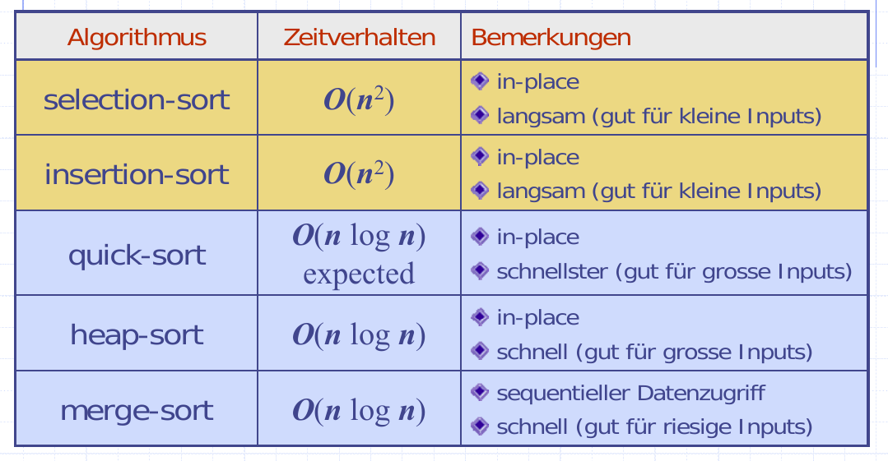

Sorting
=======

Merge-Sort
----------
Recap: "Divide-and-Conquer"
**Divide** Teile Input-Daten in zwei Teilmengen auf
**Recur** Wiederholen mit s1 bzw. s2: Verankerung, sobald inputgrösse 1 oder 0 ist.
**conquery** Lösungen von s1 und s2 vereinen

Nutzt **Comparator**
Laufzeit: ``O(n log n)``

.. todo::

    code beispiel

Rekursion kann als Baum Dargestellt werden (Folien 5-15)

Auch Nicht-Rekursiv möglich (Im Array - in und out wird vertauscht)

Quick-Sort
-----------

Sorting Lower Bound
--------------------

Radix-Sort
----------
