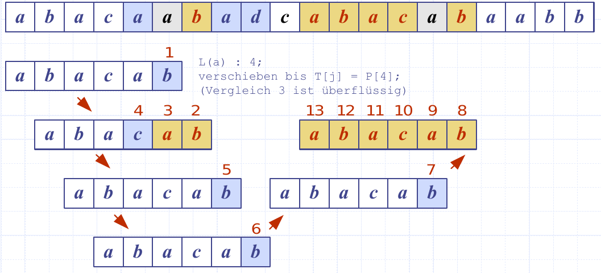
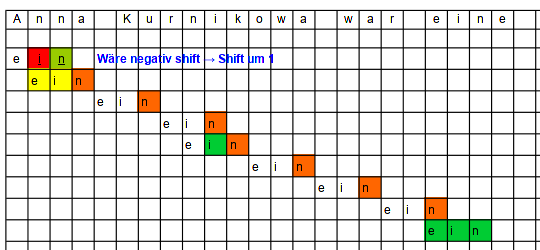
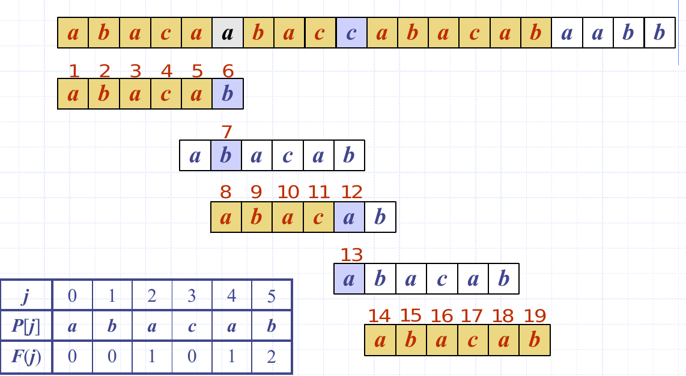
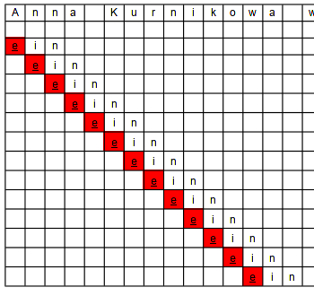

# Text-Processing

## Pattern Matching

* P: Pattern - zu suchender String
* T: Text in dem nach P gesucht werden soll
* m: Länge von P
* Präfix von P: `P[0..i]`
* Suffix von P: `P[0..(m-1)]`
* Problem: Finde Substring T, der mit Pattern P übereinstimmt

!!! warning

    `P[i..j]` → i und j *inklusive* (bei Java *exklusive*)


## Brute-Force
Die Brute-Force-Methode vergleicht das Pattern P mit dem Text T für jede mögliche Position von P relativ zu T bis eine Übereinstimmung gefunden wurde oder alle Möglichkeiten durchprobiert wurden.

Im Worst Case (T=aaa....ah, P=aaaaah) benötigt die Brute-Force-Methode $$O(nm)$$

```java
/*
 * Copyright 2014, Michael T. Goodrich, Roberto Tamassia, Michael H. Goldwasser
 * (GPL Licensed) - via Data Structures and Algorithms in Java, Sixth Edition
 */
/** Returns the lowest index at which substring pattern begins in text (or else -1).*/
public static int findBrute(char[] text, char[] pattern) {
  int n = text.length;
  int m = pattern.length;
  for (int i=0; i <= n - m; i++) {                 // try every starting index within text
    int k = 0;                                     // k is index into pattern
    while (k < m && text[i+k] == pattern[k])       // kth character of pattern matches
      k++;
    if (k == m)                                    // if we reach the end of the pattern,
      return i;                                    // substring text[i..i+m-1] is a match
  }
  return -1;                                       // search failed
}
```

## Boyer-Moore
Basiert auf zwei Heuristiken

1. Looking-Glass: Starte mit dem Vergleichen am Ende des Patterns
2. Character Jump: falls P das Zeichen c enthält, verschiebe P bis das letzte Auftreten von c in P mit T[i] übereinstimmt.

Im Vorfeld muss dafür eine "Last-Occurence" Funktion implementiert werden:
Beispiel: Missmatch bei t ➪ lastOccurence('t') → 2, verschiebe Position um 2 nach rechts.


: Ein Beispiel Ablauf mit Boyer-Moore


: Ein vollständiger Ablauf mit Boyer-Moore - mit 12 Vergleichen

Im Worst-Case (T=aaaa ... a, P: baaaaa) hat diese Methode eine Laufzeit von $$O(n \cdot m + s)$$ :disappointed:

Ist bei Textanalysen aber typischerweise sehr schnell - kann aber in Ausnahmesituationen sehr langsam sein!

```java
/*
 * Copyright 2014, Michael T. Goodrich, Roberto Tamassia, Michael H. Goldwasser
 * (GPL Licensed) - via Data Structures and Algorithms in Java, Sixth Edition
 */
/** Returns the lowest index at which substring pattern begins in text (or else -1).*/
public static int findBoyerMoore(char[] text, char[] pattern) {
  int n = text.length;
  int m = pattern.length;
  if (m == 0) return 0;                            // trivial search for empty string
  Map<Character,Integer> last = new HashMap<>();   // the 'last' map
  for (int i=0; i < n; i++)
    last.put(text[i], -1);               // set -1 as default for all text characters
  for (int k=0; k < m; k++)
    last.put(pattern[k], k);             // rightmost occurrence in pattern is last
  // start with the end of the pattern aligned at index m-1 of the text
  int i = m-1;                                     // an index into the text
  int k = m-1;                                     // an index into the pattern
  while (i < n) {
    if (text[i] == pattern[k]) {                   // a matching character
      if (k == 0) return i;                        // entire pattern has been found
      i--;                                         // otherwise, examine previous
      k--;                                         // characters of text/pattern
    } else {
      i += m - Math.min(k, 1 + last.get(text[i])); // case analysis for jump step
      k = m - 1;                                   // restart at end of pattern
    }
  }
  return -1;                                       // pattern was never found
}
```

## Knuth-Morris-Pratt
Der KMP Algorithms arbeitet von links nach rechts, versucht aber redundante vergleiche vermeiden.

Im Vorfeld wird eine Tabelle erstellt, welche die Übereinstimmungen von Präfix im Muster selbst sucht:

* `[aba]` hat sufix, der auch präfix ist: 1
* `[abaa]` hat sufix, der auch präfix ist: 1
* `[abaab]` hat sufix, der auch präfix ist: 2
* `[abaaba]` hat sufix, der auch präfix ist: 3

| j    | 0 | 1 | 2 | 3 | 4 | 5 |
|------|---|---|---|---|---|---|
| P[j] | a | b | a | a | b | a |
| F(j) | 0 | 0 | 1 | 1 | 2 | 3 |


Diese "failture function" kann als Array Dargestellt werden, in $$O(m)$$


: Ein Beispiel Ablauf mit Knuth-Morris-Pratt


: Ein ineffizienter Ablauf mit Knuth-Morris-Pratt - da ein keine interne Präfixe hat. (=Brute Force)


```java
/*
 * Copyright 2014, Michael T. Goodrich, Roberto Tamassia, Michael H. Goldwasser
 * (GPL Licensed) - via Data Structures and Algorithms in Java, Sixth Edition
 */
 /** Returns the lowest index at which substring pattern begins in text (or else -1).*/
public static int findKMP(char[] text, char[] pattern) {
  int n = text.length;
  int m = pattern.length;
  if (m == 0) return 0;                            // trivial search for empty string
  int[] fail = computeFailKMP(pattern);            // computed by private utility
  int j = 0;                                       // index into text
  int k = 0;                                       // index into pattern
  while (j < n) {
    if (text[j] == pattern[k]) {                   // pattern[0..k] matched thus far
      if (k == m - 1) return j - m + 1;            // match is complete
      j++;                                         // otherwise, try to extend match
      k++;
    } else if (k > 0)
      k = fail[k-1];                               // reuse suffix of P[0..k-1]
    else
      j++;
  }
  return -1;                                       // reached end without match
}

private static int[] computeFailKMP(char[] pattern) {
  int m = pattern.length;
  int[] fail = new int[m];                         // by default, all overlaps are zero
  int j = 1;
  int k = 0;
  while (j < m) {                                  // compute fail[j] during this pass, if nonzero
    if (pattern[j] == pattern[k]) {                // k + 1 characters match thus far
      fail[j] = k + 1;
      j++;
      k++;
    } else if (k > 0)                              // k follows a matching prefix
      k = fail[k-1];
    else                                           // no match found starting at j
      j++;
  }
  return fail;
}

```
