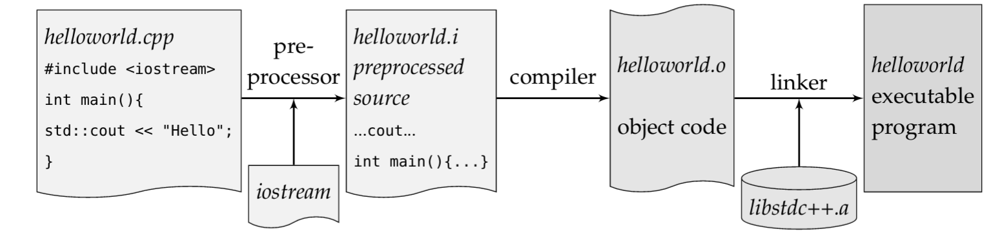

# Basics

* C++ kompiliert in sehr effizienten maschienencode
* Beitet mächtige abstracktion
* Schneller und wartbarer code.
* "Gutes" C++ zu schreiben benötigt viel Erfahrung und Wissen.
* ISO-Standardisiert

Declare before use**
: Alle Entities in C++ müssen vor deren Benützung deklariert werden.
: Da C++ kein gutes modul konzept für imports hat, wird ein preprocessor verwendet.
: Deklarationen werden in *header files* gemacht (header, da diese typischerweise im Kopf eines Programms inkludiert werden.) Mehrfach Definition: Guards

Undefined behaviour
: TBD (bsp. division durch 0, falscher Zugriff) => alles kann passieren
: Wors case: es läuft!

One-Definition-Rule
: Jeder Typ, Funktion, object, template oder translation unit darf nur genau eine definition haben.
: Für jede Definition kann es aber mehrere Deklarationen geben.

function
: Hat einen Namen (hier ``main``) und return type (hier ``int``) -
```c++
int main(){}
```
Die Kombination aus typ, name, parameter und klammern bildet die **function signature**. Für main wäre das `int main()`. Funktionen! nicht Methoden

translation unit
: Jede .cpp-Datei kann unabhängig kompiliert werden und ist eine sogenannte translation unit. Ausgabe: Ein **object file**

Argument Dependent Lookup
: Wenn der Compiler eine unqualifizierte Funktion oder einen operator-call von einem benutzerdefinierten typ trifft, dann schlägt er in dem namespace nach, in welchem der typ
definiert ist. Beispiel: `for_each(v.begin(), ...)` benötigt keinen `std::` prefix, da for_each im gleichen namespace definiert ist wie `vector (v)`.

!!! warning

    ADL hat Vorrang gegenüber lokalen Funktionen!

Daten auf dem Stack - heap muss manuell gemanaget werden.


## Header Files

Braucht es, da *declaration first*. Grund dafür ist, dass die einerseits die Deklaratonen
bequem Inkludiert werden können, andererseits kann die implementation gewechselt weden.

Headers der Standard Library (bsp. iostream) benötigen keinen .h Endung.

Es werden include Guards benötigt um mehrfach inlcudes zu behandeln (mehrfache deklaration)

```c++
#ifndef SRC_HELLO_H_
#define SRC_HELLO_H_

#include <ostream>

struct Hello {
	void sayHello(std::ostream &out) const;
};
#endif /* SRC_HELLO_H_ */
```

## Ablauf Compilation



: Compilation Modell

Pre-Processor kopiert den Unhalt der .h files in die Translation Unit.
Mehrere Translation units werden in Maschienencode umgewandelt.
Der Linker hängt die verschiedenen translation units und weitere Bibliotheken (wie bsp. die C++ stdlib) zusammen.
Liefert code, welcher effektiv die main methode aufruft.

!!! seealso

    [Lucid C++ - Kapitel 0](https://wiki.ifs.hsr.ch/CPlusPlus/files/C++chapter0.pdf)


## int
int ist *implementation defined* - sprich Compiler oder dessen Einstellungen definieren wie gross (16, 32 64 Bit) ein int sein kann.
Es gibt also keine garantie, dass ein int bsp. 32 Bits gross ist (wie in Java).
Dies ist insbesondere mühsam, wenn portabler code geschrieben werden soll.

## return

Jede funktion benötigt ein Return-Statement, mit 2 Ausnahmen:

* Return-Type ist ``void``
* Die ``main``-Methode (Falls ohne return wird 0 angenommen)

## Structs / Classes

Class private, struct: public (blockweise)
Semikolon nach der Klassendefinition!

## lambda

Labdas sind first class vaues!

Closure im []

```c++
// TODO: does it work?
for_each(crbegin(v), crend(v), [](auto x) -> void {
    // ...
});

// Void can be omitted
for_each(crbegin(v), crend(v), [](auto x) {
    // ...
});

// Pass "captures" with &(reference) and =(copy, default if omitted)
// Here, reference to out is passed
for_each(crbegin(v), crend(v), [&out](auto x) {
out << x
});

auto const g=[](char c) -> char{return std::toupper(c);};

// A method, that takes a function (the above declared lambda)
// as parameter
void f(std::function<char(char)> function){
std::cout << function('a');
}
```
