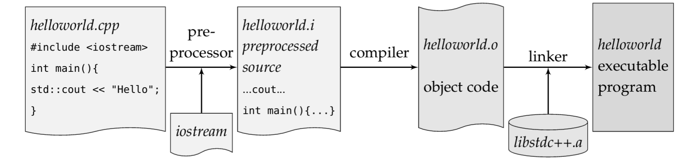

Basics
======

* C++ kompiliert in sehr effizienten maschienencode
* Beitet mächtige abstracktion
* Schneller und wartbarer code.
* "Gutes" C++ zu schreiben benötigt viel Erfahrung und Wissen.
* ISO-Standardisiert

**Declare before use**
    Alle Entities in C++ müssen vor deren Benützung deklariert werden.
    Da C++ kein gutes modul konzept für imports hat, wird ein preprocessor verwendet.
    Deklarationen werden in *header files* gemacht (header, da diese typischerweise im Kopf
    eines Programms inkludiert werden.)

**One-Definition-Rule**
    Jeder Typ, Funktion, object, template oder translation unit darf nur genau eine definition haben.
    Für jede Definition kann es aber mehrere Deklarationen geben.

**function**
    Hat einen Namen (hier ``main``) und return type (hier ``int``) -

    .. code:: c++

        int main(){}

    Die Kombination aus typ, name, parameter und klammern bildet die **function signature**.
    Für main wäre das `int main()`

**translation unit**
    Jede .cpp-Datei kann unabhängig kompiliert werden und ist eine sogenannte translation unit.
    Ausgabe: Ein **object file**

Header Files
-------------
Headers der standard library (bsp. iostream) benötigen keinen .h Endung.

Ablauf Compilation
-------------------

Pre-Processor kopiert den Unhalt der .h files in die Translation Unit.
Mehrere Translation units werden in Maschienencode umgewandelt.
Der Linker hängt die verschiedenen translation units und weitere Bibliotheken (wie bsp. die C++ stdlib) zusammen.
Liefert code, welcher effektiv die main methode aufruft.

.. seealso::

        `Lucid C++ - Kapitel 0 <https://wiki.ifs.hsr.ch/CPlusPlus/files/C++chapter0.pdf>`_

int
---
int ist *implementation defined* - sprich Compiler oder dessen Einstellungen definieren wie gross (16, 32 64 Bit) ein int sein kann.
Es gibt also keine garantie, dass ein int bsp. 32 Bits gross ist (wie in Java).
Dies ist insbesondere mühsam, wenn portabler code geschrieben werden soll.

return
------
Jede funktion benötigt ein Return-Statement, mit 2 Ausnahmen:

* Return-Type ist ``void``
* Die ``main``-Methode (Falls ohne return wird 0 angenommen)
