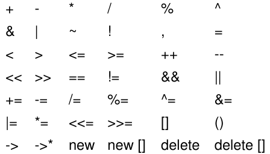

# Classes

## Best Practice

* Tut etwas gut und ist ensprechend benannt
* Tief verschachtelte Kontrollstrukturen vermeiden
* invarian: Garantiert einen State (spätestens nach dem Ablauf des Konstruktors)

## Struktur

Klassen werden im typischerweise in den header-files definiert und in cpp-Dateien implementiert..

```c++
/*Normaler include Guard*/
#ifndef DATE_H_
#define DATE_H_

class Date { /*Class Head*/

    /*Member Variables*/
    int year, month, day;

public: /*Public block*/

    /*Konstruktor*/
    Date(int year, int month, int day);

    /*Statische Methode*/
    static bool isLeapYear(int year);

private: /*Private block*/
    bool isValidDate() const;
}; /*Semikolon NICHT VERGESSEN!*/
#endif /* DATE_H_ */
```

```c++
#include "Date.h"

Date::Date(int year, int month, int day)
    : year{year}, month{month}, day{day}
{
    if (!isValidDate()) {
        throw std::out_of_range{"invalid date"};
    }
}
static bool isLeapYear(int year)
{
    /*...*/
}
bool isValidDate() const
{
    /*...*/
}
```

Bestehend aus:

* **Include Guards** - um nicht gegen die one definition rule zu verstossen
* **Class Head** - kann entwerde `class` oder `struct` sein. Einziger Unterschied:
    * `class`: Default Sichtbarkeit der Members ist `private`
    * `struct`: Default Sichtbarkeit der Members ist `public`
* **Access Specifier** - Sichtbarkeit. Alle Members, welche unter einem Access Specifier definiert werden haben die ensprechende Sichtbarkeit. Die Sichtbarkeiten dürfen mehrfach vorkommen.
    * `private`: Nur in der Klasse (und friends)
    * `protected`: Sichtbar für Subklasssen
    * `public`: Sichtbar von überall - für die Klassenschnittstelle
* **Member Variables** (Make *const if possible*)
* **Konstruktor**: Spezielle member Funktion - hat Initializer! Ohne Initializer  werden alle Members default initialisiert! (Was oft unnötig ist!)
    ```
    <classname>(<parameters>)
        : <initializer-list>
    {}
    ```

## Verwendung
```c++
#include "Date.h"

void foo() {
    Date today{2016, 10, 19};

    auto thursday{today.tomorrow()};

    Date::isLeapYear(2016);

    Date invalidDate {2016, 13, 1};
}
```

## Konstruktoren

**Konstruktoren dürfen nur valide Instantzen produzieren** - sonst sollte eine Exception geworfen werden!

Default Constructor
: Hat keine parameter. Initialisiert die Member-Variablem mit default Werten.
: Implizit verfügbar, wenn keine expliziten Konstruktoren deklariert sind.

```c++
Date();
```

Copy Constructor
: Dient dazu, ein Objekt zu duplizieren - daher wird als Parameter ein bestehendes Objekt mitgegeben.
: Implizit verfügbar, wenn kein move Konstruktor oder assignment operator definiert ist.

```c++
// Deklaration
Date(Date const &);
// Aufruf
Date d2{d};
```

Move Constructor
: Dient dazu, alle Members des übergebenen Objekts zu "moven" - daher wird als Parameter ein bestehendes Objekt mitgegeben.
: Implizit verfügbar, wenn kein expliziter copy Konstruktor oder assignment operator definiert ist.

```c++
// Deklaration
Date(Date &&);
// Aufruf
Date d2{std::move(d)};
```

Typeconversion Constructor
: Konvertiert den Input-Typ, wenn möglich. Muss mit `explicit` deklariert werden um mögliche Typumwandlungen zu vermeiden.

```c++
// Deklaration
explicit Date(std::string const &);
// Aufruf
Date d{"19/10/2016"s};
```

## Destruktor

Dient dazu, Ressourcen freizugeben. Ist implizit verfügbar und wird automatisch am ende eines Blocks für alle lokalen Instantzen aufgerufen.

**Sollte bei gutem code nicht verwendet werden müssen**

Im Destruktor dürfen keine Exceptions geworfen werden!

```c++
~Date();
```

## Vererbung

In C++ gibt es **Mehrfachvererbung**, da es keine Interfaces gibt.
Dabei kann eine Sichtbarkeit angegeben werden. Diese definiert die *maximale Sichtbarkeit* der geerbten Eigenschaften.

```c++
class Base {
private:
    int onlyInBase;
protected:
    int baseAndInSubclasses;
public:
    int everyoneCanFiddleWithMe
};
class Sub : public Base {
    //Can see baseAndInSubclasses and
    //everyoneCanFiddleWithMe
};
```

## this

This ist aus historischen Gründen ein Pointer!

Daher muss mittels `->` auf members zugegriffen werden:
```c++
this->day
```

Ist eine Methode `const`, darf diese auf members von this zugreiffen aber nichts setzen.

## static
Wenn ein Member static ist kann er nicht auch const sein. Das `this` Object ist analog zu Java nicht verfügbar. Der Aufruf erfolgt über `::`.

```c++
Date::isLeapYear(2016);
```

## Operator overloading

Wie in C# ist Operator-Overloading in C++ möglich.

Mächtig, sollte aber nur dann verwendet werden, wenn sinnvoll und "natürlich". Im Zweifelsfall analog zu `int`.


: Überladbare Operatoren

`::`, `.*`, `.` und `?:` können nicht überladen werden.s

### Freies Operator-Overloading
Im Header-File:
```c++
class Date { int year, month, day;};
inline bool operator<(Date const & lhs, Date const & rhs)
{
    return lhs.year < rhs.year ||
        (lhs.year == rhs.year && (lhs.month < rhs.month ||
        (lhs.month == rhs.month && lhs.day == rhs.day)));
}
```

Problem:
* Member Variablen von Date sind `private` - daher kann so nicht darauf zugegriffen werden.

### Member Operator-Overloading
Im Header-File:

```c++
class Date {
    int year, month, day;

    // (Inline ist nicht nötig, da alle Member implizit inline sind)
    bool operator<(Date const & rhs) const {
        return year < rhs.year || (year == rhs.year && (month < rhs.month ||    
                (month == rhs.month && day == rhs.day)));
    }
};
```

Problem:
* Nur ein Parameter (Linke Seite) - kann zu unnatürlichem Verhalten führen.

### Best Practice
Nur einmal Implementieren und dann mehrfach verwenden
```c++
class Date {
    Date.h int year, month, day;
public:
    bool operator<(Date const & rhs) const;
};
inline bool operator>(Date const & lhs, Date const & rhs) {
    return rhs < lhs;
}
inline bool operator>=(Date const & lhs, Date const & rhs) {
    return !(lhs < rhs);
}
inline bool operator<=(Date const & lhs, Date const & rhs) {
    return !(rhs < lhs);
}
inline bool operator==(Date const & lhs, Date const & rhs) {
    return !(lhs < rhs) && !(rhs < lhs);
}
inline bool operator!=(Date const & lhs, Date const & rhs) {
    return !(lhs == rhs);
}
```
Noch besser mit Boost.


### Tipps
Die Implementierung ist sehr aufwändig und fehleranfällig. Darum gibt es in der Stdlib ein Hilfskonstrukt `std::tie`.

```c++
bool Date::operator<(Date const & rhs) const {
    return std::tie(year, month, day) <
        std::tie(rhs.year, rhs.month, rhs.day);
}
```

Aber auch so müssen viele Operatoren überschrieben werden - darum können Libraries wie Boost verwendet werden, welche das übernehmen.


### Best pracice mit shift Operatoren & Streams

Problem: Wenn implementierung als Member ist das Verhalten unnatürlich:

```c++
// Unnatürlicher aufruf
Date::myBirthday << std::cout
// Natürlich wäre
std::cout << Date::myBirthday
```

Um ein natürliches Verhalten zu erreichen, eine Member-Funktion `print` implementieren, welche dann mit der freien Operator-Overloading implementiert wird:

```c++
#include <istream>
class Date {
    int year, month, day;
public:
    std::istream & read(std::istream & is) {
        //Logic for reading values and verifying correctness
        return is;
    }
};

inline std::istream & operator>>(std::istream & is, Date & date) {
    return date.read(is);
}
```
