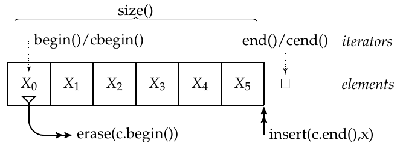
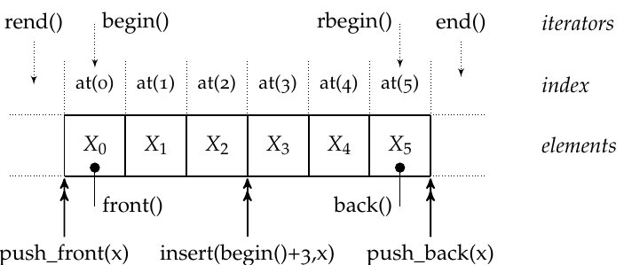
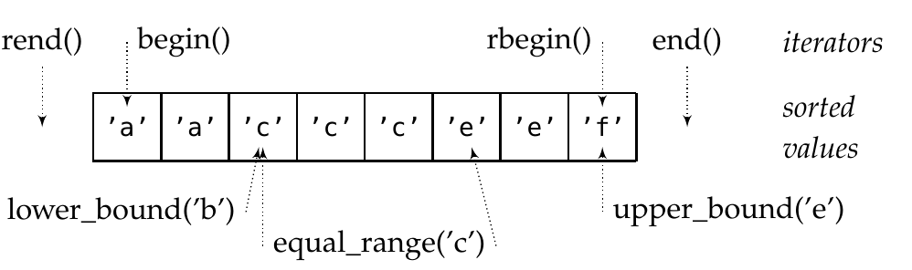

# STL Containers

Die STL bietet diverse Container an - daher ist es wichtig zu Wissen *wann* *welcher* container genutzt werden soll.

Vorsicht: Generell sollten die Memberfunktionen der Container den Algorithmen aufgrund besserer Performance vorgezogen werden - bsp. `v.count()` statt `std::count(v.begin(), v.end())`

Für die Typisierung sollte das `auto`-Keyword verwendet werden, da dies wesentlich besser lesbar ist! (Beispiel: `auto it` vs `std::vector<int>::const_reverse_iterator it`)


## Allgemeines Container-API


: Quelle: CPl Vorlesung

* `cbegin()`, `cend()`
* `insert(iter, value)` Element einfügen
* `erase(iter)` Element entfernen
* Konstruktoren
    * Default
    * Copy

    ```c++
    // Vektor mit den Werten 1,2,3,5,7,11
    std::vector<int> v{1,2,3,5,7,11};
    // Vektoren mit 5 Elementen, mit 42 default initialisiert,
    // also {42, 42, 42, 42, 42}
    // Runde Klammern wenn mehrdeutig
    std::list<int> l(5,42);
    // Wenn nicht mehrdeutig auch mit `{}`
    // also {"foo", "foo", "foo", "foo", "foo"}
    std::vector<string> l{5,"foo"};
    // Container mit zwei Iteratoren
    std::deque<int> q{begin(v),end(v)};
    ```

* Container mit gleichem Typ können mit `==` verglichen werden.
* Können mit `clear()` geleert werden (`empty() == true`)

## Iterator Kategorien

Iterator Kategorien sind ähndlich wie Java Markers, bsp. `Clone`.

Der Vorteil mächtiger Iteratoren ist, dass komplexe Algorithmen effizienter und besser lesbar umgesetzt werden können.

In den Dokumentationen der Algorithmen wird spezifiziert, welche Art von Iterator benötigt wird.
Derzeit können "Anforderungen" an Iterator noch nicht als bsp. Typ bei der Funktionsdeklaration spezifiziert werden - soll in einem späteren C++ ermöglicht werden.


### Input Iterator

* Ist "one pass" - der Wert kann als nur ein Mal gelesen werden
* Aktuelles Element lesen/schreiben `*it`
* Präfix increment `it++`
* Postfix increment `++it`
* Prüfen auf (un-)gleichheit `==`, `!=`

### Forward Iterator

* **Ist "multipass" - der Wert kann als nur ein mehrfach gelesen werden**
* Aktuelles Element lesen/schreiben `*it`
* Präfix increment `it++`
* Postfix increment `++it`
* Prüfen auf (un-)gleichheit `==`,

### Bidirectional Iterator

* Ist **"multipass"** - der Wert kann als nur ein mehrfach gelesen werden
* **Präfix decrement** `it--`
* **Postfix decrement** `--it`
* Aktuelles Element lesen/schreiben `*it`
* Präfix increment `it++`
* Postfix increment `++it`
* Prüfen auf (un-)gleichheit `==`,

### Random access iterators

* Ist **"multipass"** - der Wert kann als nur ein mehrfach gelesen werden
* **Präfix decrement** `it--`
* **Postfix decrement** `--it`
* **Index Zugriff** `it[4]`
* Aktuelles Element lesen/schreiben `*it`
* Präfix increment `it++`
* Postfix increment `++it`
* Prüfen auf (un-)gleichheit `==`,

# Output Iterator

* Spezialfall: Man darf *genau einmal* schreiben (analog `std::cout`)
* Nur einmal schreiben (analog ostream_iterator)
* Die meisten Iteratoren können auch als Output Iteratoren verwendet werden, wenn diese nict `const` sind.
* Keine Vergleiche
* Ende nicht abfragbar


## Iterator Funktionen

### distance
Retourniert die Anzahl benötigter increments, um von Element `first` zu `last` zu gelangen - kann negativ sein.

```c++
std::vector<int> v{ 3, 1, 4 };
std::cout << std::distance(v.begin(), v.end()) << '\n'  // 3 (v.end() ist *nach* dem Letzten Element)
          << std::distance(v.end(), v.begin()) << '\n'; // -3
```

Hat Komplexität $$O(1)$$, falls ein RandomAccessIterator verwendet wird.

### advance
Inkrementiert den gegebenen iterator n Mal.

```c++
std::vector<int> v{ 3, 1, 4 };
auto vi = v.begin();
std::advance(vi, 2);
std::cout << *vi << '\n'; // 4
```

Hat Komplexität $$O(1)$$, falls ein RandomAccessIterator verwendet wird.

### next

Gibt den n-ten Nachfolger vom gegebenen Iterator zurück.

```c++
std::vector<int> v{ 3, 1, 4 };
auto it = v.begin();
auto nx = std::next(it, 2);
std::cout << *it << ' ' << *nx << '\n'; // 3 4
```

## Sequence Containers

* Geordnet in Reihenfolge des Einfügens
* Lists sind Gut für splicing / Einfügen in der Mitte → Recap AD1
* Zugriff in $$O(n)$$
* `std::vector` (analog zu Javas ArrayList)
* `std::deque`
    * Wie `std::vector` aber mit effizientem Einfügen am Anfang und Ende
* `std::list` (Doubly-Linked-List)
* `std::forward_list` (Singly-Linked-List) → Nur


: Sequence Container API - Quelle CPl Vorlesung

### Spezialfall: `std::array`

* `std::array` ist ein Einfacher wrapper für C-Array
* Grund: Fixed Size - grösse Abfragbar (in C Arrays nicht möglich)
```c++
// DOPPELTE KLAMMERN!
std::array<int,6> a{{1,1,2,3,5,8}};
```

## (Sorted) Associative Containers

* Sortiert
* Gibt Varainten mit unique Key und Multikey.
* Suche und Zugriff mit Key
* Zugriff in $$O(log(n))$$
* `std::set`, (`std::set<int> s{7,1,4,3,2,5,6};`)
    * `find()`
    * `count()`
    * `count(x)`: Kann nur 0 oder 1 zurückgeben → Überprüft, ob X im set ist
* `std::map` (`std::map<char,size_t> vowels {{'a',0},{'e',0}, ...;`)
    * Intern nach Key soritert
    * Zugriff mit index Operator: `++vowels[c];`
    * Wert ist `std::pair<key, value>`
        * Zugriff auf key: `.first`
        * Zugriff auf Wert: `.second`
    * Default-Wert wird initialisert!
    ```c++
    std::map<std::string,size_t> words;
    std::string s;
    while (std::cin >> s)
        ++words[s];
    ```
* `std::multiset` (`std::multiset<char> letters{};`)
    * mehrere gleiche Werte sind erlaubt
    * `equal_range('b')` m `lower_bound('c')` und `upper_bound('c')`


: Multiset/Multimap API - Quelle CPl Vorlesung

## Hashed Containers
* Unsortiert
* Zugriff in $$O(1)$$
* Vorsicht: Nicht jedes objekt hat Hash-Wert!
* "Don't use unordered_set with own types, unless you are an expert in hash functions and you benefit from the speedup"
* `unordered_set<char>`
* `unordered_map`

## Weiters

### Stack

* `pop()` IST void
* `top()`
* `push(x)`
* Keine Iteration möglich

```c++
std::stack<int> s{};
s.push(42);
std::cout << s.top();
s.pop();
```

### Queue/PQ

* `push()` delegates to `push_back()`
* `front()` delegates to `pop_front()`
* Keine iteration möglich

```c++
std::queue<int> q{};
q.push(42);
std::cout << q.front();
q.pop();
```
## Ungültigkeit

Ein Wert kann mehrfach aus einem iterator gelesen werden. Sobald eine von n Referenzen inkrementiert wird werden alle referenzen ungültig!

```c++
*it++
```

++ Als Postinkrement gibt als expression den vorherigen wert zurück. Muss sich also kopieren und diese Kopie zurückliefern. Da `++` alle kopien davon ungültig macht kann mit der Kopie nicht weitergearbeitet werden.
