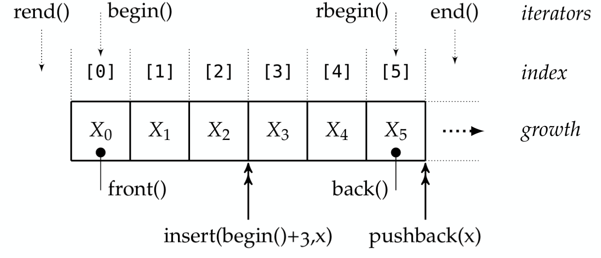

Sequences
=========
* Recap: } -> "Best Garbage Collector"
* Alles weg

std::vector
-----------

Kette von Elementen Bsp. Arraylist in Java.
Vector in C++ **beinhaltet** die Elemente (!= Referenzen in Java)

Vector ist ein **container**

.. code:: c++

    // Vector mit den Werten 1,2,3,4,5 initialisiern
    std::vector<int> v{1,2,3,4,5};
    std::vector<int> v{};

    // Vektor mit 10 2er initialisiern
    std::vector<int> v(10, 2);

    // Anzahl der Elemente, für die Platz geschaft werden soll
    std::vector<int> v(6);

    // extend a vector:
    v.push_back(42);

    // Vektor aus input stream füllen
    using input=std::istream_iterator<int>;
    input eof{};
    std::vector<int> v{};
    copy(input{std::cin}, eof, back_inserter(v));
    // or
    std::vector<int> const v{input{std::cin}, eof};

Todo: Kärtli: vector<string> vs{6} bs vector<string> vs(6)

.. todo::

    FRAGE: WANN RUNDE KLAMMERN UND WANN {} bei Konstruktor?
    Was sind template klassen / template typename perameter?

iteration
----------
Bad iterator style:

.. code:: c++

    for (size_t i=0l i < v.size(); ++i){
        std::count << "v[" <<i<<"] = " << v[i] << '\n';
    }

Problem bei Zugriff out of bound: "Undefined Behaviour" (keine Exeption)

Besser - aber immernoch doof

.. code::

    for (std::vector<int>::size_type i=0; v < v.size(); ++i){
        std::cout << v.at(i) << '\n';
    }

size_type garantiert den Typ - `at` ist bound-checked (aber slow)

besser:

.. code:: c++

    // Auto: Typ wird passend aus v ausgewählt
    // i enthält eine KOPIE!
    for(auto const i:v){
        std::cout << "element: " << i << '\n'
    }

am besten:

.. code:: c++

    // Auto: Typ wird passend aus v ausgewählt
    // i ist das gleiche Element - also eine REFERENZ
    for (auto &j : v){
        j *= 2;
    }

    // Wenn nicht verändert
    // USE CONST AS MUCH AS POSSIBLE
    for (cont auto &j : v){
        std::cout << i
    }

C++ Iteratiroen
...............
"Dümmer als in Java" - wissen nicht, wann fertig!
Darum: Merke begin iterator und end iterator
Wenn iterator = end iterator - fertig!

Vorsicht! So wenig schleifen wie möglich Nutzen!
Statessen algorithms nutzen!

cbegin = element im iterator ist KONSTANT
begin = Element im iterator ist nicht konstant
=> Kärtli!

Folgender Code ist PFUI!

.. code:: c++

    //cbegin(v) : aktueller iterator
    //cend(v) : ende iterator
    //cbegin(v) == cend(v) : Am Ende
    // ++i : nächstes Element
    for (auto it=cbegin(v); it!=cend(v);++it){
        // Zugriff auf das aktuelle Element aus dem Iterator
        // mit *it
        std::cout << *it << ", ";
    }

**Iterator = Glue zwischen Container und Algorhtmen**

There are special iterators for I/O

.. code:: c++

    include <iterator>

    // Copy everything from v comma spearated into stdout
    copy(begin(v), end(v), std::ostream_iterator<int>{std::cout, ", "});

    // analog dazu:
    std::istream_iterator<T>
    // endet, wenn nicht mehr `good()`

    // shorten using with alias
    // DANGER: Ignores whitespaces!
    using input = std::istream_iterator<std::string>;

    // For a "prefect copy"
    using input=std::istreambuf_iterator<char>;

    // The default-constructed std::istream_iterator is known as the end-of-stream iterator
    input eof{};

Complete example for copying stdin to stdout:
.. code:: c++

    #include <iterator>
    #include <iostream>
    #include <algorithm>
    int main(){
        using input=std::istreambuf_iterator<char>;
        input eof{};
        input in{std::cin};
        std::ostream_iterator<char> out{std::cout};
        copy(in,eof,out);
    }

algorithms
----------
``count``, ``distance``, ``for_each``, ``accumulate``
frage:
    In den Folian: count(begin(s),end(s),' ')

    -> crbegin? rbegin?

Labdas sind first class vaues!

.. code:: c++

    void print(int x){
        std::cout << "print:" << x++ << '\n';
    }
    // ..
    for_each(crbegin(v), crend(v), print);

lambda
------

Closure? How to copy(=) or reference &

.. code:: c++

    // TODO: does it work?
    for_each(crbegin(v), crend(v),  -> void {
    // Void can be omitted
    //for_each(crbegin(v), crend(v),  {
        std::cout << x
    });

Weiters
--------

.. code:: c++

    // Range berechnen
    std::vector<double> w{};
    double x{2.0};
    generate_n(std::back_inserter(w), 5, [&x]{return x*=2.0;});

    // Range mit Zahlen 1,2,3,4... füllen
    std::vector<int> v(100);
    iota(begin(v), end(v), 1);
