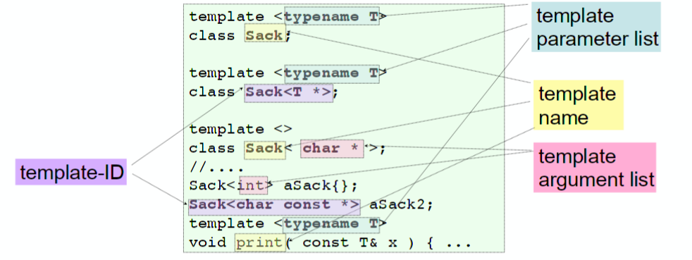

# Template Function

Template Functions ermöglichen Typsichere Container und Funktionen ähnlich wie Generics in Java. Dies ermöglicht, Funktionen und Typen für Typen wiederzuverwenden, welche erst später definiert werden (Bsp. `std::vector` wurde von `MyClass` geschrieben, kann aber trotzdem zusammen verwendet werden: `std::vector<MyClass>`)

Im Gegensatz zu Generics in Java wird der Typenname implizit bei der Benützung bestimmt.

In der Vergangenheit gab es Probleme wie verwirrende Compiermeldungen. Diese Probleme sind heute aber behoben.

## Kontext (Lambdas)

Lambdas können Definiert werden, ohne dass ein Typ für die Parameter oder den Rückgabewert angegeben werden muss. Alle Werte werden am "Ort des Geschehens" zur Laufzeit bestimmt.

```c++
[x=1](auto y){return x*y;}
```

## Definition

Eine Template-Funktion wird einmal definiert und kann beliebig oft mit unterschiedlichen typen instantiiert werden.

Für die Definition wird das Keyword `template` zusammen mit Eckigen Klammern verwendet `<>`. Oft werden Template-Funktionen inline definiert.

!!! todo

    Warum inline?

```c++
namespace MyMin{
template <typename T>
// inline definition!
T const& min(T const& a, T const& b){
    return (a < b)? a : b ;
}
}
```


## Verwendung

template argument deduction
: T wird automatisch beim Funktionsaufruf anhand der argumente bestimmt (zur Compiletime!)

Um die definierte Template-Funktion zu Verwenden, kann diese einfach mit den ensprechenden Typen aufgerufen werden. Die Template-Function wird bei der Verendung für die gegebenen Argumente instantiiert.

```c++
#include "MyMin.h"
#include <string>

int main(int argc, char **argv) {
    using MyMin::min;
    const int i{88};
    min(i, 42); // min<int>()

    const double pi{3.1415};
    const double e{2.7182};
    min(pi, e); // min<double>()
    min(2, pi); // Compile error!
    min(static_cast<double>(2),pi); // min<double>()

    std::string s1{"Hello"};
    std::string s2{"Hello World"};
    min(s1, s2); // Compilererror: min ist mehrdeutig (*)
    MyMin::min(s1, s2);  // MyMin::min<string>()

    min("Pete","Toni"); // Result: "Toni" (**)
    min<std::string>("Pete", "Toni"); //Result: "Pete"
    min("Pete"s, "Toni"s); //Result: "Pete"
}
```

*: TODO

**: String-Literals sind `char arrays`! Darum wird hier der Pointer mitgegeben - und dann werden die Pointer verglichen - daher das falsche Resultat.

!!! todo

    * Warum ist min(s1, s2) mehrdeutig?

## Concepts

**Anforderungen** an Template-Typen werden implizit bei dern Verwendung evaluiert.

Im Falle von `min` sind die Concepts:

* `operator<(T, T)` muss auf `T` definiert sein.
* Rückgabewert muss in `bool` konvertierbar sein - Bsp. `void` ist nicht möglich.

!!! todo

    Was für andere Kozepte für `max`?!
    ➪ Muss kopierbar / "movebar" sein. (Rückgabetyp)
    Folie 11

## Overloading

Funktion-Overlading ist möglich - wobei immer die spezifischste Funktion gewinnt.

* Overloading sollte im allgemeinen vermieden werden.
* Die Sichtbarkeit der Overloads muss gleich sein
* Alle Deklarationen sollten in einen gemeinsamen Header

```c++
namespace MyMin{
template <typename T>
T const& min(T const& a, T const& b){
    return (a < b)? a : b ;
}

// Funktioniert, da spezifischer!
char const * min(char const* a, char const * b){
    // TODO: Don't do this inline - avoid std::string in header!
    return std::string(a) < std::string(b)? a:b;
}
}
```

## Variadic
Ermöglicht 0..n Argumente mitzugeben.

```c++
template <typename...ARGS>
void variadic(ARGS...args){
    println(std::cout,args...); // println is also a variadic template function
}
```

Wenn explizit minimal ein Argument benötigt wird, muss dies zusätzlich angegeben werden:

```c++
void println(std::ostream &out)
{
    out << "\n";
}

template<typename HEAD, typename... Tail>
void println(std::ostream &out, Head const& head, Tail const& ....tail){
    out << head;
    if(sizeof...(tail)){
        out << ", ";
    }
    println(out, tail...); // recursive call
}
```

```
out, x, [y, z]
out, y, [z]
out, z, []<- Tail ist leer
out
```

# Class Templates = Template Clases
Class Templates funktionieren gleich wie function templates - einfach für Klassen und Structs.

Ein wesentlicher Unterschied ist aber, dass im Gegensatz zu template Functions **der Typ immer angegeben werden muss** - auto-deduction funktioniert also nicht.

Wie bei Function Templates können für Class Templates folgende "Dinge" als Parameter für Templates angegeben werden:

* Typen (Klassen, int) mit `typename`
* Ganzzahlige (Compile-Zeit)-Konstante (Bsp.`std::array<int, 3>`)
* Andere Templates

Die Template-Parameter Klasse können auch auf allen data members und function members verwendet werden.

Type aliases
: Ein einfacher alias auf einen andere typ - bsp. `using SackType=std::vector<T>`. Benötigt für *dependent Types* das `typename` Keyword `using size_type=typename SackType::size_type;`

Template definition
: `template <typename T> class Sack {...};`

Template deklaration
: `template <typename T> class Sack;` (Vorwärtsdeklaration)

Template Klasse explizite Spezialisierung
: `template<> class Sack<char const *> {...};`

Partielle Template Spezialisierung
: `template<typename T> class Sack<T *> {...};`

Template Klasse Member Spezialisierung
: `template <> void Sack<char const *>::putInto(char const *p) {...}`



Eine Implementation könnte wie folgt aussehen:

```c++
#ifndef SACK_H_
#define SACK_H_
#include <vector>   // Implementation specific
#include <random>
#include <stdexcept>

template <typename T,
    template<typename...> class container=std::vector>  // Optional: container Typ
class Sack
{
	using SackType=container<T>;     // Type alias
	using size_type=typename SackType::size_type; // dependent type alias- needs `typename` keyword
	SackType theSack{};
public:
	bool empty() const { return theSack.empty() ; }
	size_type size() const { return theSack.size();}
	void putInto(T const &item) { theSack.push_back(item);}
	T getOut() ;           // Member function forward declaration
};

// Member deklaration ausserhalb der class template
template <typename T>
inline T Sack<T>::getOut(){
		if (! size()) throw std::logic_error{"empty Sack"};
		auto index = static_cast<size_type>(rand()%size());
		T retval{theSack.at(index)};
		theSack.erase(theSack.begin()+index);
		return retval;
}

// Simple Factory Method - type deduction works 🎉
#include <initializer_list>
template <typename T>
Sack<T> makeSack(std::initializer_list<T> list){
	Sack<T> sack;
	for (auto it=list.begin(); it != list.end(); ++ it)
		sack.putInto(*it);
	return sack;
}
#endif /*SACK_H_*/
```

Für `T` gelten folgende Concepts:

* Typ `T` muss in einen **Vector** passen → `CopyAssignable` und  `CopyConstructible`
* `T` darf nicht `void` sein. Es werden **Referenzen** übergeben, und weil es von `void` keine Objekte gibt, kann es folglich keine Referenzen darauf geben.
* **Kopierbar** sein, da es returns gibt, wo keine Referenz überegeben wird. Movebar wäre hier auch eine Option.
* Die Methode `at` liefert eine Objektreferenz zurück → T einen **Kopierkonstruktor haben** (nicht movable)


## Regeln

* Müssen komplett im Header-File implementiert werden
    * Grund: Compiler muss Typ kennen um effizienter code generiern zu können
    * Direkt als member Funktionen in der Klasse
    * Alternativ als inline Funktionen im header file (etwas hässlicher)
* Für Typen Aliase, die die direkt oder indirekt auf Template-Parametern basieren muss das `typename` Keyword nagegeben werden.
* Statische Member-Varibalen (`static`) einer Template-Klasse können problemlos definiert werden (ohne gegen One-Definition-Rule zu verstossen.)
* Zugriff auf Members der Parent-Klasse immer mit `this` (oder class name::) damit immer das richtige Passiert - bsp. nicht variablen aus dem globalen namespace verwendet werden (Siehe Folie 12, Vorlesung W12)

Vorsicht: Template methoden, die nicht aufgerufen werden werden nicht kompiliert - kann zu Fehler führen, bsp. dass ein Template Parameter nicht movable sein muss.


## (partielle) Template Spezialisierung

Beispiel: Pointer verbienten aber Strings zulassen. Problematisch, weil Strings character Pointer sind.


```c++
#ifndef SACKSPECIALIZATIONS_H_
#define SACKSPECIALIZATIONS_H_

template <typename T> class Sack; // forward declaration

// Pointer verbienten
template <typename T>
struct Sack<T*>
{
	~Sack()=delete;    // Destruktor löschen = Konstruktoren löschen
};

#include <vector>
#include <string>
#include <stdexcept>
template <>
class Sack<char const *> {
	typedef std::vector<std::string> SackType;
	typedef SackType::size_type size_type;
	SackType theSack;
public:
	// Specific implementation....
	bool empty() { return theSack.empty() ; }
	size_type size() { return theSack.size();}
	void putInto(char const *item) { theSack.push_back(item);}
	std::string getOut() {
		if (! size()) throw std::logic_error{"empty Sack"};
		std::string result=theSack.back();
		theSack.pop_back();
		return result;
	}
};
#endif /*SACKSPECIALIZATIONS_H_*/
```

### Regeln

* Das nicht-spezialisierte template muss zuerst deklariert werden (Vorwärtsdeklaration).
* Die spezifischste Version wird verwendet


## Factory-Methoden

Factory-Methoden können genutzt werden, um argument deduction mit Class Templates zu nutzen.

```c++
#include <initializer_list>
template<template<typename...> class container, typename T>
Sack<T> makeSack(std::initializer_list<T> list){
    return Sack<T>{list};
    // oder wenn kein initializer_list konstruktor
    Sack<T> sack;
    for (auto const & elt : list){
        sack.putInto(*elt);
    }
    return sack;
}
// Usage
// Nur das Template, welches ganz rechts ist kann mit auto-deduction evaluiert werden.
auto setsack = mySack<std::set>({'a', 'b', 'c'})
```

## Vererbung - Von Standard Containern ableiten

```c++
template<typename T>
struct safeVector:std::vector<T> {

// Alle Konstruktoren erben
using std::vector<T>::vector;
using size_type=typename std::vector<T>::size_type;

decltype(auto) operator[](size_type i){ // or T & als return type
	return this->at(i);
}
decltype(auto) operator[](size_type i) const { // or T const &
	return this->at(i);
}

};
```

Vorsicht: Mit`decltype` funktionierne `auto` auch mit Referenzen.

## Tips:

Initializer list

```c++
// in der definition
Sack(std::initializer_list<T> il):theSack(il){}

// Verwendung
Sack<char> aSack{'a', 'b', 'c'};
```


!!! todo

    * Recap Klammern Konstruktor: `()` vs. `{}`
