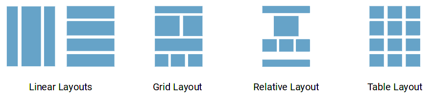
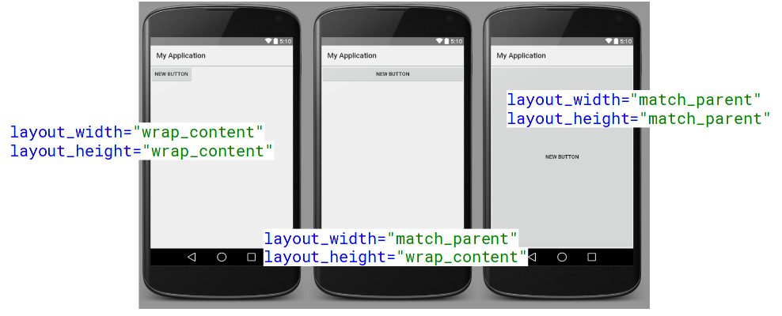
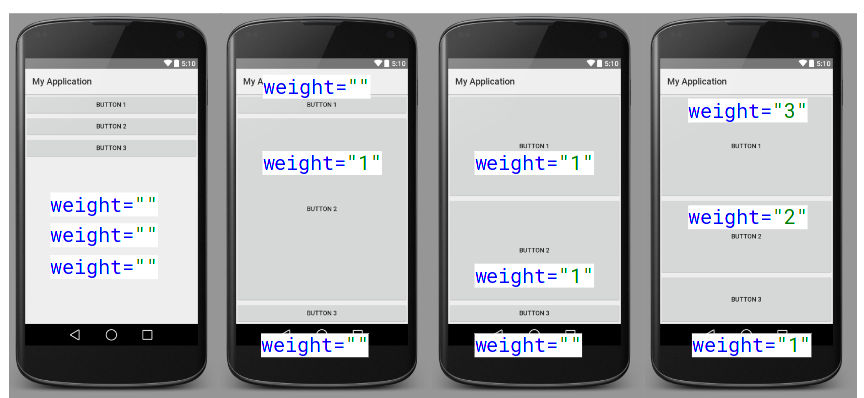

Grundlagen GUI Programmierung
=============================

.. seealso::

    `W02 - Grundlagen der GUI-Programmierung <https://docs.google.com/presentation/d/1tb-dj9ZSPiaYXGIRMvbM1lN18KTmAMkSK93f19S6Zok/edit>`_

.. todo::

    Was ist relevant für Prüfung?
    Welche XML-Attribute etc müssen auswendig gelernt bzw. in den Spick aufgenommen werden?
    Merke: ``tools:`` namespace nur für GUI-Builder

Übersicht
---------
* Imperativ mit Java-Code
* Deklarativ mit XML und GUI-Builder
    * IDs deklarieren mit beispielsweise ``android:id="@+id/myId"`` (mit Plus)
    * Alle IDs werden in die Klasse ``R`` generiert
    * ID/Referenz verwenden mit beispielsweise ``android:src=@mipmap/ic_launcher`` (ohne Plus)
    * Name eines Tags, beispielsweise TextView, entspricht einer klasse im SDK.
    * Eigene Elemente können analog eingebunden werden.
    * Resourcen ermöglichen unterschiedliche Varianten je Gerät, Sprache usw. zu verwenden

Views
-----
* View ist Basisklasse um Userinterfaces zu bauen und verantwortlich für ...
    * ... Inhalt zu zeichnen
    * ... Events behandeln (Touchinput...)

Widgets und ViewGroups (Bsp. LinearLayout) sind Unterklassen von View.

ViewGroups sind eine Unterklassen von View und beinhaltet andere Views (Composite Design Pattern)

Views, die in XML deklariert sind werden automatisch instantiiert ( Beispielsweise ``R.layout.activity_main``).

Widgets
-------
Abgrenzung: Widgets für im GUI und nicht Widgets auf dem Home-Screen

Widgests sind "Konkrete Elemente" wie Buttons etc.

Es gibt im SDK viele unterschiedliche Widgets - unter anderem:

* Passwort
* Telefon Nummer
* Uhrzeit
* Button
* Toggle
* Stars
* ...

Vorteil: Optimale Eingabemethode.

Layouts
-------

Breite und Höhe eines Layouts:

    * match_parent: Nimmt den gesammten Platz des Parents ein
    * wrap_content: Nur so viel platz wie nötig.
    * Absolute Grössen: nur selten empfehlenswert

Linear Layout
.............
* Alle gleich viel Platz
* layout_weight: Gewichtung, für mehr Platz.

Relative Layout
...............
* Kinder werden relativ zu einander angeordnet
  Bsp: "unterhalb von X und neben Z"
* sehr vielseitig

Ressourcen
----------

* drawables (Bilder)
* menu (Menus)
* values (Strings/Konstanten):
    * Zugriff mit ``getString(R.string.app_name``)
    * Zugriff in XML über: ``@string/app_name``
    * ``strings.xml`` (Unterordner für Sprache, bsp. de)

.. code:: xml

    <resources>
        <string name="app_name">My Application</string>
        <string name="hello_world">Hello world!</string>
        <string name="action_settings">Settings</string>
    </resources>

Dimensionen
-----------
* Einheit: dp/dip (Density-independent Pixels)
    * Werden Pixel werden mit der Auflösung skaliert.
* in ``dimens.xml``
* Für Schriften: sp

Events und Listeners
---------------------
* Eventloop - analog zu JS
* Nur Main-Thread darf GUI verändern
* Listener auf Objekt registrieren, bsp. ``OnTouchListener``, ``OnClickListener`` `usw. <https://developer.android.com/guide/topics/ui/ui-events.html>`_

.. code:: java

    button.setOnClickListener(new View.OnClickListener() {
        @Override
        public void onClick(View v) {
            // ...
        }
    });

Alternativ: im XML definieren. Dafür muss Activity-Klasse die Methode implementieren (für kleine Acitvities):

.. code:: xml

    android:onClick="onButtonClicked"

.. code:: java

    public void onButtonClicked(View view)

.. seealso::

    `The Android Event Loop <http://mattias.niklewski.com/2012/09/android_event_loop.html>`

GUI-Objekte finden
-------------------

.. code:: java

    // Sucht im aktuellen Layout - das mit setContentView gesetzt wurde
    Button button = (Button) findViewById(R.id.button);
    EditText editText = (EditText) findViewById(R.id.editTextA);

Bsp. Inputvalidierung
----------------------

.. code:: java

    final EditText password = (EditText) findViewById(R.id.password);
    password.addTextChangedListener(new TextWatcher() {
       @Override
       public void afterTextChanged(Editable s) {
           String pw = s.toString();
           if (s.length() < 8) {
               password.setError("Passwort muss mindestens 8 Zeichen lang sein.");
           }
       }
       // ...
    });
