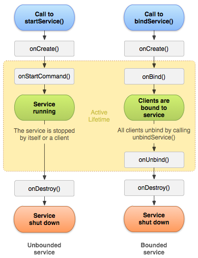

## Hintergrundtasks

Problem: Lang **laufende Tasks blockieren den UI-Thread** (bsp. Download).
Der **Main/UI-Thread koordiniert Events**, zeichnet GUI (Event-Loop - siehe Grundlagen)

### AsyncTask (schön)

```java
class DownloadBitmapTask extends AsyncTask<String, Integer, Bitmap> {
    @Override
    protected void onPreExecute() {
        // Wird im UI-Thread ausgeführt
        super.onPreExecute();
    }
    @Override
    protected Bitmap doInBackground(String... params) {
        // Background Task
        publishProgress(10);
        return download(params[0]);
    }
    @Override
    protected void onPostExecute(Bitmap bitmap) {
        // Wird im UI-Thread ausgeführt
        imageView.setImageBitmap(bitmap);
    }
    @Override
    protected void onProgressUpdate(Integer... values) {
        // Wird im UI-Thread ausgeführt
       progressBar.setProgress(values[0]);
    }
}
new DownloadBitmapTask().execute("http://slow.hsr.ch/hsr_cat.bmp");
// Evtl aufruf wie folgt, da sonst ClassCastException
new DownloadBitmapTask().execute(new String[]{"http://slow.hsr.ch/hsr_cat.bmp"});
```
### Runnable (unschön)
```java
public void onClick(View v) {
Runnable runnable = new Runnable() {
   @Override
   public void run() {
       // Hier kann nicht auf UI zugegriffen werden!
       final Bitmap bitmap = download("http://slow.hsr.ch/hsr_cat.bmp");
       // command wird im UI-Thread ausgeführt
       Runnable command = new Runnable() {
           @Override
           public void run() {
               imageView.setImageBitmap(bitmap);
           }
       };
       imageView.post(command);
   }
};
Thread thread = new Thread(runnable);
thread.start();
}
```

### Services
 Services dienen dazu, Aufgaben im Hintergrund auszuführen, deren Abarbeitung das UI zu lange blockieren würde wie **Abspielen von Musik oder Laden von Daten über das Netzwerk**.

Services **werden im UI gestartet** (einmalige Aufgabe, `startService(intent)`) **oder gebunden** (längere Zeitdauer, `bindService(intent, ...)`), **laufen UI-Thread** und **laufen weiter**, wenn die App gewechselt wird. Zudem müssen sie in in der **Manifest-Datei deklariert werden**.


Mit dem AsyncTask kann eine Aufgabe *vom Main-Thread* entkopppelt werde während ein Service *von Context* entkoppelt.

```xml
<application>
   <service
       android:name=".ExampleService"
       android:exported="false" /> <!-- Dieser Service steht nur der eigenen App zur Verfügung -->
</application>
```

#### Started Service
Für einmalige Aufgaben (z.B. Download) im Hintergrund (und wird nicht gestoppt), auch wenn der Anwender die App wechselt oder der startende Context zerstört wird. Der **Service sollte sich beenden, wenn die Arbeit getan ist**.

```java
// Service starten
Intent intent = new Intent(this, SimpleService.class);
startService(intent);
// Service stoppen (im Service selbst)
stopSelf();
```

#### Bound Services
Beim Aufruf von `bindService()` erhält der **Client ein Interface**, um mit dem Service zu **kommunizieren**. App kann Funktionalität so anderen Apps zur Verfügung stellen. Nachdem **alle Clients `unbindService()`** aufgerufen haben, wird der **Service beendet**.

```java
public class LocalService extends Service {
   private final IBinder binder = new LocalBinder();
   public class LocalBinder extends Binder {
       LocalService getService() {
           return LocalService.this;
       }
   }
   @Override
   public IBinder onBind(Intent intent) {
       return binder;
   }
   public int getRandomNumber() {
       return new Random().nextInt(100);
   }
}
// Client
private ServiceConnection connection = new ServiceConnection() {
   @Override
   public void onServiceConnected(ComponentName className,
                                  IBinder binder) {
       LocalService.LocalBinder myBinder = (LocalService.LocalBinder) binder;
       LocalService myService = myBinder.getService();
       int random = myService.getRandomNumber();
   }
   @Override
   public void onServiceDisconnected(ComponentName name) { }
};
Intent intent = new Intent(this, LocalService.class);
bindService(intent, connection, Context.BIND_AUTO_CREATE);
```

#### Datenrückgabe

* Variante Broadcast: Service verschickt und die Activity stellt einen Broadcast Receiver zur Verfügung, der Intent empfängt. (Siehe nächstes Kapitel)
* Variante `PendingIntent` (nicht prüfungsrelveant)

### Broadcasts
Das **System verschickt Meldungen** wie SMS empfangen, System wurde gebootet, Akku schwach, Power Connected usw. per Broadcast. Broadcast **Receiver können registriert** werden, um bestimmte Meldungenzu erhalten. Zudem können auch **Apps Meldungen per Broadcast verschicken**.

Statischer Receiver in der Manifest registrieren. Receiver wird bei jeder Meldung neu instanziert und ist somit an keine Activity gebunden

```xml
<receiver android:name=".TimeChangedReceiver">
   <intent-filter>
       <action android:name="android.intent.action.TIME_SET" />
   </intent-filter>
</receiver>
```

Dynamisch registrieren in Java. Anmeldung über Activity.

```java
// Muss von BroadcastReceiver ableiten...
private class MyBroadcastReceiver extends BroadcastReceiver {
   public MyBroadcastReceiver(MainActivity activity) {
   }
   @Override
   public void onReceive(Context context, Intent intent) {
   }
}
// Anmelden
LocalBroadcastManager lbm = LocalBroadcastManager.getInstance(getApplicationContext());
IntentFilter filter = new IntentFilter(Intent.ACTION_BOOT_COMPLETED);
MyBroadcastReceiver receiver = new MyBroadcastReceiver(this);
lbm.registerReceiver(receiver, filter);
//Abmelden
LocalBroadcastManager lbm = LocalBroadcastManager.getInstance(this);
lbm.unregisterReceiver(receiver);
// senden
Intent intent2 = new Intent(ACTION); // Bsp. ACTION = "hsr.example.fractalapp2.ACTION"
lbm.sendBroadcast(intent2);
```

* Namensgebung der Action ist global, bei eigenen Actions Name mit eigenem Namespace verwenden
* Beim `Intent` können mit `putExtras` (Bundle) zusätzliche Daten hinterlegt werden
* Nutze `LocalBroadcastManager` um im selben Prozess zu senden

### Content Provider

Bsp. Android stellt Daten über Content-Provider zur Verfügung: Kalender, Kontakte, ...
**Stellt Daten prozessübergreifend zur Verfügung** und stellt Daten zur Verfügung, die in einer Datenbank abgelegt sind. Die Schnittstelle ähnelt stark der SQL-Syntax. Content Provider kann **Permissions setzen**, um den Zugriff auf die Daten einzuschränken oder zu schützen, **Client** muss die erforderlichen **Permissions im Manifest angeben** (`uses-permission`)

```java
Cursor cursor = getContentResolver().query(
       UserDictionary.Words.CONTENT_URI, // content://user_dictionary/words
       mProjection, // columns
       mSelectionClause, //criteria
       mSelectionArgs,
       mSortOrder);
int index = cursor.getColumnIndex(UserDictionary.Words.WORD);
while (cursor.moveToNext()) {
String word = cursor.getString(index);
}
```
