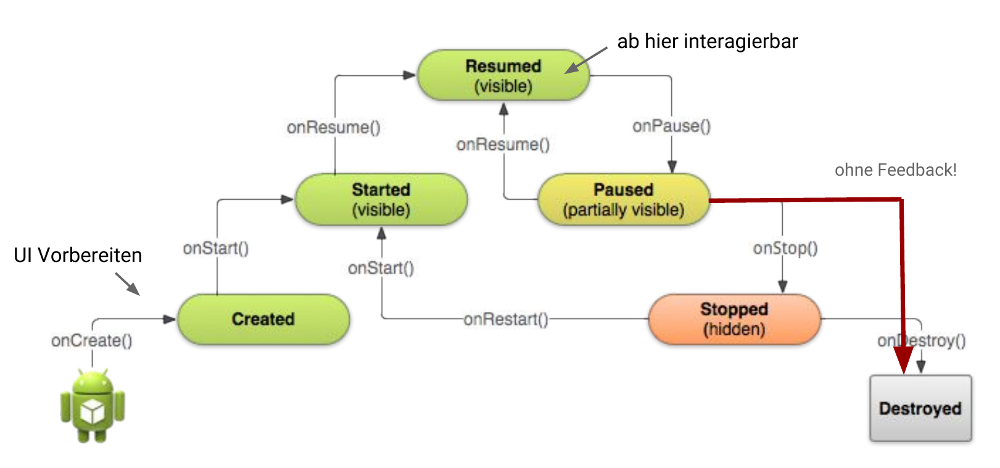

# Android
* Android System kontrolliert den Lifecycle und die Kommunikation zwischen den Komponenten. Komponenten sind Activities (~ Screens), Services, Content Provider, Broadcast Receivers.

## Konzepte
**Activity**

* Activities sind Bausteine, welche die Interaktion mit dem Benutzer regeln.
* Die Klasse **MainActivity wird vom System aufgerufen** (kein "public static void")
* **Konstruktor nicht nutzbar** für "Initialisierung" - sondern "on"-Methoden nutzen
* Die **On-Methoden** werden **beim Zustandwechsel** vom System aufgerufen (Template-Method Pattern).

<figure>
    
    <figcaption>Der Lifecycle einer Activity</figcaption>
</figure>

* Vorsicht: **on-stop wird nicht garantiert aufgerufen**. Darum sollten Daten unbedingt bei on-pause gesichert werden.
* Jegliche "**Konfigurationsänderung**" (auch wenn man den Viewport dreht) hat einen **Reset** zur Folge

```java
startActivityForResult(intent, SOME_ID);
@Override protected void onActivityResult(int request, int result, Intent data) {
    if (result == Activity.RESULT_OK && request == SOME_ID) { /* Resultat verarbeiten */ } }
```

**Task**

* Ein Task ist ein Stack von Activities (Bsp. je App ein Stack).
* Defaultverhalten des Back-Buttons: Popt activity vom Stack.

**Intents**

* Kommunikation zwischen Komponenten erfolgt über Intents (Absicht, Vorhaben)

```java
Intent intent = new Intent(this, CalculateActivity.class); // Explizit (Typischerweise interne Activities)
Intent i2 = new Intent(MediaStore.ACTION_IMAGE_CAPTURE) // Implizit (generische Aktionen w. Bild erstellen, mail senden)
// Zusatzinformationen
Bundle bundle = new Bundle();
bundle.putCharSequence("key", "value"); // putSerializable, putFloat usw.
intent.putExtra(MyConsts.Foo, bundle);
// Activity starten
startActivity(intent);
```

**APK**

* Dateiformat, in dem Android-Apps gebündelt werden
* Je APK ein Linux-Prozess (über mehrere Tasks/Activities)

**Views**

* Deklarativ (XML) oder Imperativ (Java)
* Hierarchisch geordnet (Composite Pattern)

**API-Level**

* Immer Abwärtskompatibel
* Features können auch mit externen Libraries nachgerüstet werden
* Auswahl Abwägung zwischen Features und Anzahl zu erreichende User

**Manifest**

* **Das Manifest enthält alle wichtigen Informationen über unsere App**, komponenten, Metadaten (Name, Icon, Versionsnummer), Permissions (Internet, kostenpflichtige Anrufe etc.), Anforderungen an die Geräte API)
* Berechtigungen, welches API-Level, Activities usw.
* Ein Teil wird erst durch das Build-System ergänzt.

### Launch Modes

standard
: Neue activity kommt auf den Stack. Seit Lollipop werden externe Aktivitäten (bsp. Gallerie öffnen) in einem neuen Task gestartet

singleTop
: Gleich wie standard aber: Wenn bereits eine Instantz des zu startenden Activity-Typs zuoberst auf dem Stack liegt wird diese verwedet und die Methode `onNewIntent` aufgerufen. (Bsp. 10x Suche)

singleTask
: Singleton: Es darf nur einen Task dieser App auf dem System geben.

singleInstance
: Nur genau eine systemweite instanz einer Activity.

### Application

* Pro App **genau eine Instanz** des Application-Objekts.
* Das Application-Objekt kann **gemeinsam genutzte Daten** enthalten
* Keine Garantie, wie lange es lebt (aber existiert immer, wenn Activity existiert)
* Subklasse möglich (im Manifest angeben)

    ```xml
    <manifest > <application android:name="MyApplication"> </application></manifest>
    ```

* Alle Activities können drauf zugreifen - beispielsweise für globalen Zustand (Login-Tokens...)

### Context

Context-Instanz ( typischerweise die Activity) kann:

* neue Views erstellen
* auf System-Services zugreifen `context.getSystemService(LAYOUT_INFLATER_SERVICE);`
* Applikationsinstanz erhalten
* neue Activities starten
* Preferences lesen und schreiben
* Services starten
