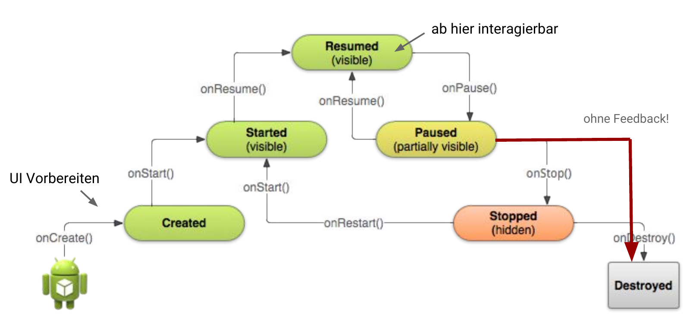

Konzepte
========

Generell
--------

* Java 7 (Java 8 Features experimentell)
* Android System kontrolliert den Lifecycle und die Kommunikation zwischen den Komponenten

Activity
--------
* Activities widmen sich (wie der Name verrät) einer Aktivität (etwa gleich einem "Screen")
* Activities sind Bausteine, welche die Interaktion mit dem Benutzer regeln.

Java-Grundgerüst: 

.. code:: java

  public class MainActivity extends Activity {
  
     @Override
     protected void onCreate(Bundle savedInstanceState) {
         super.onCreate(savedInstanceState);
         // Hier unser Code
     }
  }

* Die Klasse MainActivity wird vom System aufgerufen (kein "public static void")
* Konstruktor nicht nutzbar für "Initialisierung" - sondern "on"-Methoden nutzen
* Die On-Methoden werden beim Zustandwechsel vom System aufgerufen (Template-Method Pattern).

* Vorsicht: on-stop wird nicht garantiert aufgerufen. Darum sollten Daten unbedingt bei on-pause gesichert werden.
* Jegliche "Konfigurationsänderung" (auch wenn man den Viewport dreht) hat einen Reset zur Folge

Task
----

* Ein Task ist ein Stack von Activities (Bsp. je App ein Stack).
* Defaultverhalten des Back-Buttons: Popt activity vom Stack.

APK
---
* Dateiformat, in dem Android-Apps gebündelt werden
* Je APK ein Linux-Prozess (über mehrere Tasks/Activities)

Intents
-------
* Kommunikation zwischen Komponenten erfolgt über Intents (Absicht, Vorhaben)
* Explizit: `new Intent(this, CalculateActivity.class)`
* Implizit: `new Intent(MediaStore.ACTION_IMAGE_CAPTURE)`
* Neue Activity starten: `startActivity(intent);`
* Weiter Parameter können der Intent-Instanz mitgegeben werden (eg. putExtra)

Views
-----
* Deklarativ (XML) oder Imperativ (Java)
* Hierarchisch geordnet (Composite Pattern)

API-Level
---------
* Immer Abwärtskompatibel
* Features können auch mit externen Libraries nachgerüstet werden
* Auswahl Abwägung zwischen Features und Anzahl zu erreichende User 

Manifest
----------
* Berechtigungen, welches API-Level, Activities usw.
* Ein Teil wird erst durch das Build-System ergänzt.

