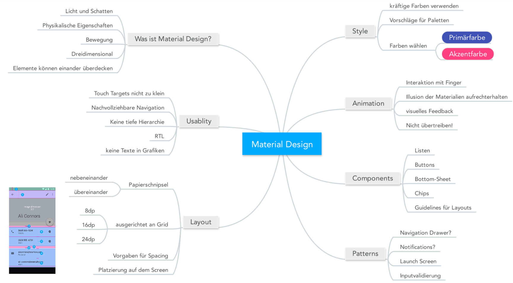

Material Design
===============

Vision
----------
Einheitliche Design Language und "Human-Interface Guidelines" für Android (und mehr Applikationen von Google) zu etablieren.

Umfasst Regeln, Empfehlungen und Beispiele - von Farben, Icons bis zum Screen aufbau.
Der `Styleguide <https://material.google.com/>`_ umfasst:

* Layout
* Style
* Animation
* Components (Fertige, verwendabar Komponente)
* Patterns (Hilfestellung bei oft auftretenden Problemen)
* Usability (Bsp: Texte in Grafiken sind problematisch)


Design Language
: "Hilfestellung für den Designprozess". Beschreibt wie die Teile einer Applikation aussehen und sich verhalten sollen.

Materia "Metapher" - 3D-Raum mit Licht und Schatten, Angelehnt an physikalische Begebenheiten mit Schatten und unterschiedlichen Höhen von UI-Elementen.

Animationen helfen die Illusion aufrecht zu erhalten, dass wir die Materialien auf dem Screen (durch eine Glasscheibe) direkt manipulieren

.. image:: https://material-design.storage.googleapis.com/publish/material_v_9/0Bzhp5Z4wHba3VG9SaVpNbkpHb2s/whatismaterial_3d_elevation2.png


!!! merke

    * Dinge sollen sich nur dann bewegen, wenn sinnvoll.
    * Material Design orientiert sich an einem 8dp Gitter - folglich sind alle Grössen ein vielfaches von 8.




!!! seealso

    * [Physical properties](https://material.google.com/material-design/material-properties.html#material-properties-physical-properties)
    * https://play.google.com/store/apps/collection/promotion_3001769_io_awards
    * https://play.google.com/store/apps/details?id=com.bhphoto


Integration in die eigenen App
-------------------------------

Das aussehen sollte nicht direkt auf den Elementen verändert werden sondern global (analog nicht inline in HTML sondern extern in CSS.)

In der View können Styles referenziert werden (analog "klasse"):
```xml
<Button
   ...
   style="@style/MyButtonStyle"
```

Dieser Style kann dann in `res/values/styles.xml` definiert:

```xml
<style name="MyButtonStyle">
   <item name="android:background">#ff85e1</item>
   <item name="android:height">36dp</item>
   <item name="android:minWidth">64dp</item>
   <item name="android:padding">8dp</item>
</style>
```

Unterschiedliche Styles für Geräte, Versionen etc sind möglich, aber Vorsicht: *Styles werden vererbt - gelten also nur für die aktuelle View!*

Damit nicht immer Klassen deklariert werden müssen gibt es Themes, welche ein generelles look-and-feel für App/Activity festlegen.

Das Theme wird in Manifest.xml angegeben...

```xml
<application
   ...
   android:theme="@style/AppTheme" >
   <activity
       android:name=".MainActivity"
       android:theme="@style/AppTheme" >
```

und kann in der Datei `styles.xml` spezifiziert werden:
```xml
<style name="AppTheme" parent="Theme.AppCompat.Light.NoActionBar">
   <!-- Hier können wir Theme-Einstellungen überschreiben -->
</style>
```

Hier können dinge wie die [Primärpalette bestehend aus drei Farbtönen](https://material.google.com/style/color.html#color-color-palette)
überschrieben werden.


!!! warning

    GUI-Builder zeigt nicht zwinged das GUI an, welches verwendet wird


UI-Komponenten
--------------

FAB – Floating Action Button
: Aktion nicht eindeutig ist, lieber keinen FAB nehmen

!!! seealso

    * [Material Design for Developers](https://developer.android.com/training/material/index.html)
    * [Material Design for Android Developers](https://www.udacity.com/course/material-design-for-android-developers--ud862)
