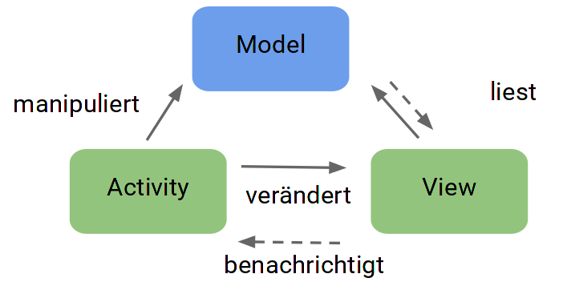

## Patterns

* Design-Patterns die in UIs sehr verbreitet sind: Observer und MVC

### Multitier Architecture

Jede Schicht hat Zugriff auf die Darunterliegende - aber nicht umgekehrt.

Es gibt verschiedenste variationen davon.

#### Presentation-Schicht
* Darstellung
* Interaktion mit dem Benutzer
* stark an UI-Toolkit gebunden

#### Domain-Schicht
* Businesslogik
* Domainklassen
* Wenig externe Abhängigkeiten
* Gut Testbar

#### Data-Schicht
* Speicherung der Daten
* Stellt diese Dienste der Domain zur Verfügung (z.B. DB, Cloud)

### Observer

Zweck: Um Zyklen zu vermeiden (Presentation-Schicht kennt Domain-Schicht aber nicht umgekehrt)

* Zwei Rollen: Subject (wird beobachtet) und Observer (welcher beobachtet)
* Observer melden sich beim Subject an
* Wird der Observer benachrichtigt kann dieser den aktuellen Zustand abholen

➪ Observer kennt Subject sehr gut aber das Subject weiss nichts über den konkreten Observer.

Java bringt bereits das Observer-Pattern mit:

* Subject: Klasse Observable
* Observer: Interface Observer ()
* notify in zwei Schritten
    * `setChanged()`
    * `notifyObservers()` → Ruft `update(Observable o, Object arg)` auf allen Observern auf.

### Model-View-Controller

Model
: beinhaltet die Daten

View
: liest die Daten des Modells und zeigt diese an

Controller
: erhält Events der View und manipuliert das Model
: In Android etwa "Activity"
