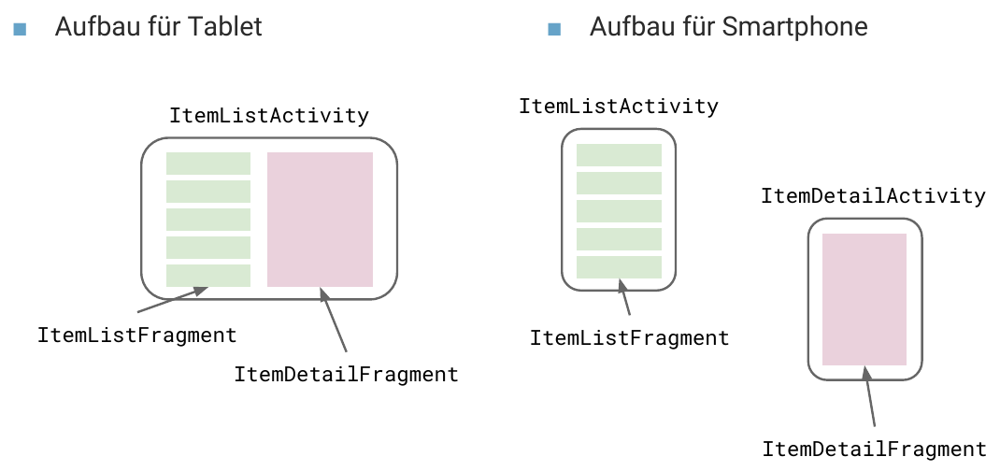

## Struktur

### Vorgehen

1. Domainmodell entwerfen
2. Screens ableiten
3. Screens in Beziehung bringen ("Sollte erreichbar sein über") und gruppieren (Orientation/Screen Size)
4. Navigation zwischen den Screens festlegen
5. Wireframe/Storyboard für die Gesamtübersicht erstellen
6. Usability Test mit einem Paper-Prototypen des Wireframes

### Zurück ≠ Zurück
<figure style="float: right;max-width: 40%;">
    
    <figcaption></figcaption>
</figure>

Zurück kann entweder *zum hierarchischen Parent* **up** (ancestral) oder aber zurück zum *vorherigen Element* **back** (temporal) bedeuten.

In Android wird typischeweise *ancestral* über den Button oben Links implementiert **Up** ("zum Parent screen")
Der Up-Button muss manuell implementiert werden und zu dessen hierarchischen Parent (oder typisch
hierarchischen Parent bzw. Root) führen.

*Temporal* dagegen wird über den "hardware" **Back-Button** implementiert ("zurück zum vorherigen Screen").
Typischerweise muss der Back-Button nicht manuell gemanaged werden - das Default Verhalten entspricht
meistens dem, was der User erwartet. Tabs, Filter, Zoom, Sorting usw. macht der Back-Button
nicht "rückggängig".

### Fragments


**Problem**: Je nach Formfaktor wäre es nützlich, mehrere Screens anzuzeigen
aber es kann nur eine Activity aufs Mal angezeigt werden. **Fragment** Modularer Teil einer Activity mit eigenem Lebenszyklus (analog Activity - aber umfangreicher!). Sollten immer dann verwendet werden, wenn die Ansicht kein möglicher Eintrittspunkt in die App ist (sonst Activity). Implementierung eines Fragments mehrheitlich analog zu einer Activity, mit dem Unterschied, dass die **View explizit erstellt/inflated werden muss.**

```java
public class MainActivityFragment extends Fragment {
   public MainActivityFragment() {}
   @Override
   public View onCreateView(LayoutInflater inflater, ViewGroup container,
                            Bundle savedInstanceState) {
       return inflater.inflate(R.layout.fragment_main, container, false);
   }
}
```

#### Implementations Variaten
##### Statisch
Deklarativ mittels Fragment-Tag im Layout der Activity. Der Code der Activity ändert sich nicht.

```xml
<LinearLayout ...>
   <fragment
       android:id="@+id/fragment"
       android:name="com.example.myfragmentapplication.MainActivityFragment"
       android:layout_width="match_parent"
       android:layout_height="match_parent"
       tools:layout="@layout/fragment_main" />
</LinearLayout>
```
##### Dynamisch
Explizit wird ein **Platzhalter im Layout** der Activity (mit id!) hinzugefügt (Per Konvention
FrameLayout)

```xml
<LinearLayout ...>
   <!-- ID nicht vergessen! -->
   <FrameLayout android:id="@+id/fragment_container"
      android:layout_width="match_parent"
      android:layout_height="match_parent" />
</LinearLayout>
```

Zugriff in der Activity mit dem `FragmentManager`: Überschrieben des Platzhalters werden. Müssen explizit **inflated** werden (Während Activities nie "von Hand" instantiert werden)

```java
public class MainActivity extends Activity {
    @Override
    protected void onCreate(Bundle savedInstanceState) {
       super.onCreate(savedInstanceState);
       setContentView(R.layout.activity_main);
       FragmentManager fragmentManager = getFragmentManager(); // Starte Transaktion auf FragmentManager
       FragmentTransaction fragmentTransaction = fragmentManager.beginTransaction();
       // Instantiere Fragment und dem FragmentManager übergeben
       MainActivityFragment fragment = new MainActivityFragment();
       fragmentTransaction.add(R.id.fragment_container, fragment);
       // mehrere Fragments können hier hinzugefügt / entfernt werden
       // Transaktion abschliessen
       fragmentTransaction.commit();
    }
}
```


### Activity-Fragment Kommunikation

Fragments dürfen (sollten) keine Abhängigkeit auf Parent haben. **Best Practice**: Implementiere Interface auf dem Parent zur Kommunikation.

```java
public class MainActivityFragment extends Fragment {
    public interface OnItemSelectedListener { void onItemSelected(String item); }
    OnItemSelectedListener parentActivity;
    @Override
    public void onAttach(Context activity) {
        super.onAttach(activity);
        if (!(activity instanceof OnItemSelectedListener)) {
            throw new AssertionError( "Activity must implement View.OnClickListener!");
         }
         parentActivity = (OnItemSelectedListener) activity;
     }
 }
```

### Master-Detail Navigation


Für unterschiedliche Screens werden unterschiedliche XML Layouts entworfen, welche
1..n Fragments nutzen (Hier 1 oder 2).

Die Activity liest zur Laufzeit aus, welche Fragments vorhanden sind und reagiert ensprechend.

```xml
<!-- 2 Panes in Bsp. layout-sw600dp/activity_main.xml -->
<LinearLayout
        android:layout_width="match_parent"
        android:layout_height="match_parent"
        android:orientation="horizontal">
        <fragment
            android:id="@+id/notesListFragment"
            android:name="ch.hsr.mge.masterdetailflow.presentation.NotesListFragment"/>
        <FrameLayout
            android:id="@+id/notesDetailContainer"/>
</LinearLayout>
<!-- 1 Pane in layout/activity_main.xml  -->
<fragment
        android:id="@+id/notesListFragment"
        android:name="ch.hsr.mge.masterdetailflow.presentation.NotesListFragment"/>
```

```java
public class ItemListActivity extends Activity
                implements ItemListFragment.Callbacks {
    private boolean twoPane;
    @Override
    protected void onCreate(Bundle savedInstanceState) {
       super.onCreate(savedInstanceState);
       setContentView(R.layout.activity_item_list);
       // Gibt es das 2te Fragment? Falls ja: Tablet mode
       if (findViewById(R.id.item_detail_container) != null) {
           twoPane = true;
       }
    }
    @Override
    public void onItemSelected(String id) {
        if (twoPane) {
            Bundle arguments = new Bundle();
            arguments.putString(ItemDetailFragment.ARG_ITEM_ID, id);
            ItemDetailFragment fragment = new ItemDetailFragment();
            fragment.setArguments(arguments);
            getFragmentManager()
                    .beginTransaction()
                    .replace(R.id.item_detail_container, fragment)
                    .commit();
        } else {
            Intent detailIntent = new Intent(this, ItemDetailActivity.class);
            detailIntent.putExtra(ItemDetailFragment.ARG_ITEM_ID, id);
            startActivity(detailIntent);
        }
    }
}
```

### Option Menu

Implementation Deklarativ in XML (im bsp. menu/main.xml). Eine Imperative implementierung
wäre auch möglich, deklarativ ist aber wann immer möglich vorzuziehen. Nutzung mit Fragments: in ``onCreate`` die Methode ``setHasOptionsMenu(true);`` aufrufen und `onCreateOptionsMenu`-Methode überschrieben.

```xml
<menu xmlns:android="http://schemas.android.com/apk/res/android" ...>
   <item android:id="@+id/action_search"
       android:title="@string/action_search"
       android:icon="@drawable/ic_action_search"
       android:orderInCategory="100"
       android:showAsAction="never" />
   <item android:id="@+id/action_settings"
       android:title="@string/action_settings"
       android:showAsAction="never" />
</menu>
```
```java
public class MainActivity extends Activity {
   public boolean onCreateOptionsMenu(Menu menu) {
       // Inflate the menu; this adds items to the action bar if it is present.
       getMenuInflater().inflate(R.menu.menu_main, menu);
       return true;
   }
   public boolean onOptionsItemSelected(MenuItem item) {
       switch (item.getItemId()) {
       case R.id.action_search: // ID aus main.xml
           // ....
    }}}
```

### Toolbar


Früher Action-Bar (deprecated seit Android 5.0)

1. App Icon und ev. Up- / Home-Navigation
2. Name der App oder View-Switcher
3. Actions (Teil des Options Menu)
4. Action-Overflow mit dem Rest des Menus

```xml
<android.support.v7.widget.Toolbar
       android:id="@+id/toolbar"
       android:layout_width="match_parent"
       android:layout_height="wrap_content">
   </android.support.v7.widget.Toolbar>
```
```java
public class MainActivity extends AppCompatActivity {

   @Override
   protected void onCreate(Bundle savedInstanceState) {
       super.onCreate(savedInstanceState);
       setContentView(R.layout.activity_main);

       Toolbar toolbar = (Toolbar) findViewById(R.id.toolbar);
       setSupportActionBar(toolbar);
   }
}
```

### Navigation Drawer

Der Navigation Drawer ist platzsparend - hat aber eine schlechte Usuability.
Das Widget ist nicht Teil von Android und muss über eine Support-Library eingebunden werden. (Implementation mit `DrawerLayout`)
---
### Toast vs. Snack

**Toast** ist eine kleine Feedback-Nachricht

```java
Toast toast = Toast.makeText(getActivity(), "Hello MGE!", Toast.LENGTH_SHORT);
toast.show();
```

Die **Snackbar** ist der Nachfolger von Toast - mächtiger, da auch Aktionen angegeben werden können.

```java
private void mkSnack() {
   Snackbar snackbar = Snackbar.make(content, "Hello MGE!", Snackbar.LENGTH_LONG);
   snackbar.setAction("Again!", new View.OnClickListener() {
       @Override
       public void onClick(View v) {
           mkSnack();
       }
   });
   snackbar.show();
}
```
