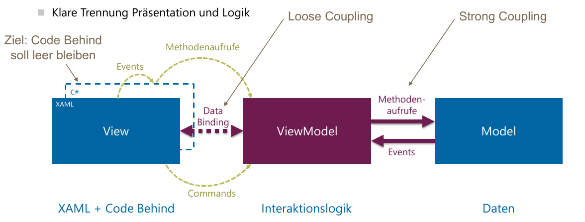

# Architekturmodelle

## Internationalization (i18n)

**Internationalisierung** : App für mehrere Sprachen **vorbereiten**.

**Lokalisierung** : Effektive **Übersetzung** in die einzelnen Sprachen.

In .NET finden sich alle Informationne zur aktuellen Locale in `System.Globalization.CultureInfo`.

Es gibt verschiedene Mechanismen, um WPF-Applikationen zu lokalisieren. Die einfachste und meist verberitete Methode ist dabei der **Resource-Mechanismus** von .NET. Dieser generiert für jede Sprache ein eigenes Sattelite Assembly (Bsp. `en-US/appname.resource.dll`). (WPF hat einen spezifischen Mechanismus für Internationalisierung, Alternativ eingene Lösungen: bsp. Static Binding im XAML)

### Vorgehen Internationalisierung mit .NET Embedded Resources

* Öffnen der Datei `Resources.resx` unter `Properties` und Art der Resource auf Strings setzen
* Weitere Lokalisierungen mit neuen Resource Dateien `Resources.<lang>.resx`, woebi lang das Locale-Kurzel (`de-CH`, `en-US` usw.) ist.
* Neutrale Sprache Festlegen
* Zugriff von Code behind über `Properties.Resources.SAVE_ERROR`(strongly-typed) oder `Properties.Resources.ResourceManager.GetString("SAVE_ERROR")` (dynamic)
* Zugriff im XAML über `{x:Static resx:Resources.LABEL_FIRST_NAME}`
    * `xmlns:resx="clr-namespace:I18n.Properties"` im Root-XAML-Element nicht vergessen!
* Parameter über `String.Format` bzw. Binding/Multibinding verwendet im XAML

    ```
    "{Binding MinPwLenth, StringFormat={x:Static resx:Resources.MIN_PASSWORD_LENGHT_ERROR}}"
    ```

## MVVM

Dient dazu, die View und das Modell sauber zu "verleimen".



Wichtigste Regeln:

* Die **View kennt Model nicht**
* Nur das ViewModel kennt das Model und handled alle Kommuniaktion damit
* **View binded auf ViewModel** - einzige Verbindung!
* Das Model hat kein verhalten, macht weder Formatierung, Darstellung noch Laden/Speichern.
* ViewModel kennt die View nicht (keine einzige Referenz!!)
* ViewModel erstellt neue Views nicht direkt selber.
* Commands und allenfalls CommandParamter nutzen.
* Startup Code in `App.xaml.cs` (`StartupUri`-Attribut aus `App.xaml` löschen)
* View-Model der View via Dependency-Injection mitgeben.

#### Implementierung von Commands (Relay Command)
`RelayComand` übernimmt ein Action swoie eine Funktion `canExecute`.

```csharp
public class RelayCommand<T> : ICommand
{
    private readonly Action<T> _execute;
    private readonly Predicate<T> _canExecute;

    public RelayCommand(Action<T> execute, Predicate<T> canExecute = null) {
        if (execute == null){
            throw new ArgumentNullException("execute");
        };
        _execute = execute;
        _canExecute = canExecute;
    }

    public bool CanExecute(object parameter) => _canExecute?.Invoke((T)parameter) ?? true;

    public void Execute(object parameter) => _execute((T)parameter);

    public event EventHandler CanExecuteChanged
    {
        add { CommandManager.RequerySuggested += value; }
        remove { CommandManager.RequerySuggested -= value; }
    }
}

public class GadgetVm
{
    public ICommand SaveCommand { get; set; } = new RelayCommand(
        () => this.Save(), raw => raw is Option);

    public void Save() { ... }
}
```

Binding im XAML

```xml
<Button Content="Open" Command="{Binding OpenGadgetViewCommand}" CommandParameter="{Binding SelectedGadget}" />
```
