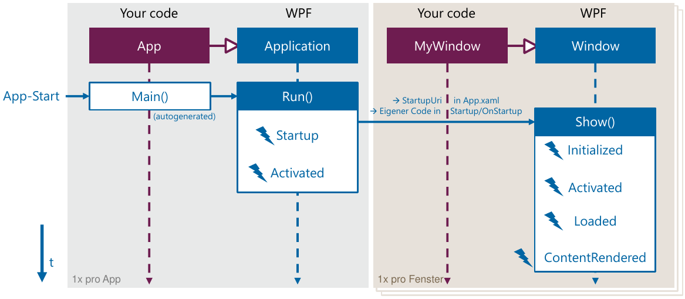
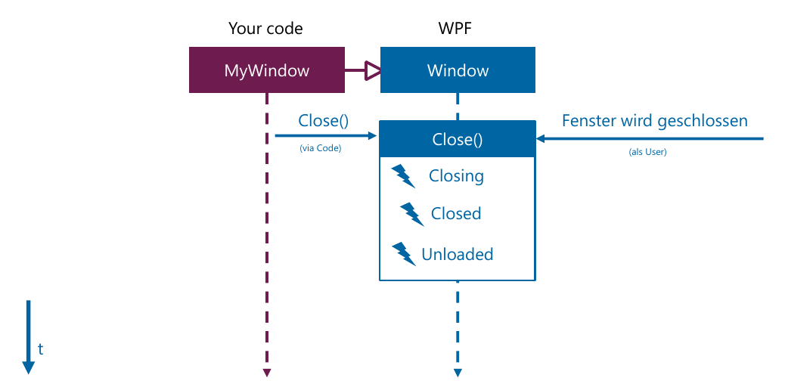
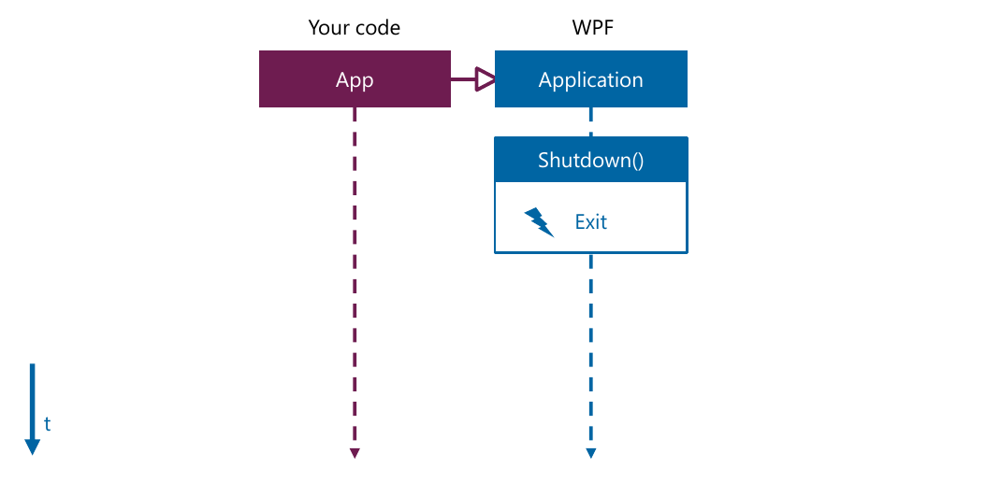
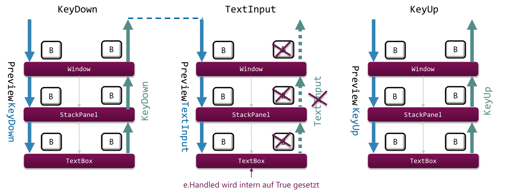

## Benutzerinteraktion

### Review C# Events
* Events sind ein in .NET Sprachen eingebauter Publish/Subscribe-Mechanismus.
* Events werden typischerweise in einer Klasse ausgelöst. Externe Klassen können sich von Aussen subscriben.

Beispiel:

```csharp
// Implementierung
public event PropertyChangedEventHandler PropertyChanged;

// Schnittstelle für Event-Handler ist wie
// folgt (als Delegate) definiert
public delegate void PropertyChangedEventHandler(object sender,
                                      PropertyChangedEventArgs e);
// Wobei PropertyChangedEventArg in .NET vordefiniert ist.
```

### Events in WPF

* In WPF gibt es ganz viele Events - können in Dokumentation oder mittels IntelliSense (Blitz Symbol) gefunden/gesucht werden.
* WPF liefert diverse vordefinierte Event Handler Methoden (`OnStartup`, `OnClosing` etc.) -

Ob die vordefinierten Event Handler Methoden oder manuelles Eventhandling genutzt werden soll bleibt dem Entwickler überlassen.

```csharp
public partial class App : Application {
    public App() {
        this.Startup += (o, args) => { ... };
    }
    // oder
    protected override void OnStartup(StartupEventArgs e) { ... }
}
```

### WPF App Lifecycle
Eine WPF-App hat keine Lifecycle in gleichem Ausmass wie Android, da WPF nicht auf Single-App-Betrieb ausgelegt its.

#### App Startup
.NET generell: `Main`-Methode wird automatisch beim Ausführen der EXE ausgeführt.

Bei WPF wird im Hintergrund (im `obj`-Ordner) eine Teil der App-Klasse (Partial) generiert, welche die `Main`-Methode definiert & implementiert.

```csharp
public partial class App : System.Windows.Application {
 // ...
 public static void Main() {
    LayoutsAndControls.App app = new HelloWpf.App();
    app.InitializeComponent();
    app.Run();
 }
}
```


: App Startup Ablauf - Quelle: MGE-Vorlesung (HSR)

Welches Fenster gestartet wird kann entwerde in der `App.xaml` über das Attribut `StartupUri="MyMainWindow.xaml"` oder direkt in der Methode `OnStartup` im Code Behind manuell gemacht werden:

```csharp
protected override void OnStartup(StartupEventArgs e) {
    MainWindow = new MainWindow();
    MainWindow.Show();
}
```

#### Window Close


: Window Close Ablauf - Quelle: MGE-Vorlesung (HSR)

#### App Shutdown


: App Shutdown Ablauf - Quelle: MGE-Vorlesung (HSR)

### Routed Events

Routed Events: Events, welche durch den **Visual Tree** gereicht.

Events gehen wie in JS mit dem DOM zuerst von Innen nach Aussen (Preview/Tunneling) und dann von Aussen nach innen.

Alle EventArgs leiten von `RoutedEventArgs` ab und stellen somit mindestens folgende Attribute zur Verfügung(Siehe F42):

* `Handled` - Wenn auf True gesetzt wird die Chain abgebrochen.
* `OriginalSource` - Das "oberste"-Element - das, auf das gemäss dem Control-Template geklickt wurde.
* `Source` - Element, welches den Event gemeldet hat (Bsp. in Controltemplate ist `OriginalSource` ein Bild, aber die `Source` ein Button)
* `RoutedEvent` - Der Routed Event, welches mit diesem Objekt verknüpft ist.


Verschiedene RoutedEvents liefern verschiedenste weiter (mehr oder weniger) nützliche Werte.

Routed Events können auf zwei Varianten behandelt werden:

* Im UI Selbst. Für Methodennamen gilt die Namenskonvention: `[ElementName]_On[EventName]`.

    ```xml
    <Button Name="SaveButton"
            MouseDown="SaveButton_OnMouseDown"
            PreviewMouseDown="SaveButton_OnPreviewMouseDown">Save</Button>
    ```

    ```csharp
    private void SaveButton_OnPreviewMouseDown(object sender, MouseButtonEventArgs e)
    { ... }
    private void SaveButton_OnMouseDown(object sender, MouseButtonEventArgs e)
    { ... }
    ```


: Keyboard: Taste `B` wird gedrückt und wieder losgelassen - Standardverhalten. Quelle MGE-Vorlesung (HSR)

Typischerweise werden Events relativ weit unten behandelt, weil dort entsprechend spezifisch gehandelt werden kann.

RoutedEvents bringen aber durch dieses EventBubbling auch Fallstricke mit sich:


!!! warning

    * Gleichartiges Event kann für verschiedene Controls ausgelöst werden
    * Quelle des Events entscheidend

```csharp
private void MainTabControl_SelectionChanged(object sender,
    SelectionChangedEventArgs e) {

    if (this.MainTabControl.SelectedIndex == 0) {
        // (Re-)Populate ListBox
        this.ListBox1.Items.Clear();
        this.ListBox1.Items.Add("...");
        this.ListBox1.Items.Add("...");
        ...
    }
}
```
Im obigen Beispiel wird der Event `SelectionChanged` nicht nur vom `MainTabControl` sondern auch von der `ListBox` geworfen. Genaugenommen endet der obige Code in einer Endlosschleife.

Um dies zu umgehen muss auf die Quelle des Events geprüft werden:

```csharp
private void MainTabControl_SelectionChanged(object sender,
    SelectionChangedEventArgs e) {

    if (e.OriginalSource == this.MainTabControl) { ... }
}
```

#### Nützliche Events

* Maus: MouseDown, MouseUp, MouseMove
* Keyboard: KeyDown, KeyUp, TextInput
* Touch: TouchDown, TouchUp, TouchMove

### Hintergrund-Operationen
Problem wie bei Android: Wenn lange Operationen gleichen Thread laufen wird das UI blockiert - ein Effekt, den man nie will! (Bsp. Download, DB-Zugriff usw.)

Vorgehen:

1. Visuelles Feedback geben
    * Spinner, Overlay, Popup
    * Beispiel Button:
        * Eigenes ContolTemplate für Button mit Spinner
        * Spinner Visibility an IsEnabled von Button binden
        * Dafür ist ein eigener Converter nötig
        * Nach Klick wird Button deaktiviert - und und somit wird gleich der Spinner angezeigt.
2. Starten eines Background-Threads als Reaktion auf ein Event + Kontrolle an UI Thread zurückgeben
    * `Task.Run(() => { /* Code läuf im Background-Tread */ } );`
    * Wenn Berechnung komplett, zurück in UI-Tread mit `Displatcher.Invoke(() => { /* Code läuft im UI Thread */});`
    * NB: Dispatcher ist Property auf UI-Control. Wenn nicht in Code-Behind Statische Variante `System.Windows.Threading.Dispatcher.DurrentDispatcher` verwenden (Bsp. in ViewModel)
