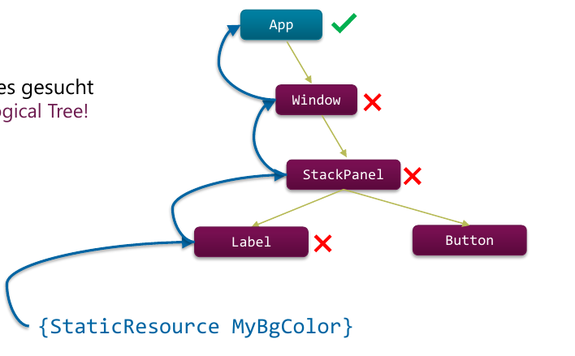

# GUI-Design


!!! todo

    Ergänzungen Übungen?
    Basis für N: #80


## Resources

WPF-Resources sind im XAML hinterlegte Elemente wie Brush, Style, Color, String usw. Das Konzept ist _entfernt_ vergleichbar mit CSS im Browser.

Bei Android wird eine Ordnerstruktur vorgegeben, bsp. `res/colors`, `res/layout`, `res/strings` usw. Bei WPF ist man dagegen völlig frei.

Eine Resource wird einmal definiert miit einen Key (`x:Key` in XAML). Über diesen key kann diese Resource beliebig oft im Projekt referenziert werden, was folgende Vorteile mit sich bringt:

* Effizient
    * Einmal definieren, n mal verwenden
    * Wenig code
    * Wenig Speicher
* Wartbar
    * Zentral abgelegt (cooperate design)
* Adaptierbarkeit
    * Trennung Darstellung und Struktur
    * Bessere Anpassbarkeit an User, System usw.

Key ≠ Name! Recap: Der Name ermöglicht Zugriff auf das Element im Code-Behind.

Recap: Der `x` Namespace ist für allgemeine XAML Eigenschaften/Elemente, während der default Namespace in XAML-Files die WPF-Elemente beinhaltet.

```xml
<Application.Resources>
    <SolidColorBrush x:Key ="MyButtonBackground" Color="#EEEEEE" />
</Application.Resources>

<!-- Verwenden (Data Binding im Hintergrund)-->
<Button Background="{StaticResource MyButtonBackground}" Content="Save" />
```
#### Zugriff auf Resource

Eine Resource wird Bottom-Up im _locical Tree_ (also dieselbe Struktur wie im XAML) gesucht.

<figure>
    
    <figcaption>Zugriff auf Ressource - Reihenfolge wird im XAML-Code entschieden!</figcaption>
</figure>

```xml
<!-- Zugriff auf Resource - 1x mit static binding -->
<Button Background="{StaticResource MyButtonBackground}" Content="Save" />

<!-- Zugriff auf Resource - jedes mal mit dynamic binding -->
<Button Background="{DynamicResource MyButtonBackground}" Content="Save" />

<!-- Zugriff auf Systemresourcen -->
<Button Background="{x:Static SystemColors.ControlBrush}" Content="Save" />
```

In C# wird über die Methode `FindResource` zugegriffen, welche auf `FrameworkElement` deklariert ist.

```csharp
var okText = (string)FindResource("OkText");
var bgBrush = FindResource("DarkBrush") as Brush;
```

### Dynamische vs. Statische Resources

Statische Resourcen

* Zur Compile Time
* Compile Error wenn key nicht vorhanden
* Einmalige Auswertung
* = static binding

Dynamic Resource

* Zur Laufzeit
* Check zur Laufzeit (Exception)
* Wird N-Mal ausgewertet
* = dynamic binding

Ein Theme Switch wie in VisualStudio geht also nur mit Dynamic Resource.

### Resource Dictionary

Resource Dictionary
: Behälter, um Resources zu speichern - einfacher Key-Value-Store. Bsp. `Application.Resources` `Window.Resources` `Button.Resources`

Es können beliebig viele eigene Resource Dictionaries erstellt werden (separates XAML File).

Zudem können Resource Dictionaries gemerged werden. Dies ermöglicht flexible Strukturierung (separation of concerns).

```xml
<Application.Resources>
    <ResourceDictionary>
        <SolidColorBrush x:Key ="MyButtonBackground" Color="#EEEEEE" />

        <ResourceDictionary.MergedDictionaries>
            <!– just list your external resource dictionaries, here -->
            <ResourceDictionary Source="Colors.xaml"/>
            <ResourceDictionary Source="Brushes.xaml"/>
        </ResourceDictionary.MergedDictionaries>

        <!– Kaskadierung - sprich Verwendung von Properties aus
            bsp. Colors.xaml möglich -->
        <SolidColorBrush x:Key="ButtonBgBrush" Color="{StaticResource ThemeColor1}" />

    </ResourceDictionary>
</Application.Resources>
```

Externe Ressourcen können über externe Assemblys eingebunden werden. Dabei wird als Key eine PackageURI angegeben.

```xml
<Image Source="/BasePicLib;component/media/pix/open.png" />
<!-- ist die Kurzform für -->
<Image Source="pack://application:,,,/BasePicLib;component/media/pix/open.png" />
```

Varianten für Package-URIs sind

* `siteOfOrigin:///` Relativ zum aktuellen Ordner
* `application:///`  Relativ zur Assembly


!!! todo

    Image ohne `{DynamicResource MyButtonBackground}` aber bei Color schon?!


## Styles & Themes
Styles sind vom Konzept fast analog zu CSS Klassen.

Generelle Definition. Macht nur für Spezielle Styles - wie bsp. `DangerButton` Sinn.

```xml
<!-- Definition (im Resource Dictionary) -->
<Style x:Key="MyButtonStyle">
    <!-- Gleiche Werte gelten auch auf Labels etc... -->
    <Setter Property="Button.Foreground" Value="#2672EC" />
    <Setter Property="Button.Background" Value="Transparent" />
    <!-- ... -->
</Style>

<!-- Nutzung im XAML  -->
<StackPanel Orientation="Horizontal">
    <Button Style="{StaticResource MyButtonStyle}" Content="Cancel" />
    <Button Style="{StaticResource MyButtonStyle}" Content="Ok" />
    <Button Style="{StaticResource MyButtonStyle}" Content="Save" /> </StackPanel>
```

NB: Komplexe Werte möglich - bsp. `<Setter.Value><LinearGradientBrush ...></Setter.Value>`

Sinnvoller ist es, für sepzifische Typen Styles zu Definieren. Diese gelten dann für alle Elemente, welche von diesem Typ sind.

```xml
<!-- KEIN x:Key!  -->
<Style TargetType="Button"> <!-- kurz für TargetType="{x:Type Button}" -->
    <Setter Property="Background" Value="Transparent" />
    <Setter Property="Foreground" Value="Black" />
    <Setter Property="BorderBrush" Value="Silver" />
    <!-- ... -->
</Style>
```

!!! warning

    Wenn Key Hinterlegt: Gilt nur für Controls mit dem Typ
    Wird Key Weggelassen, gilt Style für ALLE Typen des Controls!

Styles können **vererbt** werden

```xml
<Style x:Key="DangerButtonStyle" TargetType="Button"
    BasedOn="{StaticResource MyButtonStyle}">
        <Setter Property="Background" Value="Red" />
</Style>
```

### Control Templates
ControlTemplates ermöglicht ein Style für ein Beliebiges WPF-Control festzulegen. Jedes Control hat ein Default-ControlTemplate. Die visuelle Darstellung der Controls kann dadurch 100% selbst gewählt werden

Dies ist Quasi das HTML der Control - während das Style dem CSS entspricht.

!!! todo

    38: Code relevant? -> Falls in Übungen, Copy-Paste aus Folien.


### Trigger
Style Trigger sind analog zu Pseudo-Klassen in CSS.

```xml
<Style x:Key="MyButtonStyle" TargetType="Button">
    <Setter Property="Background" Value="White" />
    <Setter Property="Foreground" Value="Black" />
    <Setter Property="Cursor" Value="Hand" />
    <Style.Triggers>
        <Trigger Property="IsMouseOver" Value="True">
            <Setter Property="Background" Value="#2672EC" />
            <Setter Property="Foreground" Value="White" />
        </Trigger>
    </Style.Triggers>
</Style>
```

```xml
<Style TargetType="ListBoxItem">
    <Style.Triggers>
        <DataTrigger Binding="{Binding InStock}" Value="0">
            <Setter Property="Foreground" Value="Red" />
        </DataTrigger>
    </Style.Triggers>
</Style>
```

!!! warning

    Default Button Style verhindert, dass dies für Buttons wie erwartet funktioniert (Visual States - wird aber nicht weiter besprochen).

    **Fix**: Eigenes Control Template


### Best Practice

* Kleinstprojekte:
    * Styling direkt in Window.Resources (oder teilweise direkt inline bei Controls)
* **Kleine bis mittlere Projekte:**
    * Eigene Resource Dictionaries für verschiedene Typen (z.B. nach Grundfarben, Pinsel, Control-Styles, etc.)
* Grössere Projekte:
    * Eigene Assemblies mit Resource Dictionaries und Image-Resources pro Design/Theme

## GUI Design Principles

* Es gibt keine Design Guidelines wie bei Android
* Grobe Grundsätze (Design Principles):
    * Pride in craftsmanship
    * Be fast and fluid
    * Authentically digital
    * Do more with less
    * Win as one

→ See [UX checklist for desktop applications](https://msdn.microsoft.com/en-us/library/windows/desktop/dn742479.aspx)
