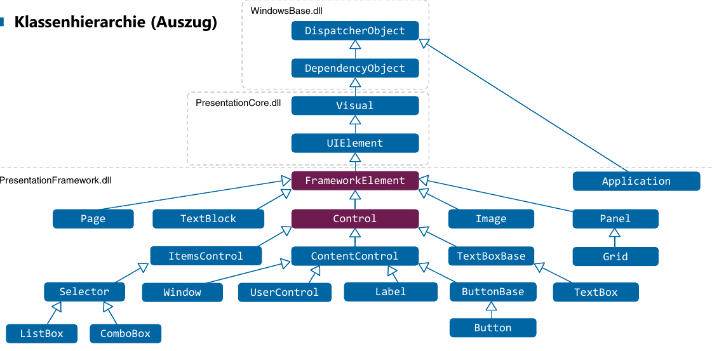
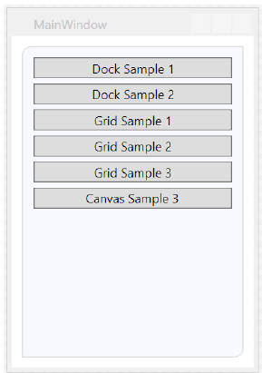

# Controls / GUI Entwurf

<figure>

    <figcaption><b>FrameworkElement</b>: Darstellbare elemente. <b>Control</b>: Konkrete Interaktion</figcaption>
</figure>

## Grössenangaben


Grössenangaben auf Attributen `Width`/`Height`, `MinWidth`/`MaxWidth` (Priorität: 1. MinWidth, 2. MaxWidth, 3. Width)  (`FrameworkElement`) definiert. Kann mit `ActualWidth` (Read-Only Property) zur Laufzeit abgefragt werden.

Default Einheit: **Pixel**. Device Independent Pixels → 1px = 1/96" (*FIX* im Gegensatz zu Android!). Problem: "Rundungsfehler", darum etwas "schwammig" (=aliasing - siehe `UseLayoutRounding` und `SnapsToDevicePixels`). Weitere Einheiten **px, in, cm und pd** definiert werden.

## Ausrichtung
<figure>
    
</figure>

Ausrichtung wird auch auf `FrameworkElement`. Die Ausrichtung hat **tiefere Priorität** als explizite Width/Height-Angaben. Defautl typischerweise "Stretch/Stretch" (Kann je nach Control abweichen).

## Weitere Eigenschaften

* `Name` = (Bsp. für Zugriff im Code-Behind) - `FrameworkElement`
* `Resources` = → Siehe Kap. UI-Design - `FrameworkElement`
* `Tag` = Beliebiger Wert (Bsp. für Binding Hacks) - `FrameworkElement`
* `Tooltip` - `FrameworkElement`
* `UseLayoutRounding` = Rundet Pixelangaben auf physische Gerätepixelwerte (Layout) - `FrameworkElement`
* `SnapsToDevicePixels` = Rundet Pixelangaben auf phys. Gerätepixelwerte (Rendering) `UIElement`
* `IsEnabled` = UI interagierbar/ Bsp. Button (Standard = True) `UIElement`
* `Visibility` = Collapsed, Hidden, Visible (Standard) `UIElement`

## Ränder & Rahmen

Aufbau eines `Control` ist vergleichbar mit CSS-BoxModel mit `box-sizing: border-box`. Dimensionen können **expizit** (`l,t,r,b`), **partiel** (`l,t`, wobei `r=l` und `b=t`) und **für alle** (`x`) angegeben werden.

```xml
<Button Width="100" Height="60" Content="..."
    BorderThickness="4"
    Margin="10,10,40,40"
    Padding="30,20,10,10" />
```

### Brush
Wenn im XAML für `Background` ein **Hex-Wert** angegeben wird, dann wird dieser **Wert mittels ValueConverter** in einen `SolidColorBrush` umgewandelt.

Vorsicht: Andere Namen bei Shapes: `Stroke` ist die  Linienfarbe und `Fill` die Ausfüllfarbe

<figure style="max-width: 50%;">
    
    <figcaption>Es gibt 6 unterschiedliche Pinseltypen</figcaption>
</figure>

### Clipping

Mit dem Attribut `ClipToBounds` kann angegeben werden, ob das Kind-Control an den Rändern des Parents abgeschnitten werden sollen - Default ist `False`.


<figure>
    
    <figcaption>Mit `Clip` können Elemente "Ausgeschnitten" werden</figcaption>
</figure>

## Layouts

### StackPanel (=LinearPanel in Android)

<figure style="float:right;max-width: 60%;">
    <figcaption>Child Elements werden vertikal oder horizontal aufgelistet.</figcaption>
</figure>


```xml
<StackPanel Margin="240,120,0,0">
    <TextBlock Text="Hello, World!" />
    <TextBlock Text="What's your name?" />
    <StackPanel Orientation="Horizontal">
        <TextBox Width="300" />
        <Button Content="Say Hello"/>
    </StackPanel>
</StackPanel>
```

### Wrap Panel
Child Elements werden vertikal oder horizontal aufgelistet und automatisch umgebrochen, wenn Zeilen-/Spaltenumbruch. Wird in der Praxis für Layouting nur noch selten verwendet.

<figure>
    
</figure>

### DockPanel
Child Elements werden an einer Seite oder dem Zentrum "angedockt". **Was zu erst definiert ist, füllt am meisten Platz aus**! Mehrere Elemente Wie StackPanel.


```xml
<DockPanel>
    <TextBlock Text="Child Element Top 1" DockPanel.Dock="Top" />
    <TextBlock Text="Child Element Bottom 2" DockPanel.Dock="Bottom" />
    <TextBlock Text="Child Element Left 3" DockPanel.Dock="Left" />
    <TextBlock Text="Child Element Right 4" DockPanel.Dock="Right" />
    <TextBlock Text="Child Element Center 5" />
</DockPanel>
```
<br><br>


```xml
<DockPanel>
    <TextBlock Text="Child Element Left 1" DockPanel.Dock="Left" />
    <TextBlock Text="Child Element Right 2" DockPanel.Dock="Right" />
    <TextBlock Text="Child Element Top 3" DockPanel.Dock="Top" />
    <TextBlock Text="Child Element Bottom 4" DockPanel.Dock="Bottom" />
    <TextBlock Text="Child Element Center 5" />
</DockPanel>
```
<hr>
### Grid
Wie eine Tabelle, wobei die Elemente **explizit in Zeile / Spalte abgelegt** werden müssen. Die Breiten- und Höhenangaben können **entweder fix in Pixel**, **mit `auto`** automatisch verteilen oder **mit `*` gewichten**. Je mehr Sterne, umso höher die Gewichtung (Praktisch für 1/3 oder 1/6  - mühsam in %).

Elemente werden bei **Überschneidungen übereinander gestapelt**!

```xml
<Grid>
    <Grid.ColumnDefinitions>
        <ColumnDefinition Width="50"></ColumnDefinition>
        <ColumnDefinition Width="Auto" MinWidth="40"></ColumnDefinition>
        <ColumnDefinition Width="Auto" MinWidth="40"></ColumnDefinition>
    </Grid.ColumnDefinitions>
    <Grid.RowDefinitions>
        <RowDefinition Height="50"></RowDefinition>
        <RowDefinition Height="Auto" MinHeight="10"></RowDefinition>
        <RowDefinition Height="*"></RowDefinition>
    </Grid.RowDefinitions>
    <Button Content="A" Grid.Column="0" Grid.Row="0" Grid.RowSpan="3" Grid.ColumnSpan="3" />
    <Button Content="B" Grid.Column="2" Grid.Row="2" Grid.RowSpan="3" Grid.ColumnSpan="3" />
    <Button Content="C" Grid.Column="0" Grid.Row="2" Grid.RowSpan="3" Grid.ColumnSpan="1" />
</Grid>
```

#### Canvas (ohne Layout)
**Absolute Positionierung**, keine Layout-Logik, Gleiche Geometrieklassen wie bei Clipping.

```xml
<Canvas>
    <Rectangle Canvas.Left="80" Canvas.Top="60" Width="128" Height="80" Fill="#006aa6" />
    <Ellipse Canvas.Left="260" Canvas.Top="160" Width="120" Height="120" Fill="#6E1C50" />
</Canvas>
```

### Weitere (ohne Layout)

**ViewBox**: Skalliert einzelnes Child Control -> Transformation - alles wird grösser!


**Image**: Attribut "Source" für Angabe der Datenquelle, Verhalten wie ViewBox (`Stretch=…`).

**ScrollViewer**: Einfacher mit `VerticalScrollBarVisibility="Visible"`

**Border**: Zeichnet Rahmen um ein Child Control, Kann mit Panels kombiniert werden


```xml
<Border Background="GhostWhite" CornerRadius="8,0,8,0"
        BorderBrush="#ddd" BorderThickness="1"
        Margin="10" Padding="10">
    <StackPanel Orientation="Vertical">
        ...
    </StackPanel>
</Border>
```

### Dialogfenster

Wenn im Dialogfenster das Property `DialogResult` auf `True` bzw. `False` gesetzt wird, so wird als Siteneffekt auch gleich das Dialogfenster geschlossen. (Attribute `isCancel="True"` und `isDefault="True"`)

```csharp
var win = new DialogWindow();
if (win.ShowDialog() != true) { /* BLOCKING AUFRUF! */ }
```

## Event-Handling & Commands

### Klassischer Event

1. Im XAML-Code name des Handlers angeben, bsp. ein `Click="SayHelloButton_OnClick"`
2. Event-Handler im Code ergönzen `private void SayHelloButton_OnClick(object sender, MouseButtonEventArgs e)`

### Command (Siehe MVVM & RelayCommand)

Vorteil zu "klassischen" Event: **Wiederverwendung** & **gut testbar** (Command Pattern)

1. Eigenes Command erstellen
    ```csharp
    public static RoutedUICommand MyCutCommand = // Derszeit static :(
        new RoutedUICommand("Ausschneiden", "MyCut", typeof(WindowWithToolbar));
    ```
2. Angabe des Commands im XAML (`local:` ist ein Namespace, welcher das aktuelle Projekt "festgelegt" / `WindowWithToolbar` ist die Klasse, in der das Command implementiert ist.)
   ```xml
    <MenuItem InputGestureText="CTRL + X" Command="local:WindowWithToolbar.MyCutCommand" />
   ```
3. Command-Handler im XML binden
    ```xml
    <Window.CommandBindings>
        <CommandBinding Command="local:WindowWithToolbar.MyCutCommand" Executed="MyCutCommand_Executed" />
    </Window.CommandBindings>
    ```
4. Keyboard-Shortcuts definiern
    ```xml
    <Window.InputBindings>
        <KeyBinding Key="X" Modifiers="Control" Command="local:WindowWithToolbar.MyCutCommand" />
    </Window.InputBindings>
    ```
5. Implementierung des Commands
    ```csharp
    private void MyCutCommand_Executed(object sender, ExecutedRoutedEventArgs e) { /*...*/ }
    ```

## UI-Testing


: Verschiedene Test-Varianten
