# GUI Entwurf

## Controls
FrameworkElement
: Darstellbare elemente

Control
: Konkrete Interaktion

## Grössenangaben

Grössenangaben werden über die Attribute Width/Height auf `System.Windows.FrameworkElement` definiert.

Wird keine Einheit angegeben, so werden Pixel verwendet. Pixel = Device Independent Pixels -> 1px = 1/96".

Alternativ können Einheiten wie px, in, cm und pd definiert werden.

Weitere relevante Attribute zur Grösse

* MinWidth/MaxWidth (Priorität: 1. MinWidth, 2. MaxWidth, 3. Width)
* ActualWidth (Read-Only Property) zum Abruf der tatsächlichen Breite zur Laufzeit

## Ausrichtung.
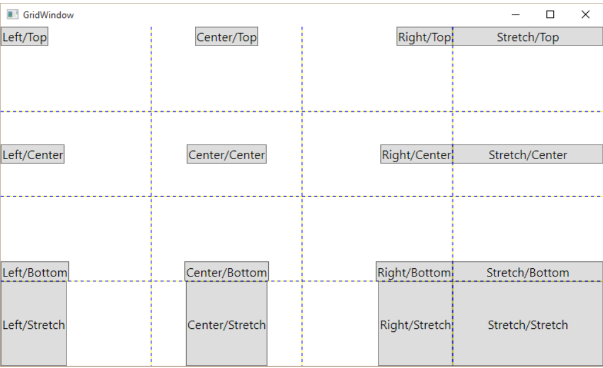

Die Ausrichtung wird gleich wie Grössenangaben auf `System.Windows.FrameworkElement` definiert.

Ein Element kann sowohl horizontal als auch vertikal ausgerichtet werden. Die Ausrichtung hat tiefere Priorität als explizite Width/Height-Angaben.

Typischerweise ist "Stretch/Stretch" der Standardwert - wobei dies je nach Control abweichen kann.

## Ränder & Rahmen
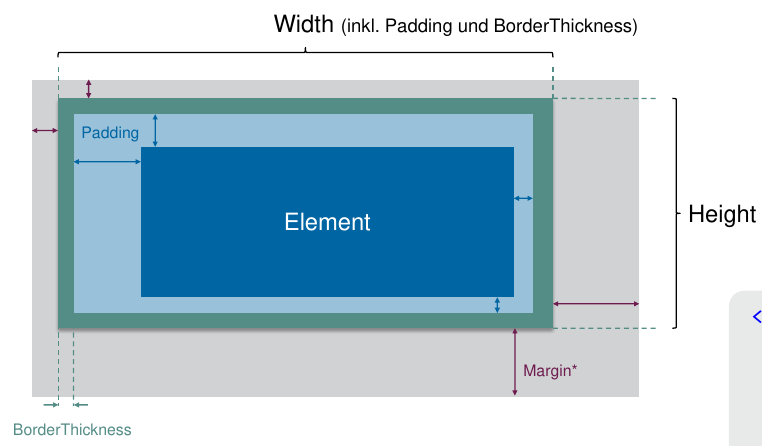

Der Aufbau eines `System.Windows.Controls.Control` ist vergleichbar mit dem CSS-BoxModel mit `box-sizing: border-box;`.

Die Dimensionen können mittels expizit (`l,t,r,b`), partiel (`l,t`, wobei `r=l` und `b=t`) und für alle (`x`) angegeben werden.

```xml
<Button Width="100"
        Height="60"
        BorderThickness="4"
        Margin="10,10,40,40"
        Padding="30,20,10,10"
        Content="Element" />
```

## Weitere Eigenschaften

* `Name` = Name des Elements (für Zugriff im Code-Behind)
* `Resources` = Lokal definierte Ressourcen
* `Tag` = Beliebiger Wert zur Markierung des Steuerelements
* `Tooltip` = Setzt das Tooltip-Layout
* `UseLayoutRounding` = Rundet Pixelangaben auf physische Gerätepixelwerte (Layout)
* `IsEnabled` = UI interagierbar? (Standard = True)
* `SnapsToDevicePixels` = Rundet Pixelangaben auf physische Gerätepixelwerte (Rendering)
* `Visibility` = Collapsed, Hidden, Visible (Standard)

### Brush
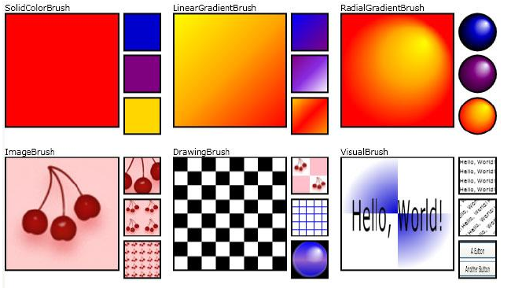

Brushes werden für die Ausfüllung von Bsp. `Background`, `BorderBrush`, `Foreground` verwendet.

Es gibt 6 unterschiedliche Pinseltypen:

Wenn im XML für `Background` ein Hex-Wert angegeben wird, dann wird dieser Wert mittels ValueConverter in einen `SolidColorBrush` umgewandelt.

Vorsicht: Bei Shapes heissen die Attribute etwas anders: `Stroke` ist die  Linienfarbe und `Fill` die Ausfüllfarbe

### Clipping
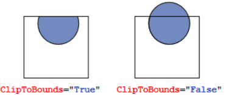

Mit dem Attribut `ClipToBounds` kann angegeben werden, ob das Kind-Control an den Rändern des Parents abgeschnitten werden sollen - Default ist `False`.

Mit `Clip` können Elemente "Ausgeschnitten" werden

<figure>
    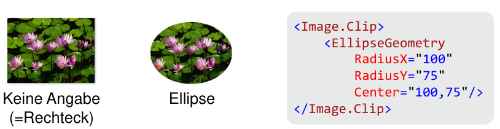
    <figcaption>Beispiel Clip mit Ellipse</figcaption>
</figure>

## Layouts

### StackPanel (=LinearPanel in Android)
Child Elements werden vertikal oder horizontal aufgelistet.

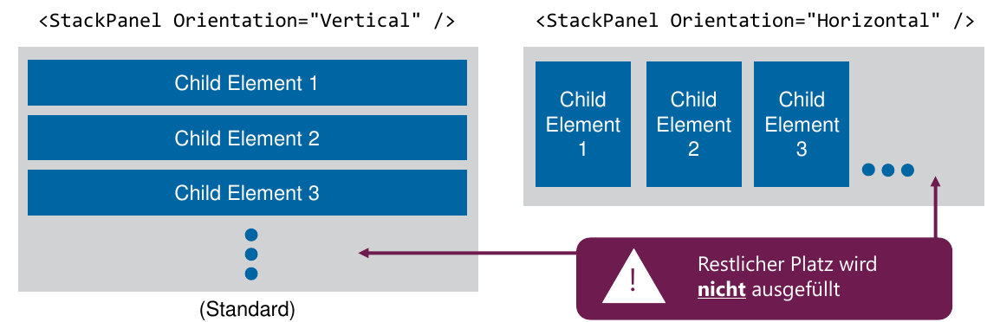

```xml
<StackPanel Margin="240,120,0,0">
    <TextBlock Text="Hello, World!" />
    <TextBlock Text="What's your name?" /> 2 <StackPanel Orientation="Horizontal">
        <TextBox Width="300" />
        <Button Content="Say <td></td>&quot;Hello&quot;" />
    </StackPanel>
</StackPanel>
```

### Wrap Panel
Child Elements werden vertikal oder horizontal aufgelistet und automatisch umgebrochen, wenn Zeilen-/Spaltenumbruch. Wird in der Praxis für Layouting nur noch selten verwendet.

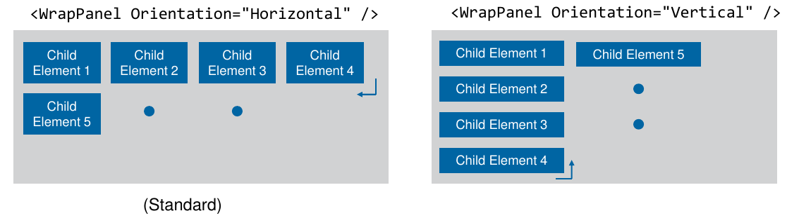

### DockPanel
Child Elements werden an einer Seite oder dem Zentrum "angedockt".

Vorsicht: Was zu erst definiert ist, füllt am meisten Platz aus!

```xml
<DockPanel>
    <TextBlock Text="Child Element Top 1" DockPanel.Dock="Top" />
    <TextBlock Text="Child Element Bottom 2" DockPanel.Dock="Bottom" />
    <TextBlock Text="Child Element Left 3" DockPanel.Dock="Left" />
    <TextBlock Text="Child Element Right 4" DockPanel.Dock="Right" />
    <TextBlock Text="Child Element Center 5" />
</DockPanel>
```

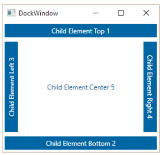

```xml
<DockPanel>
    <TextBlock Text="Child Element Left 1" DockPanel.Dock="Left" />
    <TextBlock Text="Child Element Right 2" DockPanel.Dock="Right" />
    <TextBlock Text="Child Element Top 3" DockPanel.Dock="Top" />
    <TextBlock Text="Child Element Bottom 4" DockPanel.Dock="Bottom" />
    <TextBlock Text="Child Element Center 5" />
</DockPanel>
```

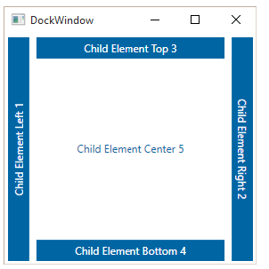


### Grid
Wie eine Tabelle, wobei die Elemente explizit in Zeile / Spalte abgelegt werden müssen. Die Breiten- und Höhenangaben können entweder fix in Pixel, mit `auto` automatisch verteilen oder mit `*` gewichten. Je Mehr sterne, umso höher die Gewichtung (Praktisch für 1/3 oder 1/6  - mühsam in %)

Elemente werden bei Überschneidungen übereinander gestapelt!

```xml
<Grid>
    <Grid.ColumnDefinitions>
        <ColumnDefinition Width="50"></ColumnDefinition>
        <ColumnDefinition Width="Auto" MinWidth="40"></ColumnDefinition>
        <ColumnDefinition Width="Auto" MinWidth="40"></ColumnDefinition>
    </Grid.ColumnDefinitions>
    <Grid.RowDefinitions>
        <RowDefinition Height="50"></RowDefinition>
        <RowDefinition Height="Auto" MinHeight="10"></RowDefinition>
        <RowDefinition Height="*"></RowDefinition>
    </Grid.RowDefinitions>
    <Button Content="A" Grid.Column="0" Grid.Row="0" Grid.RowSpan="3" Grid.ColumnSpan="3" />
    <Button Content="B" Grid.Column="2" Grid.Row="2" Grid.RowSpan="3" Grid.ColumnSpan="3" />
    <Button Content="C" Grid.Column="0" Grid.Row="2" Grid.RowSpan="3" Grid.ColumnSpan="1" />
</Grid>
```

### Container ohne Layout

#### Canvas
* Absolute Positionierung
* Keinerlei Layout-Logik
* Gleiche Geometrieklassen wie bei Clipping

#### ScrollViewer

!!! todo

    ergänzen

#### ViewBox
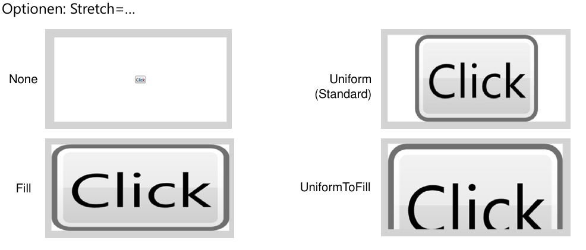

Skalliert einzelnes Child Control -> Transformation - alles wird grösser!

#### Image
* Attribut "Source" für Angabe der Datenquelle
* Verhalten wie ViewBox (Stretch=…)

#### Border
* Zeichnet Rahmen um ein Child Control
* Kann mit Panels kombiniert werden

```xml
<Border Background="GhostWhite" CornerRadius="8,0,8,0"
        BorderBrush="#ddd" BorderThickness="1"
        Margin="10" Padding="10">
    <StackPanel Orientation="Vertical">
        <Button Margin="0,0,0,5" Content="Dock Sample 1" />
        <Button Margin="0,0,0,5" Content="Dock Sample 2" />
        <Button Margin="0,0,0,5" Content="Grid Sample 1" />
    </StackPanel>
</Border>
```

### Dialogfenster

Dialogfenster sind meistens Modal, also blocking. Dialogfenster sind normale Fenster, welche mit der Methode `ShowDialog` gestartet werden. Diese Methode ist Blocking!

Wenn im Dialogfenster das Property `DialogResult` auf `True` bzw. `False` gesetzt wird, so wird als Siteneffekt auch gleich das Dialogfenster geschlossen.


!!! note

    Mit den Attribute `isCancel="True"`  und `isDefault="True"` kann können Events wird Standartverhalten "Ender = OK" und "Escape = Abbruch" automatisch implementiert.

```csharp
var win = new DialogWindow();
if (win.ShowDialog() != true) { // BLOCKING AUFRUF!
    Debug.WriteLine("Cancelled :-(");
    return;
}
Debug.WriteLine("OK :-)");
// ...
```

## Event-Handling & Commands

### Klassischer Event

1. Im XAML-Code name des Handlers angeben, bsp. ein `Click="SayHelloButton_Click"`
2. Event-Handler im Code ergönzen
3. Namenskonvention `[NAME]_On[Event]`

### Command

Hat gegenüber dem "klassischen" Event primär folgende Vorteile:

* Wiederverwendung derselben Aktion für Menus, Buttons etc. ohne x Click Hanlder zu implementieren.
* Sehr gut testbar!
* Vgl. Command Pattern

Vorgehen:

1. Eigenes Command erstellen
    ```csharp
    // Derszeit static :(
    public static RoutedUICommand MyCutCommand =
        new RoutedUICommand("Ausschneiden", "MyCut", typeof(WindowWithToolbar));
    ```
2. Angabe des Commands im XAML (`local:` ist ein Namespace, welcher das aktuelle Projekt "festgelegt" / `WindowWithToolbar` ist die Klasse, in der das Command implementiert ist.)
   ```xml
    <MenuItem InputGestureText="CTRL + X"
            Command="local:WindowWithToolbar.MyCutCommand" />
   ```
3. Command-Handler im XML binden
    ```xml
    <Window.CommandBindings>
        <CommandBinding Command="local:WindowWithToolbar.MyCutCommand"
                Executed="MyCutCommand_Executed" />
    </Window.CommandBindings>
    ```
4. Keyboard-Shortcuts definiern
    ```xml
    <Window.InputBindings>
        <KeyBinding Key="X" Modifiers="Control" Command="local:WindowWithToolbar.MyCutCommand" />
    </Window.InputBindings>
    ```
5. Implementierung des Commands
    ```csharp
    private void MyCutCommand_Executed(object sender, ExecutedRoutedEventArgs e) {
        ///...
    }
    ```

!!! note

    Besser mit MVVM lösen!


## UI-Testing

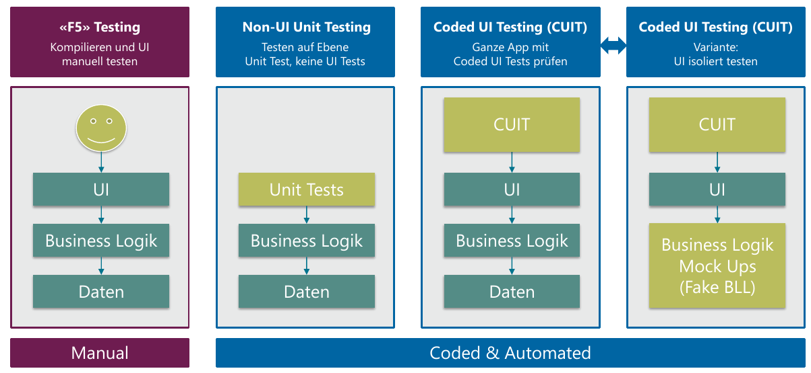
: Verschiedene Test-Varianten

!!! todo

    Ergänzen nach Übungen


!!! todo

    Appendix zu Block 2
