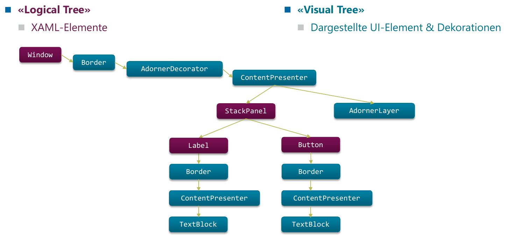

<!-- <div style="font-weight: bold;font-size: 2em;page-break-before: always;">Inhalt</div>
{{TOC}} -->

# Einführung
Desktop Apps haben immer noch eine gewisse Existenzberechtigung.

* Kosten
* Komplexe UIs
* Hohe Performance
* Grosse Datenmengen beherrschbar
* Breiter Technologiemix

## Zu WPF

* Windows Presentation Foundation
* Vektorbasiert
* Deklarativ (XAML) ermöglicht Trennung zwischen UI/Code
* Hardware-nah (DirextX)
* Programmierbar mit VB.NET, C#, Python ...


## Logical Tree vs Visual Tree

<figure>
    
    <figcaption></figcaption>
</figure>

**Logical Tree** Entspricht der Struktur der XAML-Elemente. **Visual Tree** sind Dargestellte UI-Element & Dekorationen. Beinhaltet *alle dargestellten Elemente* gemäss der Vorlage jedes Controls.

## XAML

XAML gegenüber Code bevorzugen, da **einfacher zu warten** und **weniger Schreibarbeit** ist. Zudem gibt es Tools wie Form Designer.

Dependency Properties
: Ermöglicht Data Binding: Vollautomatische Aktualisierung von UI und/oder Model-Klassen bei Änderungen.

Attached Properties
: Element setzt Eigenschaften, die das Parent-Element betreffen - Bsp. `DockPanel.Dock="Top"`

Property Element Syntax
: Ermöglicht komplexer Inhalt in XML-Attributen (`<Button Content="..." ..>`)

```xml
<!-- Attribute Syntax - kein zusammengesetzter Inhalt möglich!-->
<Button Height="50" Width="200" Content="Watch Now" />
<!-- Property Element Syntax - zusammengesetzter Inhalt möglich! -->
<Button Width="120" Height="50">
    <Button.Content>
            <TextBlock Text="Watch Now" FontSize="20" />
    </Button.Content>
</Button>
```

Markup extensions
: Verkürzte Notation um komplexe Ausdrücke unter Verwendung der Attribute Syntax eingeben zu können → (Keine Expressions wie bei Android sondern nur "Shortcut")

```xml
<TextBox Text="{Binding Path=FirstName}" />
<!-- als Kurzform für -->
<TextBox><TextBox.Text><Binding Path="FirstName" /></TextBox.Text></TextBox>
```

Type Converters
: Konvertieren (String-)Werte automatisch in einen passenden Datentyp (Bsp. Brush)

```xml
<Button Background="Aqua" />
<!-- als Kurzform für: -->
<Button><Button.Background><SolidColorBrush Color="Aqua" /></Button.Background></Button>
```

## C-Sharp Mini-Intro
### Keywords

Keywords im Vergleich zu Java

<table style="font-size: 0.8em;">
<tbody>
   <tr>
    <th>Java</th>
    <td>extends</td>
    <td>implements</td>
    <td>final</td>
    <td>for</td>
    <td>import</td>
    <td>instanceof</td>
    <td>package</td>
    <td>protected</td>
    <td>super</td>
    <td>throws</td>
    <td>... (varargs)</td>
  </tr>
  <tr>
    <th>C#</th>
    <td>:</td>
    <td>:</td>
    <td>sealed</td>
    <td>for/foreach</td>
    <td>using</td>
    <td>is</td>
    <td>namespace</td>
    <td>internal</td>
    <td>base</td>
    <td>n/a</td>
    <td>params</td>
  </tr>
</tbody>
</table>

Weitere Keywords: `event`, `operator`, `out`, `override`, `readonly`, `ref`, `struct` und `virtual`.

**Lambda Expressions**

```csharp
// Klammern, typ und return sind optional - letztes Generic ist return type.
Func<int, int> func6 = (int x) => { return x + 1; };
```

**String Interpolation**
```csharp
$"{a.OldName} changed name to {a.NewName}"
```

### Properties (Getter/Setter-Paar als natives Sprach-Feature)
Ermöglichen u.a **Lazy Initialization**, **Change Tracking**, **Calculated Properties**, **Read-Only Properties** usw.

```csharp
private string _lastName; // backing field
public string LastName {
    get { return _lastName; }
    set { _lastName = value; }
}
public string FirstName { get; set; } // C# Compiler generates backing field
public string FullName {        // Calculated property
    get { return LastName + " " + FirstName }
}
public string FullNameFirstLast => FirstName + " " + LastName; // Lambda-syntax for calc. Prop.
```

### Delegates = "Function Pointers"
```csharp
namespace DelegateExample {
    class Program {
        delegate int Calculation(int a, int b); // Define "Signature"
        static void Main(string[] args) {
            int x = 2; int y = 3;
            Calculation add = delegate(int a, int b) { return a + b; }; // Define implementation
            add(x, y);          // Call implementation
        }
    }
}
```
→ Nutze vordefinierte Delegate-Typen wie `Action` und `Func`

### C# Events Publish-Subscribe/Observer als Sprach-Feature

```csharp
public delegate void TickEventHandler (int ticks, int interval);
public class Clock
{
    public event TickEventHandler OnTickEvent;
    private void Tick(object sender, EventArgs e) { // Implementation
        ticks++;
        OnTickEvent?.Invoke(ticks, interval);
    }
}
ClockObserver t1 = new ClockObserver("O1"); // ClockObserver.OnTickEvent must have Signature of TickEventHandler
c1.onTickEvent += t1.OnTickEvent;   // subscribe...
```

### Extension Methods
```csharp
static string ToStringSafe(this object obj) //statisch & erster parameter mit `this`!
{ return obj == null ? string.Empty : obj.ToString(); }

public static void Test() {
    object myObj = null;
    myInt.ToStringSafe();
}
```
