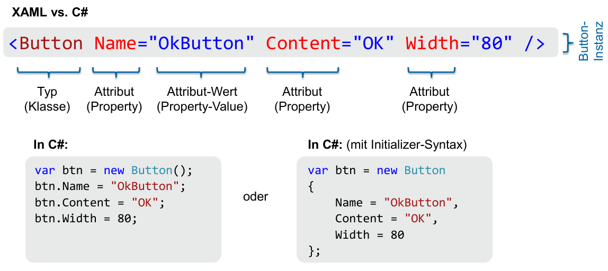

# WPF

Desktop Apps haben immer noch eine gewisse Existenzberechtigung.

* Kosten
* Komplexe UIs
* Hohe Performance
* Grosse Datenmengen beherrschbar
* Breiter Technologiemix

## WPF-Einführung

WPF
: Windows Presentation Foundation

* Teil des .NET Frameworks
* Vektorbasiert
* Deklarativ (XAML)
    * Trennung zwischen UI/Code
    * XML-basierende Beschreibungssprache für WPF UIs
* Hardware-nah (DirextX)
* Programmierbar mit VB.NET, C#, Python ...
* Pixel = device-independent pixels/units:
    * ➪ Fixe Physische Grösse: 1/96 Zoll (Fix im Gegensatz zu Android)
    * Problem: "Rundungsfehler", darum etwas "schwammig" (=aliasing - siehe `UseLayoutRounding` und `SnapsToDevicePixels`)
* Code Behind → XML wird mit Klasse *verschmolzen*
* UI Thread ➪ Blockiert - daher Multi-Threading nutzen!


### Logical Tree vs Visual Tree
Logical Tree
: Entspricht der Struktur der XAML-Elemente

Visual Tree
: Dargestellte UI-Element & Dekorationen. Beinhaltet alle dargestellten Elemente gemäss der Vorlage jedes Controls

Unterscheidung relevant, wenn Bsp. durch Tree navigiert wird.

!!! seealso

    Vorlesung "EINFÜHRUNG WPF & XAML" - Folie Nr. 25

### XAML


: Alles, was in XAML implementiert werden kann, kann auch in Code (z.B. C#) ausgedrückt werden.

XML und XML sollte gegenüber Code bevorzugt werden, da es einfacher zu warten und wesentlich weniger Schreibarbeit ist. Zudem gibt es Tools wie Form Designer.

Property Element Syntax ➪ Ermöglicht komplexer Inhalt

```xml
<!-- Attribute Syntax - kein zusammengesetzter Inhalt möglich!-->
<Button Height="50" Width="200" Content="Watch Now" />
<!-- Property Element Syntax - zusammengesetzter Inhalt möglich! -->
<Button Width="120" Height="50">
    <Button.Content>
        <StackPanel>
            <TextBlock Text="Watch Now" FontSize="20" />
            <TextBlock Text="Duration: 50m" FontSize="12"   
                Foreground="#888888" />
        </StackPanel>
    </Button.Content>
</Button>
```

Dependency Properties
: Ermöglicht Data Binding: Vollautomatische Aktualisierung von UI und/oder Model-Klassen bei Änderungen.

Attached Properties
:Element setzt Eigenschaften, die das Parent-Element betreffen - Bsp. `DockPanel.Dock="Top"`

Markup extensions
: Verkürzte Notation um komplexe Ausdrücke unter Verwendung der Attribute Syntax eingeben zu können → Keine Expressions wie bei Android sondern nur "ShortCut"
```xml
<TextBox Text="{Binding Path=FirstName}" />
<!-- als Kurzform für -->
<TextBox>
    <TextBox.Text>
        <Binding Path="FirstName" />
    </TextBox.Text>
</TextBox>
```

Type Converters
: Konvertieren (String-)Werte automatisch in einen passenden Datentyp
```xml
<Button Background="Aqua" />
<!-- als Kurzform für: -->
<Button>
    <Button.Background>
        <SolidColorBrush Color="Aqua" />
    </Button.Background>
</Button>
```

`XXX.xaml` sind die Markup Dateien - `XXX.xaml.cs` die "Code Behind" Klassen.
Diese Klassen könne mit "partials" ergänzt werden:

```cs
using System.Windows;
namespace HelloWpf {
    public partial class App : Application {
         // your logic here
     }
 }
```

### C-Sharp

!!! seealso

    MsTe Vorlesung

#### Keywords

Keywords im Vergleich zu Java

| Java          | C#          |
|---------------|-------------|
| extends       | :           |
| implements    | :           |
| final         | sealed      |
| for           | for/foreach |
| import        | using       |
| instanceof    | is          |
| package       | namespace   |
| protected     | internal    |
| super         | base        |
| throws        | n/a         |
| ... (varargs) | params      |

Für weitere Operatoren wie `event`, `operator`, `out`, `override`, `readonly`, `ref`, `struct` und `virtual` gibt es kein Äquivalent in Java.

#### Properties
Getter/Setter-Paar als natives Sprach-Feature. Ermöglichen u.a Lazy Initialization. Change Tracking. Calculated Properties, Read-Only Properties usw.

```cs
private string _lastName;
public string LastName {
    get { return _lastName; }
    set { _lastName = value; }
}

public string FirstName { get; set; }

public string FullName {
    get {
        var fullName = LastName + " " + FirstName
        return fullName;
    }
}
// Lambda-syntax (C# >=6.0)
public string FullNameFirstLast => FirstName + " " + LastName;

```

#### Delegates
= "Function Pointers"
```cs
namespace DelegateExample {
    class Program {
        delegate int Calculation(int a, int b);
        static void Main(string[] args) {
            int x = 2;
            int y = 3;
            Calculation add = delegate(int a, int b) { return a + b; };
            int answer = add(x, y); System.Console.WriteLine(answer); // output: 5
        }
    }
}
```
➪ Vordefinierte Delegate-Typen wie `Action` und `Func` nutzen!

#### Events
Observer-Patterns (Publish/Subscribe) als natives Sprach-Feature

```cs
public delegate void TickEventHandler (int ticks, int interval);
public class Clock
{
    public event TickEventHandler OnTickEvent;

    // Implementierung
    private void Tick(object sender, EventArgs e) {
        ticks++;
        OnTickEvent?.Invoke(ticks, interval);
    }
}

//
ClockObserver t1 = new ClockObserver("O1");
c1.onTickEvent += t1.OnTickEvent;
```

#### Lambda Expressions
```cs
// Klammern, typ und return sind optional!
Func<int, int> func6 = (int x) => { return x + 1; };
```

#### String Interpolation
```cs
$"{a.OldName} changed name to {a.NewName}"
```
#### Extension Methods
statisch & erster parameter mit `this`
```cs
static string ToStringSafe(this object obj)
{ return obj == null ? string.Empty : obj.ToString(); }

public static void Test()
{
    int myInt = 0;
    object myObj = null;
    myInt.ToStringSafe();
}
```

#### LINQ
**L** anguage **IN** tegrated **Q** uery - vergleichbar mit Java 8 Streams.

```cs
var q = students
    .Where(s => s.Grade < 4m)
    .Select(s => s.FirstName + " " + s.LastName);

```

### Visual Studio
#### App.config
```xml
<?xml version="1.0" encoding="utf-8"?>
<configuration>
    <appSettings>
        <add key="upload.folder" value="E:/test/daupload/files"/>
        <add key="costunit" value="1030"/>
    </appSettings>
    <connectionStrings>
        <add name="contents"
             connectionString="server=localhost;user id=hw77gx6;password=...;database=db1;" providerName="MySql.Data.MySqlClient"/>
     </connectionStrings>
     <startup>
         <supportedRuntime version="v4.0" sku=".NETFramework,Version=v4.0"/>
     </startup>
</configuration>
```
