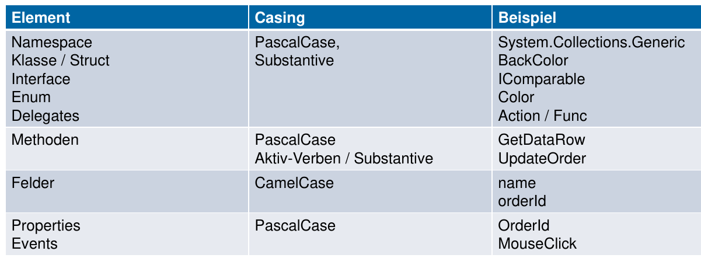
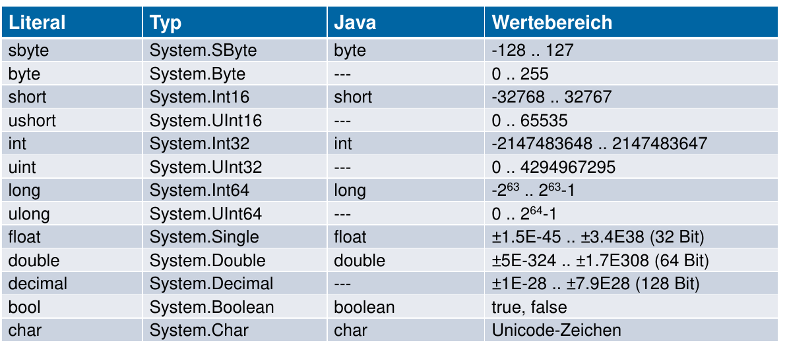
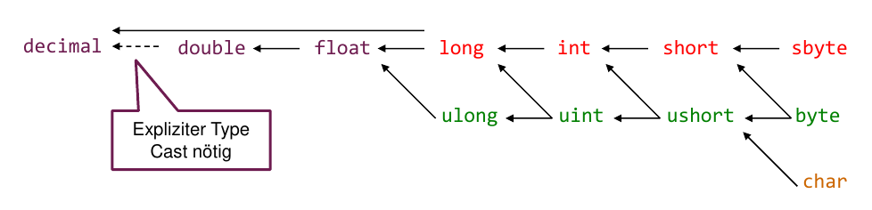
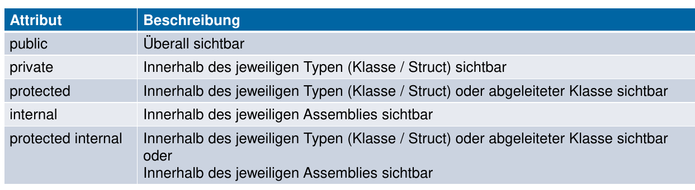

C# Basics
=========

Naming Guidelines
-----------------



Identifiers
------------

* Unicode und Unicode Escape Sequenzen (\u03c0)
* Keywords mit @ prefix @if ist ein identifier

Kommentare
-----------
Es gibt Single Line ``//`` und Multi-Line ``/* ... */`` Kommentare.
Zudem existieren `Spezielle Dokumentationsstrings <http://www.codeproject.com/Articles/3009/C-Documenting-and-Commenting>`_ (XML) ```///```(mit XML)


Primitive Datentypen
--------------------



Für Literale werden folgende Typen verwendet:

* Ohne Suffix wir der kleinste type aus int, uint, long, ulong
* u Suffix -> kleinster aus uint, ulong
* suffix l -> kleinster aus l und ul

.. warning::

    * String ist kein Primitivtyp
    * String ist kein Struct

Typ-Kompatibilität
..................



Struct vs. Object
------------------
Ein Struct ist keine Referenz, es lebt direkt auf dem Stack

Sichtbarkeitsattribute
----------------------



Defaults:

.. image:: images/default-visibility.png


Offene Fragen
---------------

* virtual keyword?
* override keyword?
* Mehrfachvererbung (syntax)?
* public B(int x, int y) : base(x) { this.y = y; } ??
* super = base?
