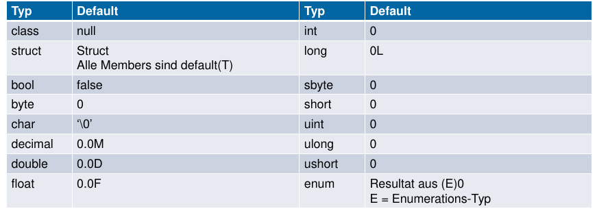

# Klassen & Structs

!!! todo

    Recap class:

    TODO: Flow chart zu vererbung, versiegeln, interfaces/abstrakte klasse,

    * new: dynamic dispatch wird unterbrochen

    von oben nach aben ab kasse bis zur spezifisten methode

    Übungen: Repetition (archiv)

Default Werte bei der Initialisierung



## Klassen

* Reference Type = wird also auf dem Heap angelegt
* Vererbung & Interfaces

```cs
class Stack {
    int[] values;
    int top = 0;

    public Stack(int size){/*...*/}
    public void Push(int x){/*...*/}
    public int Pop(){/*...*/}
}
Stack s = new Stack(10);
```

## Partials

Methoden und Klassen

Aufteilen einer Klasse / Methode in mehrere Dateien.

## Structs

* Value Type = wird also auf dem Stack abgelegt
* Keine Vererbung
* Interfaces implementierbar
* Keine Felderinitialisierung
* Mindestens 1 Parameter im Konstruktor

Structs sollten verwendet werden, wenn:

* Ein Wert repräsentiert werden soll
* Immutable gewünscht ist
* Kurzlebig / Eingebetted

```cs
struct Point {
    int x;
    int y;

    public Point(int x, int y){
        this.x = x; this.y = y;
    }
    public void MoveX(int x){/*...*/}
    public void MoveY(int y){/*...*/}
}
// Analog zu Klassen
Point p = new Point(2,3);
```


Mit dem `ref` keyword bei einem parameter (und dessen Aufruf!!) kann
auch eine Referenz übergeben werden.

Das `out` Keyword ist dazu identisch - mit dem Unterschied, dass der
übergebene Wert noch nicht initialisiert ist - wird also als return Wert
behandelt.
