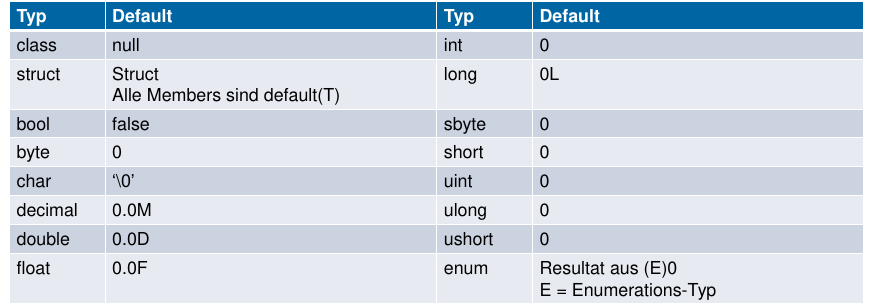

Klassen & Structs
==================

Default Werte bei der Initialisierung

Klassen
-------
* Reference Type = wird also auf dem Heap angelegt
* Vererbung & Interfaces

.. code:: c#

    class Stack {
        int[] values;
        int top = 0;

        public Stack(int size){/*...*/}
        public void Push(int x){/*...*/}
        public int Pop(){/*...*/}
    }
    Stack s = new Stack(10);

Partials
--------
Methoden und Klassen
Aufteilen einer Klasse / Methode in mehrere Dateien.

Structs
-------

* Value Type = wird also auf dem Stack abgelegt
* Keine Vererbung
* Interfaces implementierbar
* Keine Felderinitialisierung
* Mindestens 1 Parameter im Konstruktor

Structs sollten verwendet werden, wenn:

* Ein Wert repräsentiert werden soll
* Immutable gewünscht ist
* Kurzlebig / Eingebetted

.. code:: c#

    struct Point {
        int x;
        int y;

        public Point(int x, int y){
            this.x = x; this.y = y;
        }
        public void MoveX(int x){/*...*/}
        public void MoveY(int y){/*...*/}
    }
    // Analog zu Klassen
    Point p = new Point(2,3);
