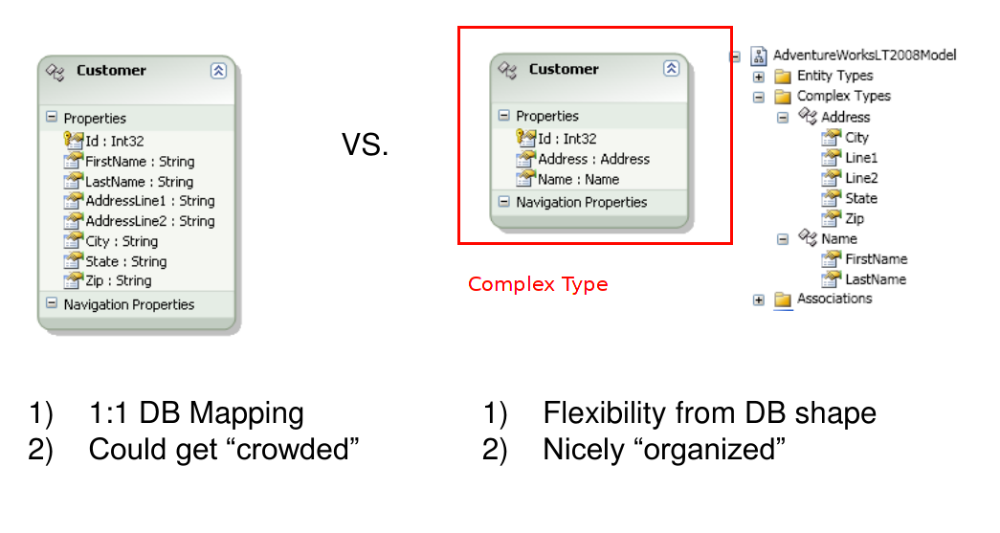
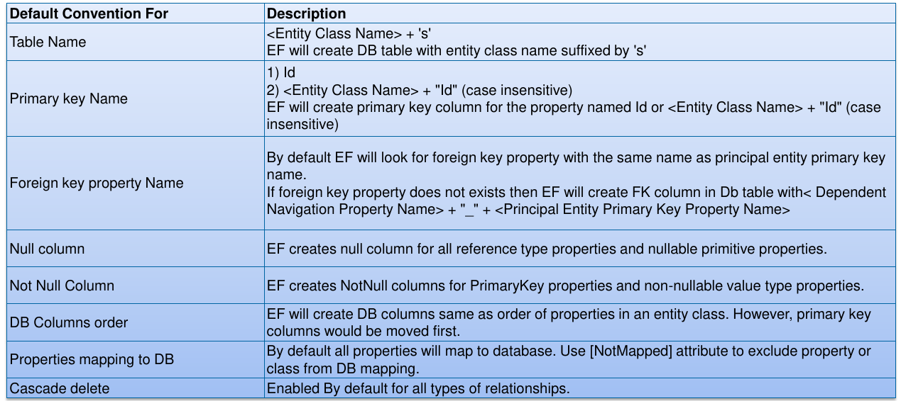

# Entity Framework


!!! todo

    By convention, DbContext erstellt eine DB.
    Falls eine SQL Express instanz verfügbar ist, wrid die DB dort erstellt. Sonst wird LocaDb verwendet - welche mit VisualStudio mitkommt.


Vorgehen

1. Neues Projekt erstellen
2. EntityFramework mit NuGet installieren
3. Klassen und Assotiationen definieren
4. Kontext Definieren
5. DB Generieren und Nutzen


## OR-Mapping
DSL
: Domain Specific Language

CSDL
: Conceptual Schema Definition Language

Entity
: Eine Instanz eines Entity Typs (Book). Entities sind in Entity-Sets (Books). Vererbung von Entities ist möglich

Association
: Beziehung zwischen zwei Entities. Hat zwei Enden mit Kardinalitäten. Entities können am einen Ende mittels **navigation properties** oder foregin keys zugegriffen werden.

Logical (Storage) Model
: Effektive logische DB Struktur - produkteneutral beschrieben.

Mit Mapping wird das Konzeptionelle Modell (.NET Klassen) mit dem Storage Modell (Effektive DB) verlinkt. Dieses Mapping wird in XML definiert.

Mapping → Table zu Class und Foreign Key zu Referenzen.

### Model based Mapping

Database-First Mapping: EDM aus existierender rationaler DB generieren.

Kann bsp. in VisualStudie editor zusammengeklickt werden.

!!! todo

    Welches Inheritance Mapping wird by default verwendet?! → Folie 23

Complex Types
: Complex types do not have keys and therefore cannot exist independently. Complex types can only exist as properties of entity types or other complex types. Damit kann quasi ein Teild er Tabelle ausgelagert werden


: Complex types vs. Fully blown 1:1 Mapping

### Code First Mapping

* BY Convention
* Deklarativ mit Annotations
* Imperatives fluent API interface
* Der `DbContext` ist der Eintrittspunkt.
* Initialisierung mit
    * CreateDatabaseIfNotExists (Exception falss Modell sich geändert hat)
    * DropCreateDatabaseIfModelChanges
    * DropCreateDatabaseAlways (For unit testings)
    * MigrateDatabaseToLatestVersion (Use Code First Migrations)

DB mit Default-Werten initialisieren

```csharp
namespace CodeFirst.Data {
    class SeedShopDB: DropCreateDatabaseAlways<ShopDB> {
        protected override void Seed(ShopDB context)
        { ... context.SaveChanges(); }
    }
    class ShopDB : DbContext
    {
         static ShopDB() {
             Database.SetInitializer(new SeedShopDB());
         }
     }
}
```

### Mapping Conventions

* Tabellennamen = Klassennamen mit 's' Suffix
* Columns: Typ wird automatisch erkannt
* Primary key by name (`Id` property bzw. `ClassnameId` property)


: Default Conventions

Conventions können explizit deaktiviert werden.

Das mapping kann auch explizit mittels Annotationen überschrieben/angegeben werden.

```csharp
[Table("orders")]
class Order
{
    [Key]
    [Column("id")]
    public Guid ID { get; set; }

    [Column("customer")]
    public Guid CustomerId { get; set; }
}
```

### Mapping mit Fluent API

Mapping kann auch in code manuell "zusammengeklebt" werden

```csharp
modelBuilder.Entity<T>.ToTable("name")
modelBuilder.ComplexType<T>()
.Ignore(x => x.Property)
.HasKey(x => x.Id)      // primary key
.HasColumnName("name")
.IsOptional() or .IsRequired()  //field nullable or not
.HasMaxLength(50)   // String Length
.HasPrecision(8, 2)     //Decimal Precision
```

!!! todo

    * Prüfungsrelevant?
    * Falls ja ->DbModelBuilder Beziehungen auch reinkopieren


## Object Services

PK-FK kann mittels LINQ & Naviagion Properties implementiert werden.

```csharp
from o in Order
from od in o.OrderDetails
where od.unitPrice > 20     // navigation property
select o;
```

und umgekehrt

```csharp
from d in OrderDetails
where d.Order.orderID == 1
select new {d.Order.OrderDate}
```

### Lazy/Eager Loading

Der Default ist Lazy loading, wbei explizit eager loading unterstützt ist.

```csharp
var query = from c in context.Customers
            where c.CustomerID == "ALFKI"
            select c;
var cust = query.FirstOrDefault(); //1. load customer

if (cust == null) return;

Console.WriteLine("Customer Id {0}", cust.CustomerID);
foreach (var order in cust.Orders) { //2. load orders (lazy!)
    Console.WriteLine("--- Order Id {0}", order.OrderID)
}
// Alternativ: Orders explizit laden
context.Entry(cust)
       .Collection(c => c.Orders)
       .Load();
```

Explizit:

```c++
using (var context = new NorthwindEntities()) {
    var cust = context.Customers
        .Include(c=>c.Orders)
        .FirstOrDefault(c => c.CustomerID == "ALFKI");
}
```

!!! warning

    Entity-Klassen müssen public und nicht sealed sein! Zudem müssen die Referenz-Properties `virtual` sein.

### CUD Operations

CUD
: Create Update Deleate

```csharp
using (var context = new NorthwindEntities() ) {

    // CREATE
    var c = new Category() {CategoryName = "DemoCat" };
    context.Categories.Add(c);
    context.SaveChanges();
    //SaveChanges sets CatgeoryId and Version
    //for each created objects

    // UPDATE
    var cat = (from c in context.Categories
               where c.CategoryName == "DemoCat"
               select c).FirstOrDefault();
   if (cat != null) {
       cat.CategoryName = "DemoCat2";
       context.SaveChanges();
   }

   // DELETE
   var cats = from c in context.Categories
              where c.CategoryName.StartsWith("DemoCat")
              select c;
   foreach (var c in cats) {
       context.Categories.DeleteObject(c);
       //mark object as deleted
   }
   context.SaveChanges();
   //delete tuples in db
}
```

DbContext Trackt alle entities über das `ObjectStateManager` Objekt. Dabei werden beim Ladevorgang alle Werte aus der DB gelesen und in die Entity-Instanzen geschrieben. Alle Änderungen werden getrackt(added, unchanged, modified, deleted, detached) und dann mit `db.SaveChanges()` in update/insert/delete SQL Statements übersetzt.

```csharp
//NorthwinEntities derives from DbContext
using (var context = new NorthwindEntities()) {
    var iPad = new Product { ProductName = "iPad", UnitPrice = 700 };
    Console.WriteLine(context.Entry(iPad).State); //Detached
    context.Products.Add(iPad);
    Console.WriteLine(context.Entry(iPad).State); //Added
}
```

## Identity Map

Identitymap ist eigentlich ein Cache - damit gleiche Daten nicht in mehreren Objekten enden. Gesucht werden Elemente in der Map nach deren Key. Gleichzeitig wird die Performance verbessert.

Die Identity Map wird vom DbContext verwaltet.

```csharp
var cust = context1.Customers
            .Where(c => c.CustomerID == "ALFKI").First();
cust.Fax = "12345";
var cust1 = context1.Customers
                    .Where(c => c.CustomerID == "ALFKI").First();
// cust is equal to cust1
Assert(cust1.Fax.Equals("12345"));
```

!!! seealso

    [Identity Map](http://martinfowler.com/eaaCatalog/identityMap.html)

## Associations

Beziehungen können entweder über Navigation Property oder über Foregin Key Ids aufgelöst werden.

```csharp
// With navigation properties
order.Customer = customer;
customer.Orders.Add(order);

// Directly with PrimaryKeys
order.CustomerID = newCustomer.CustomerID
order.CustomerID = null
Order.CustomerID = "ALFKI"
```

## Unit of Work Pattern
Mit dem Unit of Work Pattern können Ändernugen auf Objekten detektiert werden.
Beim Abschluss einer Transaktion können alle geänderten Werte gefunden und in der DB angepasst werden.

DBContext implementiert das Unit of Work pattern.

## Optimistic Concurrency
Elemente werden nicht auf der DB gelockt - es wird davon ausgegangen, dass schon alles gut geht.

Per Default speichert EF Objekte OHNE Concurrency-Check auf der DB - also nur Interne Concurrency-Checks.

Dies wird erreicht, indem pro Record eine ID oder ein Timestamp hochgezähld wird. Beim Zurückschreiben wird dann Validiert und geprüft.
Alternativ: Daten speichern und auf Kopien arbeiten. Dann auf DB nachschauen, was sich geändert hat.

## IQueryable<T>

LINQ kann auf einer beliebigen Datenquelle genutzt werden. Falls diese das Interface IQueryable<T> bekommt die die ensprechende Implementation das LINQ-Query in Form eines Expression Trees. (Mit IEnmuerable müssten ja schon alle Daten aus der DB gelesen worden sein oder viele Querys gemacht werden).
