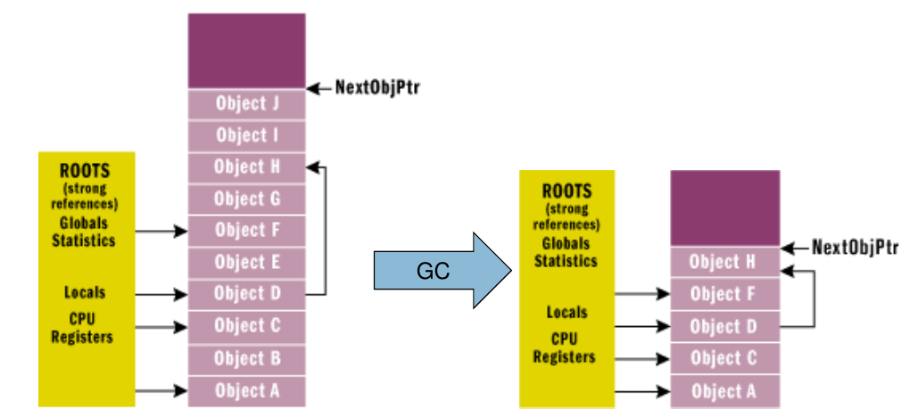

# Garbage Collection
Löscht alle Objekte auf dem heap, die
nicht mehr über eine Root-Referenz referenziert werden.

**Root** Refernzen sind:

* statische Felder
* aktive lokale Variablen (auf dem Stack)

**non-roots** sind:

* Instanz-Felder

Der GC gibt alle Ojekte frei, die nicht mind. über eine Root-Refernz erreichbar sind (mark and sweep)

* Kann objekte auf dem Heap verschieben
* Nicht deterministisch
* Aufuf über System.GC oder wenn:
    * System zu wenig Arbeisspeicher hat
    * Spezifischer (dynamischer) Schwellwert überschritten wird
    * Falls Anwendung nicht aktiv (nicht deterministisch)



Der Zugriff auf den Heap ist sehr schnell, da der heap kompakt (gemanaged) ist.

## Generationen

Objekte werden in 3 Generationen aufgeteilt:

* Gen0: Objekte seit letztem GC neu erstellt
* Gen1: Objekte, die einen GC überlebt haben
* Gen2: Objekte, die mehr als einen GC überlebt haben (Objekte ab 85'000 Bytes (.NET 4.5) sind automatisch Gen2 )

Dadurch aknn optimiert werden - bsp. erst Gen0 und Gen1 aufräumen -
da wird wohl am meisten Memory frei.

## Finalization

GC gibt Speicher von nicht mehr referenzierten Objekte frei - nicht aber *Referenzen auf Fremdresourcen* wie beispielsweise Datenbank-Verbindungen oder geöffnete Datein. Diese werden manuell verwaltet - müssen also auch manuell aufgeräumnt werden.

Die Aufrufreihenfolge der Destruktoren ist genau umgekehrt zu der der Konstruktor - also von der Untersten zur Obersten Klasse..

```csharp
class MyClass {
    ~MyClass() { /* ... */ }
}
```

!!! interna

    Der Compiler übersetzt den Destruktor in eine methode `Finalize` um und markiert die Klasse als "finalisierungsbedürftig".

    Trifft der Garbagecollector nun auf ein verwaistes und so markiertes Objekt, so schiebt er es in eine Warteschlage, welche *in einem separaten Thread* abgearbeitet wird. Das betroffene Objekt wird dann erst später vom GC abgeräumt.

    Dies ist nicht effizient - daher sollte der Destruktor nur verwendet werden, wenn wirklich nötig.

## Deterministic Finalization

Der Destruktor hat zwei entschidene Nachteile:

1. Es ist nicht exakt vorhersagbar, wann der Destruktor ausgefürt wird
2. Der Destruktor ist nicht explizit aufrufbar

Der zweite Punkt ist speziell wichtig, da man wertvolle Ressourcen so schnell wie möglich freigegeben möchte und nicht erst warten möchte bis kein Speicher mehr vorhanden ist und endlich der GC aufräumt.

Darum wird eine spezielle Methode implementiert, die diese Resourcen aufräumt. Dies könnte eine beliebige Methode sein - nach C#-Konvention implementiert man aber das IDisposable-Interface und überschreibt deren Methode `Dispose`.

Damit sich aber Destruktor und die Disposable-Methode nicht in die Quere kommen muss deren Verhalten abgestimmt werden.
Dafür gibt es das Dispose-Pattern:

Managed = Nur Speicher in C# Heap, also mit `new` erzeugt.

Unmanaged = Andere Resourcen, Bsp. Treiber, DB usw.

Wenn nur managed ressourcen verwendet werden macht dieses Pattern typischerweise keinen Sinn, ausser bsp. Abmelden von Callback-Handlern.

```csharp
public class DataAccess : IDisposable {
    ~DataAccess() { Dispose(false); }
    public void Dispose()
    {
        Dispose(true);
        System.GC.SuppressFinalize(this);
    }

    protected virtual void Dispose(bool disposing)
    {
        if (disposing)
        {
                if (resource != null)
                {
                    // Andere disposable Objekte aufräumen (managed)
                    resource.Dispose();
                }
        }
        // Lokale dinge aufräumen (falls nötig) (auch unmanaged)
        foo = null;
        ReleaseBuffer(buffer);
    }
}
```

Das Pattern löst folgende Probleme:

* Fremdresourcen sollten von Dispose oder spätestens vom Destruktor freigegeben werden
* Nach dem Dispose aufgerufen wurde muss der Finalisierungsprozess das Gleiche nicht noch einmal machen.
* Der Destruktor darf nur externe, nicht verwaltete Ressourcen freigeben.
* Dispose muss alle Referenztypen (durch setzen auf null oder Aufruf von Dispose) freigenen.

!!! warning

    Im Destruktor ist nicht garantiert, dass alle Referenztypen noch erreichbar sind. bei manuellem Dispose Aufruf dagegen schon!

Alternativ (für wenige unmanaged Resourcen) kann mit dem using Statement gearbeitet werden (analog try-with-resources in Java):

```csharp
using (DataAccess dataAccess = new DataAccess()) {
    /* ... */
}
```

## Object Pinning

Falls mit Pointern gearbeitet wird, möchte man verhindern, dass Objekte abgeräumt werden:

```csharp
// point unpinned
Point point = new Point();
point.x = 5;
point.y = 6;

// Pin point in place
fixed (int* p = &pt.x) {
    // Do something with p;
}
// point unpinned again
```

## Weak References
Explizit auf null setzen, damit das Objekt abgeräumt werden kann.
