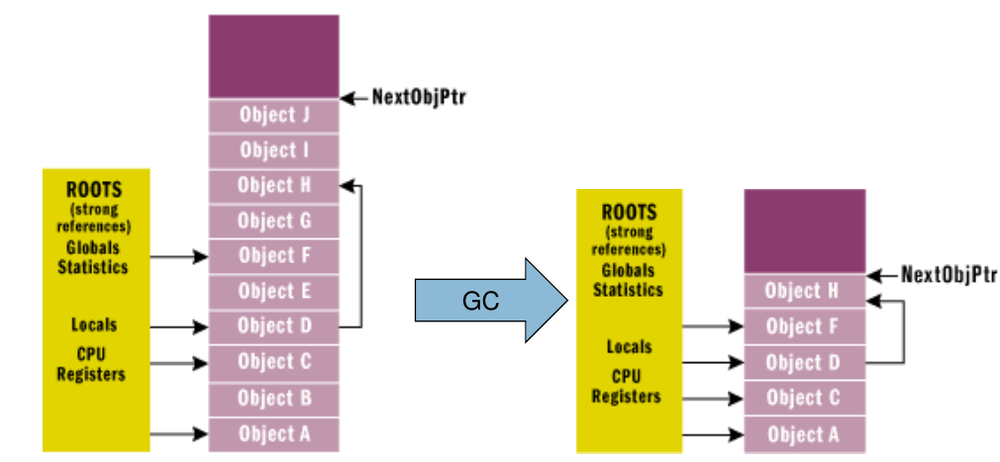

Garbage Collection
==================
Löscht alle Objekte auf dem heap, die
nicht mehr über eine Root-Referenz referenziert werden.

**Root** Refernzen sind:
* statische Felder
* aktive lokale Variablen (auf dem Stack)

**non-roots** sind:
* Instanz-Felder

* Der GC gibt alle Ojekte frei, die nicht mind. über eine Root-Refernz erreichbar sind (mark and sweep)
* Kann objekte auf dem Heap verschieben
* Nicht deterministisch
* Aufuf über System.GC oder wenn:
    * System zu wenig Arbeisspeicher hat
    * Spezifischer (dynamischer) Schwellwert überschritten wird

Der Zugriff auf den Heap ist sehr schnell, da der heap kompakt (gemanaged) ist.

Generationen
-------------
Objekte werden in 3 Generationen aufgeteilt:

* Gen0: Objekte seit letztem GC neu erstellt
* Gen1: Objekte, die einen GC überlebt haben
* Gen2: Objekte, die mehr als einen GC überlebt haben (Objekte ab 85'000 Bytes (.NET 4.5) sind automatisch Gen2 )

Dadurch aknn optimiert werden - bsp. erst Gen0 und Gen1 aufräumen -
da wird wohl am meisten Memory frei.

Finalization
-------------

Der Destruktor wird Asynchron in separatem Thread ausgeführt.
-> Viel effizienter, wenn kein Destruktor / Finalizer vorhanden sind

.. code:: c#

    class MyClass {
        ~MyClass() { /* ... */ }
    }

Deterministic Finalization
---------------------------

Der programmierer kann unmanaged Ressourcen freigeben.

.. code:: c#

    public class DataAccess : IDisposable
    {
        private DbConnection connection;
        public DataAccess()
        {
            connection = new SqlConnection();
        }

        ~DataAccess()
        {
            connection.Dispose();
        }

        public void Dispose()
        {
            connection.Dispose();
            // Call base.Dispose(); if necessary
            System.GC.SuppressFinalize(this);
        }
    }

alternativ mit dem using Statement (analog try-with-resources in Java):

.. code:: c#

    using (DataAccess dataAccess = new DataAccess()) {
        /* ... */
    }

C# Dispose Pattern

.. code:: c#

    ~DataAccess() { Dispose(false); }
    public void Dispose()
    {
        Dispose(true);
        System.GC.SuppressFinalize(this);
    }

    protected virtual void Dispose(bool disposing)
    {
        if (disposing)
        {
                if (connection != null)
                {
                    // Managed = objekte, die auch Dispose haben...
                    connection.Dispose();
                }
        }
        // Lokale dinge aufräumen...
    }

Object Pinning
--------------
Falls mit Pointern gearbeitet wird, möchte man verhindern, dass Objekte abgeräumt werden:

.. code:: c#

    // point unpinned
    Point point = new Point();
    point.x = 5;
    point.y = 6;

    // Pin point in place
    fixed (int* p = &pt.x) {
        // Do something with p;
    }
    // point unpinned again

Weak References
---------------
Explizit auf null setzen, damit das Objekt abgeräumt werden kann.
