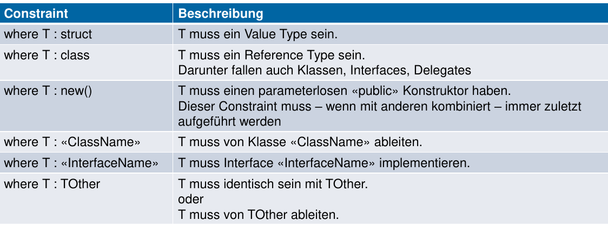

# Generics

Folgendes kann generisch sein:

* Klasse / Struct
* Interface
* Delegates / Events
* Methoden (auch wenn Klasse nicht generisch)

Deklaration immer nach Name des Elementes

Eine Typenprüfung auf Generics erfolgt "wie gewohnt"
```csharp
if(myVar is Type<T>){/*do sth...*/}
```

Der Parametertyp wird vom Compiler ermittelt.

## Type Constraints


→ Mehrere können spezifiziert werden:

```csharp
class ExamplesCombiningConstraints<T1, T2>
    where T1 : struct
    where T2 : Buffer,
               IEnumerable<T1>,
               new() { /* ... */ }
```

## Vererbung mit Generics
Normale Klassen
```csharp
class MyList<T> : List { }
```
Weitergabe des Typparameters an generische Basisklasse
```csharp
class MyList<T> : List<T> { }
```
Konkretisierte generische Basisklasse
```csharp
class MyIntList : List<int> { }
```
Mischform
```csharp
class MyIntKeyDict<T> : Dictionary<int, T> { }
```

```csharp
public void Work<T, TBase>(T a, TBase b)
    where T : TBase {
        T t1 = a;
        T t2 = b;
}
```
## Nullable Types
Problem: Statements wie `t = null` is nur gültig, wenn T ein Referenztyp ist. Analog ist `t = 0` nur für numerische Wertetypen gültig - nicht aber für bsp. structs.

Abhilfe schafft das `default` keyword. Dieses retouriert ensprechende Werte je nach typ:

* `null` für Referenztypen
* '0' für numerische Wertetypen
* Ein struct mit 0 oder null initialisierten Werten für structs.

Eine Praktische Anwendung:

```csharp
T temp = default(T);

Node current = head;
while (current != null)
{
    temp = current.Data;
    current = current.Next;
}
return temp;
```

### Nullable struct

Nullable ist analog zu Javas "Optional" - ein Wert, welcher also null sein kann. Könnte von Hand wie folgt implementiert werden:

```csharp
public struct Nullable<T>
    where T : struct
{
    public Nullable(T value);
    public bool HasValue { get; }
    public T Value { get; }
}
```

Es gibt eine bequeme "T?-Syntax", welche Nullable einfach verwendbar macht:
```csharp
int? x = 123;
double? y = 1.0;
int? j = null;
// Compiler-Output
Nullable<int> x = 123;
Nullable<double> y = 1.0;
Nullable<int> j = null;
```

Das Lesen und Casten übernimmt der Compiler auch:
```csharp
int i = GetNullableInt() ?? -1;
// Compiler-Output
int? iTemp = GetNullableInt();
int i;
if (!iTemp.HasValue) { i = -1; }
else { i = iTemp.Value; }

// Type Cast
int i = 123;
int? x = i;
int j = (int)x;
// Compiler-Output
int i = 123;
int? x = i;
int j = x.Value;
```

### Null-Conditional Operator
```csharp
// Sicheres Method Chaninig
string s = GetNullableInt()?.ToString();
// Compiler-Output
int? iTemp = GetNullableInt();
string s = iTemp.HasValue ? iTemp.GetValueOrDefault().ToString() : null;

// Sicherer Array-Zugriff
int? i = GetNullableIntArray()?[0];
// Compiler-Output
int[] arr = GetNullableIntArray();
int? i = arr == null ? default(int?) : arr[0];

// Sicherer Delegate-Aufruf
Action a = Console.WriteLine;
a?.Invoke();
// Compiler-Output
Action action = Console.WriteLine;
if (action != null) action();
```

## Ko- und Kontravarianz

**Varianz wird nicht vererbt**, In- / Out-Schlüsselwörter müssen (falls gewollt) explizit neu definiert werden.

Kovarianz
: Erlaubt die Zuweisung von stärker abgeleiteten Typen als ursprünglich angegeben - es darf also nur *abstrakter* sein.

```csharp
public interface IBuffer<out T> { }
public class Buffer<T> : IBuffer<T> { }
// [...]
IBuffer<string> b1 = new Buffer<string>();
IBuffer<object> b2 = b1;
```

> Wenn `string` an `object` zuweisbar ist Dann kann `IBuffer<string>` an `IBuffer<object>` zugewiesen werden.

Kontravarianz
: Erlaubt die Zuweisung von weniger stark abgeleiteten Typen als ursprünglich angegeben - es also nur *genauer* sein

```csharp
public interface IComparer<in T> {};
public class Comparer<T> : IComparer<T> {}

IComparer<object> c1 = new Comparer<object>();
IComparer<string> c2 = c1;
```
> Wenn `string` an `object` zuweisbar ist Dann kann `IComparer<object>` an `IComparer<string>` zugewiesen werden.

### Generic Delegates
Delegate Kovarianz:
```csharp
public delegate TResult Func<out TResult>();

class Examples {
    static string GetString() { return ""; }
    public void TestKovarianz()
    {
        Func<string> fstr = GetString;
        Func<object> fobj = fstr;
        object o = fobj();
    }
}
```

### Arrays
Sind unsafe - könnte mit eigenem Typ nicht möglich!
```csharp
object[] obj = new string[10];
// Laufzeitfehler
obj[0] = 5;
```

### `in` und `out` Schlüsselwörter
Nur erlaubt auf **Interfaces** / **Delegates** oder **Reference Types**

Beide sind als "formale Parameter" zulässig - nicht aber als Return Type.

### Übersicht

| Typ                                              | Kovariant | Kontravariant |
|--------------------------------------------------|-----------|---------------|
| IComparable<T>                                   |           | Ja            |
| IComparer<T>                                     |           | Ja            |
| IEnumerable<T>                                   | Ja        |               |
| IEnumerator<T>                                   | Ja        |               |
| IEqualityComparer<T>                             |           | Ja            |
| IGrouping<TKey, TElement>                        | Ja        |               |
| IOrderedEnumerable<TElement>                     | Ja        |               |
| IOrderedQueryable<T>                             | Ja        |               |
| IQueryable<T>                                    | Ja        |               |
| Action<T> bis Action<T1, ..., T16>               |           | Ja            |
| Comparison<T>                                    |           | Ja            |
| Converter<TInput, TOutput>                       | Ja        | Ja            |
| Func<TResult>                                    | Ja        |               |
| Func<T, TResult> bis Func<T1, ..., T16, TResult> | Ja        | Ja            |
| Predicate<T>                                     |           | Ja            |

## Generische Collections

| Generisch Namespace «System.Collections.Generic» | Nicht-generisch Namespace «System.Collections» |
|--------------------------------------------------|------------------------------------------------|
| List<T> / IList<T>                               | ArrayList / IList                              |
| SortedList<TKey, TValue>                         | SortedList                                     |
| Dictionary<TKey, TValue> /   IDictionary<TKey, TValue>                    | Hashtable / IDictionary                                    |
| SortedDictionary<TKey, TValue>                   | SortedList                                     |
| LinkedList<T>                                    | -                                              |
| Stack<T>                                         | Stack                                          |
| Queue<T>                                         | Queue                                          |
| IEnumerable<T> / IEnumerator<T>                  | IEnumerable / IEnumerator                      |
| ICollection<T>                                   | ICollection                                    |
