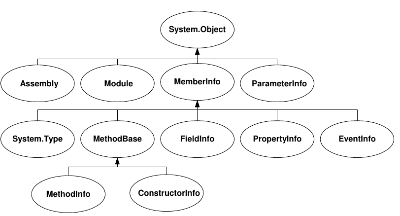

# Reflection

Zweck:

* Metadaten darstellen
* Type Discovery
    * Suchen & instantzieren von Typen
    * Zugriff auf dynamische Datenstrukturen
* Late Binding: Aufruf von Methoden/Properties nach Discovery
* Reflection Emit: Typen & Members zur Laufzeit erstellen

`System.Type` ist der Einstiegspunkt für Reflection-Operationen. Ist analog zu `getClass()` in Java.

```csharp
myObj.GetType() // Dynamic type - auf heap!
typeof(MyClass) // MyClass
```

Ist selbstbeschreibend - `obj.GetType().GetType()` retourniert Type `Type`

Mit Reflection kann auf private Felder zugegriffen werden: Sehr mächtig (Bsp. Dependency Injection kann private Fleder setzen) ist aber auch gefährlich (man arbeitet am public API vorbei)

<figure>
    
    <figcaption>C# Types Typenhierarchie (Befinden sich in `mscorelib`)</figcaption>
</figure>


Hinweise zu Namen von Flags:

* NonPublic → Alles, was nicht Public ist.
* Instance → Gegenteil vonn `static`
* DeclaredOnly -> Nur was auf code deklariert ist.


Spezialfall Method Base: Gleich für Methoden und Konstruktoren.

## Attributes
Attributes = Java Annotations
Erweitern bestehender Attribute wie public, static abstract oder sealed für bps. Serialisierung(`[DataContract, Serializable]`) oder Deprecation `[Obsolete]` usw.

Abfragbar über Reflection - sind auch parameterisierbar.

```csharp

public class CsvNameAttribute : Attribute
{
    public string Name { get; set; }

    public CsvNameAttribute(string name)
    {
        Name = name;
    }
}
public interface IStringFilter
{
    string Filter(string arg);
}

public class UppercaseAttribute : Attribute, IStringFilter
{
    public string Filter(string arg)
    {
        return arg.ToUpper();
    }
}

public class LowercaseAttribute : Attribute, IStringFilter
{
    public string Filter(string arg)
    {
        return arg.ToLower();
    }
}

public class Address
{
    [CsvName("Name"), Uppercase]
    public string Name { get; set; }

    [CsvName("Strasse"), Lowercase]
    public string Street { get; set; }

    [CsvName("Plz"), Uppercase]
    public string Postcode { get; set; }

    [CsvName("Ort")]
    public string City { get; set; }

    public Address(string name, string street, string postcode, string city)
    {
        Name = name;
        Street = street;
        Postcode = postcode;
        City = city;
    }
}

public static class Writer
{
    internal static void SaveToCsv<T>(IEnumerable<T> source, string fileName)
    {
        if (File.Exists(fileName))
        {
            File.Delete(fileName);
        }

        Type containedType = typeof(T);

        using (StreamWriter writer = new StreamWriter(fileName, false))
        {
            // Header
            foreach (PropertyInfo pi in containedType.GetProperties())
            {
                string writeThis;

                if (pi.IsDefined(typeof(CsvNameAttribute), true))
                {
                    CsvNameAttribute csvName = (CsvNameAttribute)pi.GetCustomAttributes(typeof(CsvNameAttribute), true)[0];
                    writeThis = csvName.Name + ";";
                }
                else
                {
                    // Default: Ueberschrift = Feldname
                    writeThis = pi.Name + ";";
                }
                writer.Write(writeThis);
                Console.Write(writeThis);
            }
            writer.WriteLine();
            Console.WriteLine();

            // Content
            foreach (T elem in source)
            {
                foreach (PropertyInfo pi in containedType.GetProperties())
                {
                    string writeThis;

                    if (pi.IsDefined(typeof(IStringFilter), true))
                    {
                        IStringFilter flt = (IStringFilter)pi.GetCustomAttributes(typeof(IStringFilter), true)[0];
                        writeThis = flt.Filter(pi.GetValue(elem).ToString()) + ";";
                    }
                    else
                    {
                        writeThis = pi.GetValue(elem) + ";";
                    }
                    writer.Write(writeThis);
                    Console.Write(writeThis);
                }
                writer.WriteLine();
                Console.WriteLine();
            }

            writer.Flush();
            writer.Close();
        }
    }
}
```
