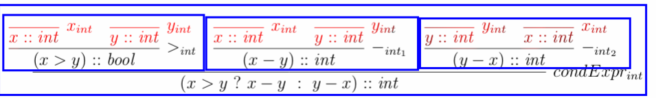

# Sequent Calculus

sequent
: a generic name for a statement

proof rule
: Used to construct proofs of sequents
: Consists of a list of an antecedent (vorhergehend) and a
: consequent (nachfolgend) sequent

Axiom
: Is a Proof rule: $$\frac{}{c}$$ (Rule ohne antecedents) - leaf node
: => Needed for a complete proof
: "Grundelemente, die immer gelten"

Theories
: a theory is a set of proof rules
: Usually infinite - specified using a finite set of proof rule schams

Proof
: Is basically a tree
: A finite tree with the following properties

    * Node consists of 1 sequent and 0/1 proof rule of the theory
    * root node = sequent to proof
    * node without proof rule has no child nodes

Pending Sub-goals of a Proof
: The sequents of a proof that have non Axium leaf nodes are called prnding sub-goals.

Complete / Incomplete
: The proof is complete if it has no prnding Sub-goals. Otherwise, it's incomplete

## Type Check Proof Example

: Axiom, proof rule, Statement
: Green: the Statement to be proofed

A proof rule can be read as follows:

> "To proof, that x > y is of type boolean, it is sufficient to proof that x and y are of type int."

or

> "If x > y results in an int, x and y must be integers"

As a basic rule:

 >"In order to proove the sequent S0 it is sufficient to proof both the sequents S1 and S2"

Now, the rules can be put togehter like lego and get a tree as a result.
The statement to proof is the root of the tree.

* Note that the rule names can't be omitted.
* Axioms are allways the leafs.
* The direction is crucial
* Think Lego!

!!! todo

    * Bug: The Pattern is not applied twice here!

A Sequent wit two Rules $$\frac{s_2}{s_1} r1$$, $$\frac{s_1}{s_2} r2$$ ist valid - but does not make
a lot of sense.

