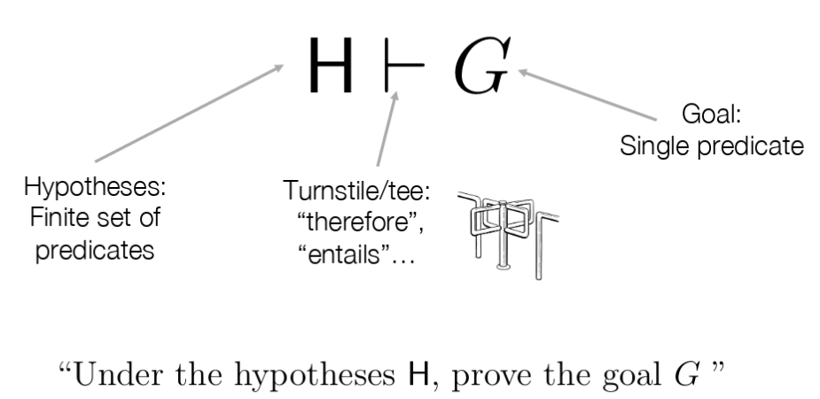

Sequent Calculus
================

**sequent**
    a generic name for a statement

**proof rule**
    Used to construct proofs of sequents
    Consists of a list of an antecedent (vorhergehend) and a
    consequent (nachfolgend) sequent

**Axiom**
    Is a Proof rule: ``\frac{}{c}`` (Rule ohne antecedents) - leaf node
    => Needed for a complete proof
    "Grundelemente, die immer gelten"

**Theories**
    a theory is a set of proof rules
    Usually infinite - specified using a finite set of proof rule schams

**Proof**
    Is basically a tree

    A finite tree with the following proerties

        * Node consists of 1 sequent and 0/1 proof rule of the theory
        * root node = sequent to proof
        * node without proof rule has no child nodes

**Pending Sub-goals of a Proof**
    The sequents of a proof that have non Axium leaf nodes are called prnding sub-goals.

**Complete / Incomplete**
    The proof is complete if it has no prnding Sub-goals. Otherwise, it's incomplete

Type Check Proof Example
-------------------------

.. image:: images/sequent_proof_exercise.png

Red: an axiom
Blue:a proof rule
Green: the Statement to be proofed

A proof rule can be read as follows:

    "To proof, that x > y is of type boolean, it is sufficient to proof that x and y are of type int."

or

    "If x > y results in an int, x and y must be integers"

Now, the rules can be put togehter like lego and get a tree as a result.
The statement to proof is the root of the tree.

.. image:: images/sequent_proof_exercise_solution.png

* Note that the rule names can't be omitted.
* Axioms are allways the leafs.
* The direction is crucial
* Think Lego!

A Sequent wit two Rules ``\frac{s_2}{s_1} r1``, ``\frac{s_1}{s_2} r2`` ist valid - but does not make
a lot of sense.

Propositional Calculus
-----------------------

Proposition vs. Predicate
..........................

**Proposition**
    A proposition is a blackbox with no input and either true or false (Eg. ``B``)

**Predicate**
    The outcome of a Predicate *depends on the input* and can therefore be
    both, true or false. (Eg. ``B(x)`` or ``A ∧ B => B ∧ A``)

H ⊢ G: "Under the hypothesis H, provee the goal G"

H is a **set of predicates**.
H, P  is basically the same, it's a set of predicates containing all elements of H and P - but only p is realy relevant
for the proof

[TODO: ∧ Goal]: "UFalls ich P ∧ Q beweisen möchte reicht es mir, P und Q zu beweisen"
"If I have to profe P∧Q, it is sufficient to proof P and Q"

basicPC
.......
TODO: Syntax (#8 im Skript)

**False** is a predicate
**not**, **and** are logical Operators

This is the abstract syntax - the concete Syntax does also contain ``(`` and ``)``
eg, ``not (A and B)``

Proof Rule Schemas
..................
Proof rule schema can be initiated - to prodica a proof rule

image #7
(mata variables = can be instantiated)
-> Beliebige Variablen können eingesetzt werden!

Proof Rules of PC
...................
TODO: Summary from #11 (skript) + mark basic PC and PC

PC
...
PC is basicPC + "syntactic Sugar". It does not provide more power ,but convenience.

TODO: Syntax (#8 im Skript)

#10

=> Introduce binding strength!

.. note::

    Quantification cannot be expressed in PC

Approach well-formated predicate
................................
#. Operators OK? (not is unary!)
#. is it ambiguous? - operator precedence OK?
   -> Can I draw a parse tree

Approach
........

#. Model argument as sequent in PC
#. construct a proof sequent #16 -> Pattern matching!
