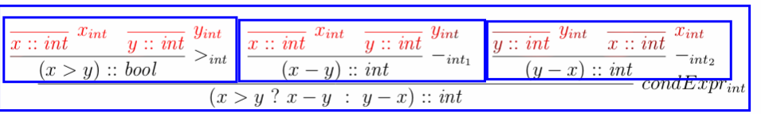

Sequent Calculus
================

**sequent**
    a generic name for a statement

**proof rule**
    Used to construct proofs of sequents
    Consists of a list of an antecedent (vorhergehend) and a
    consequent (nachfolgend) sequent

**Axiom**
    Is a Proof rule: ``\frac{}{c}`` (Rule ohne antecedents) - leaf node
    => Needed for a complete proof
    "Grundelemente, die immer gelten"

**Theories**
    a theory is a set of proof rules
    Usually infinite - specified using a finite set of proof rule schams

**Proof**
    A finite tree with the following proerties

        * Node consists of 1 sequent and 0/1 proof rule of the theory
        * root node = sequent to proof
        * node without proof rule has no child nodes

**Pending Sub-goals of a Proof**
    The sequents of a proof that have non Axium leaf nodes are called prnding sub-goals.

**Complete / Incomplete**
    The proof is complete if it has no prnding Sub-goals. Otherwise, it's incomplete

Type Check Proof Example
-------------------------

.. image:: images/sequent_proof_exercise.png

Red: an axiom
Blue:a proof rule
Green: the Statement to be proofed

A proof rule can be read as follows:

    "To proof, that x > y is of type boolean, it is sufficient to proof that x and y are of type int."

or

    "If x > y results in an int, x and y must be integers"

Now, the rules can be put togehter like lego and get a tree as a result.
The statement to proof is the root of the tree.

* Note that the rule names can't be omitted.
* Axioms are allways the leafs.
* The direction is crucial

A Note on propositional logic
------------------------------

"Assuming that  R => C and R, consequences C"

An example:

    R: It rains
    C: It's clody

"Asssuming that it rains implies that it's cloudy and it rains, consequences C"
