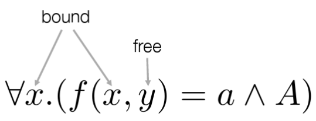
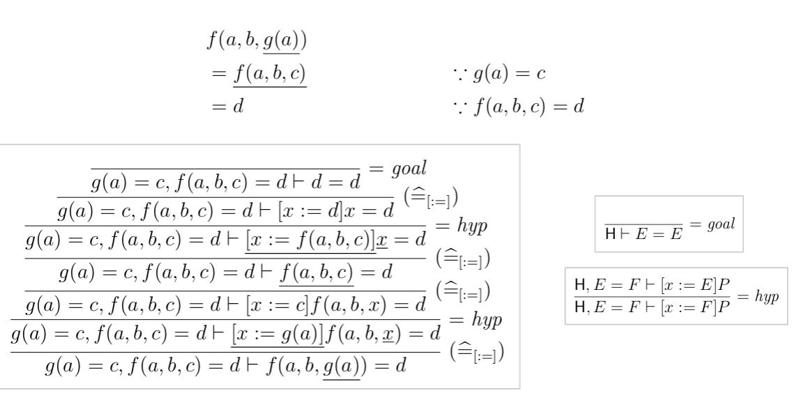

# First-order Predicate Calculus (FoPC)

Expression
: syntactic construct denoting a math. object such as number, set, function ...
: *expressions can't be proofed - they depend on the input!*
: Only a predicate can be proven ( = expression with input)

Variable
: Identifier / Placeholder: subject to subtstitution

bound variable
: = place holder. It's name has no significance and can be changed.
: Is bound in a certain context:

free variable
: A variable, that is not bound

## basicFoPCe

basicFoPCe is an extension of PC with a "for all" quantifier, an
equality relation and a an uninterpreded relation symbol:

$$P ::= ... | \forall x.P | E = E | R(\vec{E})$$

$$E ::= x | f(\vec{E})$$

$$\vec{E}$$ = List of Expressions

!!! note

    It's useful to draw an abstract syntax tree!

## FoPCe

: FoPCe in Grün

Note on the Naming of the Rule Schemas
---------------------------------------

eg. ``=goal`` means, that the goal contains an expression with an equal operator.
Can be interpreted as eg. "all expressions are equal to themselfs"

## Excursion: Computing

Logic Programming
: Programs = Rules in predicate logic
: Computation = Proof of predicate

Given the following Graph:

!!! todo

    graphiviz:

        digraph G {
        "a" -> "b"
        "b" -> "a"
        "b" -> "c"
        "c" -> "b"
        "c" -> "d"
        "d" -> "c"
        "p" -> "q"
        "q" -> "p"
        }

Is it possible, to calculate the following questions?

1. Is a reachable from d?
2. Is a *not* reachable from q?
3. Which nodes are reachable from a?

In order to answer these questions, one has to model the problem as a sequent in FoPCe:

!!! todo
    * Latexify the following formulas

Given the following Hypothesis (G)
Reflexive: ∀x. R(x,x )
Symetric: ∀x.∀y. R(x, y) ⇒ R(y, x)
Transitive: ∀x.∀y∀z. R(x, y) ∧ R(y, z) ⇒ R(x, z)

R(a, b), R(b, c), R(c,d) R(p, q)

1. Is a reachable from d? G ⊢ R(a, d)
2. Is a *not* reachable from q? G ⊢ ¬ R(a, q)
3. Which nodes are reachable from a? G ⊢ ∃x.R(a, x)

Now try to proof - if possible, the statement is correct, otherwise not.

## Equational Reasoning

If proofs only involve equality, this is a more compact and better readable
syntax:

## Approach well-formated predicate

!!! todo
    * Latexify the following formulas

1. Expression or Predicate  (eg. Equality is only defined for expressions)
    ``P ::=  ... | ∀x.P | E = E | R(E')``

    ``E ::= x | f(E')``

2. Relation or function symbol
3. Operators OK? (not is unary!)
4. is it ambiguous? - operator precedence OK? (**binding strength**: ``¬``, ``∧``, ``∨``, ``⇒``, ``⇔``)
   -> Can I draw a parse tree
