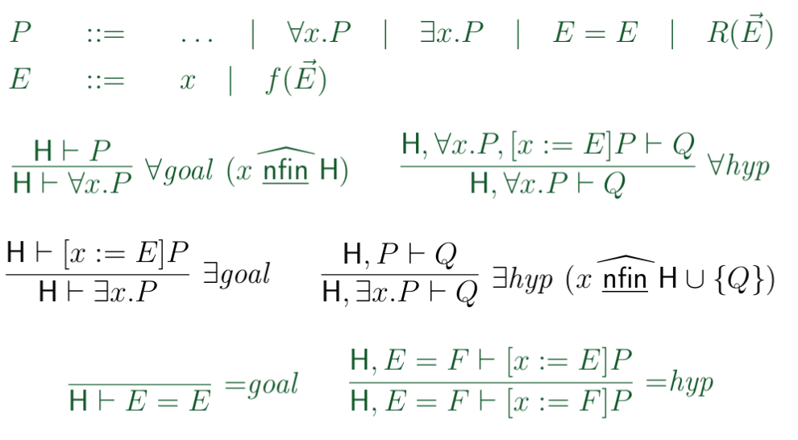

First-order Predicate Calculus (FoPC)
======================================

**Expression**
    syntactic construct denoting a math. object such as number, set, function ...
    *expressions can't be proofed - they depend on the input!*
    Only a predicate can be profen ( = expression with input)

**Variable**
    Identifier / Placeholder: subject to subtstitution

**bound variable**
    = place holder. It's name has no significance and can be changed.
    Is bound in a certain context:

    .. image:: images/bound-variable.png

**free variable**
    A variable, that is not bound

.. todo::

    What's the exact difference between bound and free variables?

basicFoPCe
-----------

basicFoPCe is an extension of PC with a "for all" quantifier, an
equality relation and a an uninterpreded relation symbol:

``P ::=  ... | ∀x.P | E = E | R(E')``

``E ::= x | f(E')``

(E' = List of Expressions, usually E with an arrow on top)

.. note::

    It's useful to draw an abstract syntax tree!

PoPCe
-----

(PoPCe in Grün)

Note on the Naming of the Rule Schemas
---------------------------------------

eg. ``=goal`` means, that the goal contains an expression with an equal operator.
Can be interpreted as eg. "all expressions are equal to themselfs"
