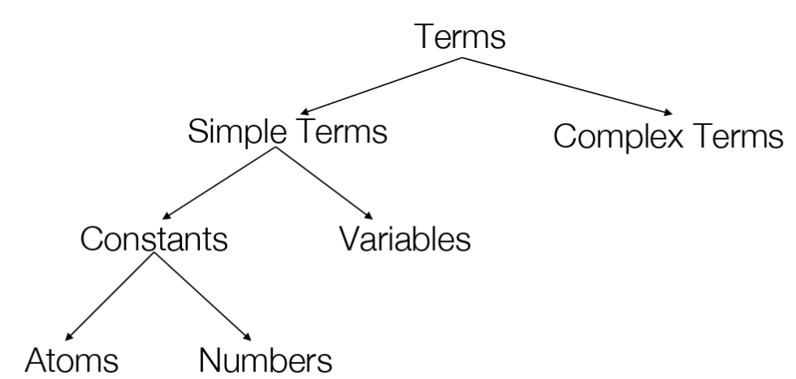
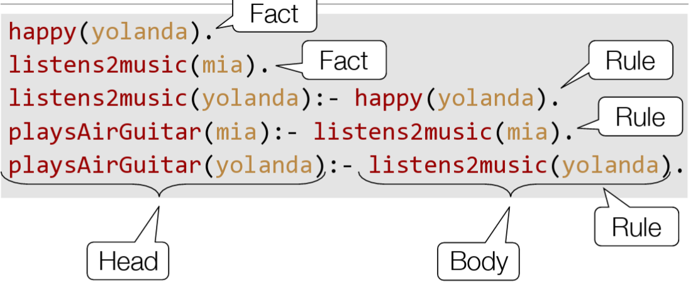

# Prolog

Use for Prolog ("Programming  with Logic") for..

* ... Applications that would be "trial and error" or search with *backtracking** (eg. Map coloring)
* ... natural language processing, constraint solvers
* ... logical calculator

Prolog is

* declarative
* based on recursion (no for/while) -> recursion
* relations(no functions) - eg woman(mia) <- woman is relation
* unifications

The concept behind it is to first describe the situation (in a knowledge base) and
then ask a query.


## Logic Programming Introduction

Program
: Predicate calculus

Computation
: Proof of a sequent

Example: "All humans are mortal. Socrates is human. Therfore, Socrates is mortal."

1. Model as argument as a sequent of FoPCe
    H(x): x is human
    M(x): x is mortal
    s: Sokrates
    ∀x.H(x) => (x), H(s) ⊢  M(s)
    $$\forall x.H(x) \Rightarrow M(x), H(s) ⊢  M(s)$$
!!! TODO

    Sth. wrong here!

2. The anser to the question above can now be calculated by a computer - for example with prolog.

```prolog
mortal(X):- human(X).           % All Humans are mortal (rule)
human(socrates).                % Socrates is human (fact)


?- mortal(socrates)             % is socrates mortal (query)
% yes                             output
```

Based on the facts abouve, we could also ask other questions.

```prolog
human(X).       % all humans
mortal(X).      % everyone who is mortal
human(sandro)   % is sandro human
```

## Prolog Basics



Atoms
: A sequence of characters of upper-case letters,
: lower-caseletters, digits, or underscore,
: startingwithalowercase letter or anything within single quotes
: Examples: `peter`, `myName`, `burger_king`, 'Vincent', 'Five dollar shake', '@$%'

Numbers
: A sequence of characters of upper-case letters,
: lower-caseletters, digits, or underscore, starting
: with a lowercase letter
: Examples: `X`, `Raphael`, foo

Complex Terms
: Atoms, numbers and variables are building blocks
: for complex terms. Functor must be an atom
: Examples: `loves(peter, maria)`, `loves(me, Q)`, `loves(me, loves(Q, me))`

Arity
: The number of arguments a complex term has is called its arity
: Examples: `house(messeturm)` arity 1, `loves(me, you)` arity 2

!!! warning

    You can define two predicates with the same functor
    but with different arity
    **Prolog treats this as two different predicates!**

    `loves(me, you) % loves/2`

    `loves(me) % loves/1`


### Realations

Relational predicates are for example `woman`, `playsAirGuitar` usw.

```prolog
woman(mia).                 % relation woman
woman(jodi).                % relation woman
woman(yolanda).             % relation woman
playsAirGuitar(jodi).       % relation playsAirGuitar
party.                      % relation party

?- woman(mia).              % yes
?- playsAirGuitar(jody).    % yes
?- playsAirGuitar(mia).     % no
?- tattoed(jody).           % no or ERROR, depending on the interpreter
?- party.                   % yes
```

### Clauses and predicates

Clauses are facts & rules

* Facts: eg. `happy(yolanda).`, `listen2music(mia)`
* Rules (head, body) eg. `playsAirGuitar(yolanda): - listens2music(yolanda).`


### Facts, Rules, Head & Body



### And / Or

```prolog
% And - with a comma
playsAirGuitar(butch):-
    happy(butch),
    listens2music(butch).

% OR - with a semicolon
playsAirGuitar(butch):-
    happy(butch);
    listens2music(butch).
```

### Asking Alternatives

```prolog
?-woman(X). % prolog finds ALL the proofs, where
```

## Unification

Terms unify if they ...

* ... are the same term or #6
* ... contain variables that can be uniformly instantiated with terms in such a way that the resulting terms are equal

Examples:

* `42` and `42` unify
* `42` and `42` unify
* `woman(mia)` and `woman(mia)` unify
* `mia` and `X` unify if mia is substitued with X
* `woman(Z)` and `woman(mia)` unify if mia is substitued with Y
* `loves(mia, X)` and `loves(X, vincent)` can not be unified

Note that Prolog does not use a standard unification algorithm
since it would have serious inpact on the performance,
eg:

```prolog
?-father(X)=X.
X=father(father(father(father(father(father(father(
father(father(father(father(father(father(father(
father(father(father(father(father(father(father(
father(father(father(father(father(father(father(
father(father(father(father(father(father(father(
father(father(father(father(father(father(father(
father(father(father(father(father(father(
.............
```

!!! seealso

    Exercises Week 4

### Occurs Check

```prolog

vertical(line(point(X,Y),point(X,Z))).

horizontal(line(point(X,Y),point(Z,Y))).

?- horizontal(line(point(1,1), point(1, Y))).
% Y=1;
% no
```

!!! seealso

    Exercises Week 4


## Proof search


!!! note

    Prolog executes "From top to bottom & left to right"
    This allows us to give priority (which is not possible in *pure* logic)


## Recursion

```prolog
child(anna,bridget).
child(bridget,caroline).
child(caroline,donna).
child(donna,emily).

% base clause (order is critical!)
descend(X,Y):- child(X,Y).
% recursive clause
descend(X,Y):- child(X,Z), descend(Z,Y).
```
This problem is analog to the graph traversal which was discussed before.

**The order is critical** - an error would be thrown if we would swap `child` and `descend` in the recursive clause.

### A Recipe for Recursion

1. Write down the signature of the predicate you want to define

    ```prolog
    len(_, _) % First argument List, second argument the length
    ```

2. Choose the parameter(s) over which recursion shall be performed.

    ➪ In the `len` example, the list.

3. Identify the case distinctions for the recursion parameter(s) on the *left hand side* of the rules.

    ```prolog
    len([],  )             % Base Case
    len([H|T], )          % Recursive Case
    ```

4.  On the *right hand side* of the Rule, write down the predicate
applied to the input parameter(s) made “smaller”.

    ```prolog
    len([],  )             % Base Case
    len([H|T],  ):-   ??? len(T, )     % Recursive Case
    ```

5. Complete Rules

    ```prolog
    len([], 0).                     % Base Case
    len([H|T], L ):- len(T, LT),    % Recursive Case
                     L is LT+1.
    ```
6. Check it

### Mismatches between declarative and procedural

Prolog answers questions in a specific way:

* Search in knowledge base from top to bottom
* Processes clauses from left to right
* Backtracking to recover from bad choises

Therefore, the order is somehow critical - where as in logic, the order is not relevant.

(See descend example above, where `child` and `descend` are swapped)

Prolog can also not compute expressions like this:

```prolog
p:- p.
?- p.
% ERROR: out of memory
```

## Lists

Lists are untyped in Prolog. The Syntax is simple and the same as in Python:

```prolog
[mia,[vincent,jules],[butch,friend(butch)]]
[[],dead(z),[2,[b,c]],[],Z,[2,[b,c]]]
```

A *non-empty list* can be thought of as consisting of two parts:

Head
: The first item of the list

Tail
: Everything else - is *always* a list

Therefore, the empty list `[]` is special!

Lists can be decomposed into head and tail using the built-in `|` operator.

```prolog
?- [Head|Tail] = [mia,vincent,jules,yolanda].
Head=mia
Tail=[vincent,jules,yolanda]
yes
```

This is not possible for an empty list:
```prolog
?- [X|Y] = []. no
```

It's also possible to get multiple values out of a list
```prolog
?- [X1,X2,_,X4|_] = [mia,vincent,marsellus, jody,yolanda].
X1=mia
X2=vincent
X4=jody
yes
```

If we don't care about a variable, we can use use `_` instead of giving it a name (anonymous variable).


The `member(element, list)` predicate allows us to check if a list contains an element
```prolog
?- member(yolanda,[yolanda,trudy,vincent,jules]).
yes
```

This could easily be implemented manually as follows:
```prolog
member(X,[X|_]).
member(X,[_|T]):- member(X,T).
```

The size of a list can be evaluated using the `len` predicate.

```prolog
?- len([a,b,c]).
X=3
yes
```

Again, this could easily be implemented manually as follows:
```prolog
len([],0).
len([_|L],N):- len(L,X), N is X + 1.
```

!!! seealso

    a2b predicate - Lecture Prolog-Lists, Slide no. 22-26

## Arithmetic
Syntax: `<?> is [HERE SHOULD BE EVALUATED]`

Recap: Equal sign **unifies**! Eg.  `X=3+2.` ➪  `X=3+2`

The right side of the `is` keyword is passed to the CPU. Therefore, prolog must be able to resolve it.

`X is 2+3.` works fine; `3+2 is X.` does not (`ERROR: is/2: Arguments are not sufficiently instantiated`).

Possible operators are: `+`, `*`, `/` and `mod(X, Y)`.
Expressions such as (`3+2` are ordinary Prolog terms - eg. the fuctor is `+`, arity 2 with 2 integer arguments)
```prolog
?- X is 3+2/
% is the same as
?- is(X,+(3,2)).
```

Note, that calculations such as: `Result is 2+2+2+2+2.` work just fine! :tada:

| Arithmetic | Prolog  |
|------------|---------|
| x < y      | X < Y   |
| x ≤ y      | X =< Y  |
| x = y      | X =:= Y |
| x ≠ y      | X =/= Y |
| x ≥ y      | X >= Y  |
| x > y      | X > Y   |


```prolog
% Step 1
max(_, _) % list of numbers, maximum number in list

% Step 2: over the list

% step 3
max([H], H)   % Base case - exactly one element
max([H|T], )  % Recursive case

% step 4 & 5
max([H], H).
max([H|T], MT):-  max(T, MT),
                  MT > H.
 max([H|T], H):-  max(T, MT),
                  H >= T.
```


## Accumulators

!!! todo

    (Arithmetic)
    = Tail Recursion / Iteration

    16 ➪ Not #20 but ~22

    Recap AD1: Result is fully calculated in the base case

## More Lists

### Append

```prolog
% append(List1, List2, List1AndList2)
% List1AndList2 is the *concatenation* of List1 and List2
append([], L, L). % Base Case
append([H|T], L, [H|R]) :-
	append(T, L, R). % Recursive call
```

Append is not always a good choise because Concatenating a list is not done in one  simple action but by traversing down one of the lists.
The order of the arguments can be crucial for performance - the first call is slower that the second one since the first list must be emptied.

```prolog
?-append([a,b,c,d,e,f,g,h,i],[j,k,l],R).
?-append([j,k,l],[a,b,c,d,e,f,g,h,i],R).
```

Prolog "magic" enables to get all combinations of sublists ...

```prolog
?- append(X, Y, [a,b,c,d]).
| X            | Y            |
|--------------|--------------|
| []           | [a, b, c, d] |
| [a]          | [b, c, d]    |
| [a, b]       | [c, d]       |
| [a, b, c]    | [d]          |
| [a, b, c, d] | []           |
false                      
```

...or prefixes/suffixes

```prolog
suffix(S,L):-append(_,S,L).
prefix(P,L) :- append(P,_,L).
?-prefix(X,[a,b,c,d]).
X=[];
X=[a];
X=[a,b];
X=[a,b,c];
X=[a,b,c,d];
no
```

### Reversing a list
```prolog
accReverse([],L,L).
accReverse([H|T],Acc,Rev) :-
    accReverse(T,[H|Acc],Rev).

% Wrapper
reverse(L1,L2) :- accReverse(L1,[],L2).
```

## Under the hood aka Horn Clauses

Prolog uses "resolution" to find proofs automatically and efficiently.

Horn Clause
: A Horn clause is a clause with at most one unnegated (aka positive) literal: $$A, (\lnot A \lor \lnot B \lor C), ...$$

Horn formula
: A Horn formula is a conjunctive normal form (CNF) formula whose clauses are all Horn clauses. $$(\lnot A \lor \lnot B \lor C) \land A \land B$$

Goal clause
: i.e. Horn clause with no positive literal (Prolog query)

definite clause
: i.e Horn clause with exactly one positive literal (Prolog rule)

Horn Clause have better computational properties than normal clauses, because:

* Resolution of two Horn clauses always results in a Horn clause.
* Resolution of a goal clause and a definit clause is always a goal clause.

## An Example

Horn clause for query: `C` (The query is negated in order to
attempt a proof by contradiction)

\[
\{\{ \lnot A, \lnot B, C \}, {A}, {B}, {\lnot C}\}
\]


!!! todo

    Understand [Example on P. 10](https://moodle.hsr.ch/pluginfile.php/53417/mod_resource/content/0/PrFm_02-LP_13-Prolog_Under_the_Hood.pdf)
