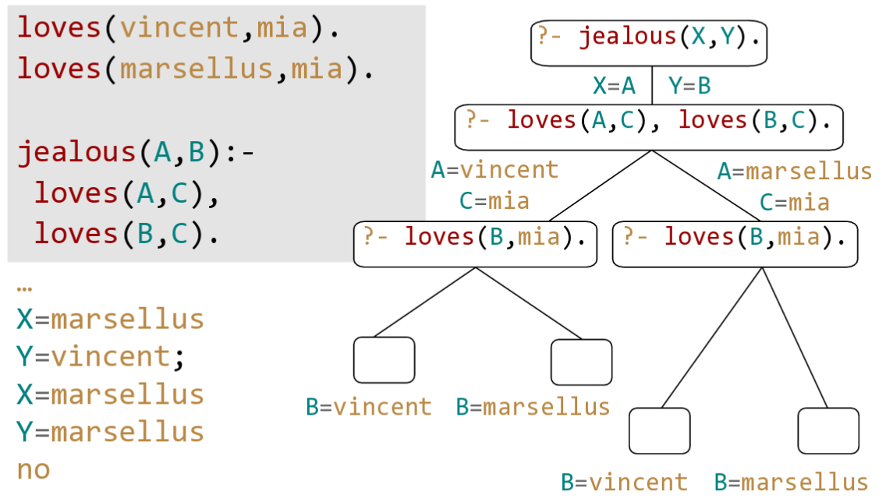

# Prolog

Use for Prolog ("Programming  with Logic") for..

* ... Applications that would be "trial and error" or search with *backtracking** (eg. Map coloring)
* ... natural language processing, constraint solvers
* ... logical calculator

Prolog is

* declarative
* based on recursion (no for/while) -> recursion
* relations(no functions) - eg woman(mia) <- woman is relation
* unifications

The concept behind it is to first describe the situation (in a knowledge base) and
then ask a query.


## Logic Programming Introduction

Program
: Predicate calculus

Computation
: Proof of a sequent

Example: "All humans are mortal. Socrates is human. Therfore, Socrates is mortal."

1. Model as argument as a sequent of FoPCe
    H(x): x is human
    M(x): x is mortal
    s: Sokrates
    ∀x.H(x) => (x), H(s) ⊢  M(s)
    $$\forall x.H(x) \Rightarrow M(x), H(s) ⊢  M(s)$$
!!! TODO

    Sth. wrong here!

2. The anser to the question above can now be calculated by a computer - for example with prolog.

```prolog
mortal(X):- human(X).           % All Humans are mortal (rule)
human(socrates).                % Socrates is human (fact)


?- mortal(socrates)             % is socrates mortal (query)
% yes                             output
```

Based on the facts abouve, we could also ask other questions.

```prolog
human(X).       % all humans
mortal(X).      % everyone who is mortal
human(sandro)   % is sandro human
```

## Prolog Basics


Atoms
: A sequence of characters of upper-case letters,
: lower-caseletters, digits, or underscore,
: startingwithalowercase letter or anything within single quotes
: Examples: `peter`, `myName`, `burger_king`, 'Vincent', 'Five dollar shake', '@$%'

Numbers
: A sequence of characters of upper-case letters,
: lower-caseletters, digits, or underscore, starting
: with a lowercase letter
: Examples: `X`, `Raphael`, foo

Complex Terms
: Atoms, numbers and variables are building blocks
: for complex terms. Functor must be an atom
: Examples: `loves(peter, maria)`, `loves(me, Q)`, `loves(me, loves(Q, me))`

Arity
: The number of arguments a complex term has is called its arity
: Examples: `house(messeturm)` arity 1, `loves(me, you)` arity 2

!!! warning

    You can define two predicates with the same functor
    but with different arity
    **Prolog treats this as two different predicates!**

    `loves(me, you) % loves/2`

    `loves(me) % loves/1`


### Realations

Relational predicates are for example `woman`, `playsAirGuitar` usw.

```prolog
woman(mia).                 % relation woman
woman(jodi).                % relation woman
woman(yolanda).             % relation woman
playsAirGuitar(jodi).       % relation playsAirGuitar
party.                      % relation party

?- woman(mia).              % yes
?- playsAirGuitar(jody).    % yes
?- playsAirGuitar(mia).     % no
?- tattoed(jody).           % no or ERROR, depending on the interpreter
?- party.                   % yes
```

### Clauses and predicates

Clauses are facts & rules

* Facts: eg. `happy(yolanda).`, `listen2music(mia)`
* Rules (head, body) eg. `playsAirGuitar(yolanda): - listens2music(yolanda).`


### Facts, Rules, Head & Body


### And / Or

```prolog
% And - with a comma
playsAirGuitar(butch):-
    happy(butch),
    listens2music(butch).

% OR - with a semicolon
playsAirGuitar(butch):-
    happy(butch);
    listens2music(butch).
```

### Asking Alternatives

```prolog
?-woman(X). % prolog finds ALL the proofs, where
```

## Unification

Terms unify if they ...

* ... are the same term or #6
* ... contain variables that can be uniformly instantiated with terms in such a way that the resulting terms are equal

Examples:

* `42` and `42` unify
* `42` and `42` unify
* `woman(mia)` and `woman(mia)` unify
* `mia` and `X` unify if mia is substitued with X
* `woman(Z)` and `woman(mia)` unify if mia is substitued with Y
* `loves(mia, X)` and `loves(X, vincent)` can not be unified

Note that Prolog does not use a standard unification algorithm
since it would have serious inpact on the performance,
eg:

```prolog
?-father(X)=X.
X=father(father(father(father(father(father(father(
father(father(father(father(father(father(father(
father(father(father(father(father(father(father(
father(father(father(father(father(father(father(
father(father(father(father(father(father(father(
father(father(father(father(father(father(father(
father(father(father(father(father(father(
.............
```

!!! seealso

    Exercises Week 4

### Occurs Check

```prolog

vertical(line(point(X,Y),point(X,Z))).

horizontal(line(point(X,Y),point(Z,Y))).

?- horizontal(line(point(1,1), point(1, Y))).
% Y=1;
% no
```

!!! seealso

    Exercises Week 4


## Proof search



!!! note

    Prollog executes "From top to bottom & left to right"
    This allows us to give priority (which is not possible in *pure* logic)


## Recursion

```prolog
child(anna,bridget).
child(bridget,caroline).
child(caroline,donna).
child(donna,emily).

% base clause (order is critical!)
descend(X,Y):- child(X,Y).
% recursive clause
descend(X,Y):- child(X,Z), descend(Z,Y).
```
This problem is analog to the graph traversal which was discussed before.

**The order is critical** - an error would be thrown if we would swap `child` and `descend` in the recursive clause.


### Mismatches between declarative and procedural

Prolog answers questions in a specific way:

* Search in knowledge base from top to bottom
* Processes clauses from left to right
* Backtracking to recover from bad choises

Therefore, the order is somehow critical - where as in logic, the order is not relevant.

(See descend example above, where `child` and `descend` are swapped)

Prolog can also not compute expressions like this:

```prolog
p:- p.
?- p.
% ERROR: out of memory
```

## Lists

Lists are untyped in Prolog. The Syntax is simple and the same as in Python:

```prolog
[mia,[vincent,jules],[butch,friend(butch)]]
[[],dead(z),[2,[b,c]],[],Z,[2,[b,c]]]
```

A *non-empty list* can be thought of as consisting of two parts:

Head
: The first item of the list

Tail
: Everything else - is *always* a list

Therefore, the empty list `[]` is special!

Lists can be decomposed into head and tail using the built-in `|` operator.

```prolog
?- [Head|Tail] = [mia,vincent,jules,yolanda].
Head=mia
Tail=[vincent,jules,yolanda]
yes
```

This is not possible for an empty list:
```prolog
?- [X|Y] = []. no
```

It's also possible to get multiple values out of a list
```prolog
?- [X1,X2,_,X4|_] = [mia,vincent,marsellus, jody,yolanda].
X1=mia
X2=vincent
X4=jody
yes
```

If we don't care about a variable, we can use use `_` instead of giving it a name (anonymous variable).


The `member(element, list)` predicate allows us to check if a list contains an element
```prolog
?- member(yolanda,[yolanda,trudy,vincent,jules]).
yes
```

This could easily be implemented manually as follows:
```prolog
member(X,[X|_]).
member(X,[_|T]):- member(X,T).
```

The size of a list can be evaluated using the `len` predicate.

```prolog
?- len([a,b,c]).
X=3
yes
```

Again, this could easily be implemented manually as follows:
```prolog
len([],0).
len([_|L],N):- len(L,X), N is X + 1.
```

!!! seealso

    a2b predicate - Lecture Prolog-Lists, Slide no. 22-26

## Arithmetic
Syntax: `<?> is [HERE SHOULD BE EVALUATED]`
Recap: Equal sign **unifies**! Eg.  `X=3+2.` -> `X=3+2`

The right side of the `is` keyword is passed to the CPU. Therefore, prolog must be able to resolve it.

`X is 2+3.` works fine; `3+2 is X.` does not (`ERROR: is/2: Arguments are not sufficiently instantiated`).

Possible operators are: `+`, `*`, `/` and `mod(X, Y)`.
Expressions such as (`3+2` are ordinary Prolog terms - eg. the fuctor is `+`, arity 2 with 2 integer arguments)
```prolog
?- X is 3+2/
% is the same as
?- is(X,+(3,2)).
```

Note, that calculations such as: `Result is 2+2+2+2+2.` work just fine! :tada:


!!! todo

    * acclen vs. len?
