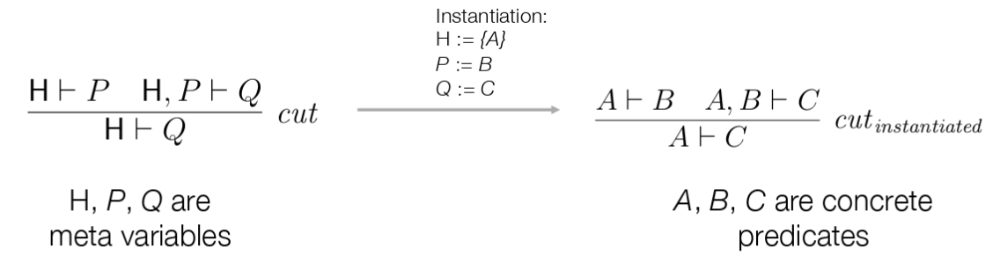
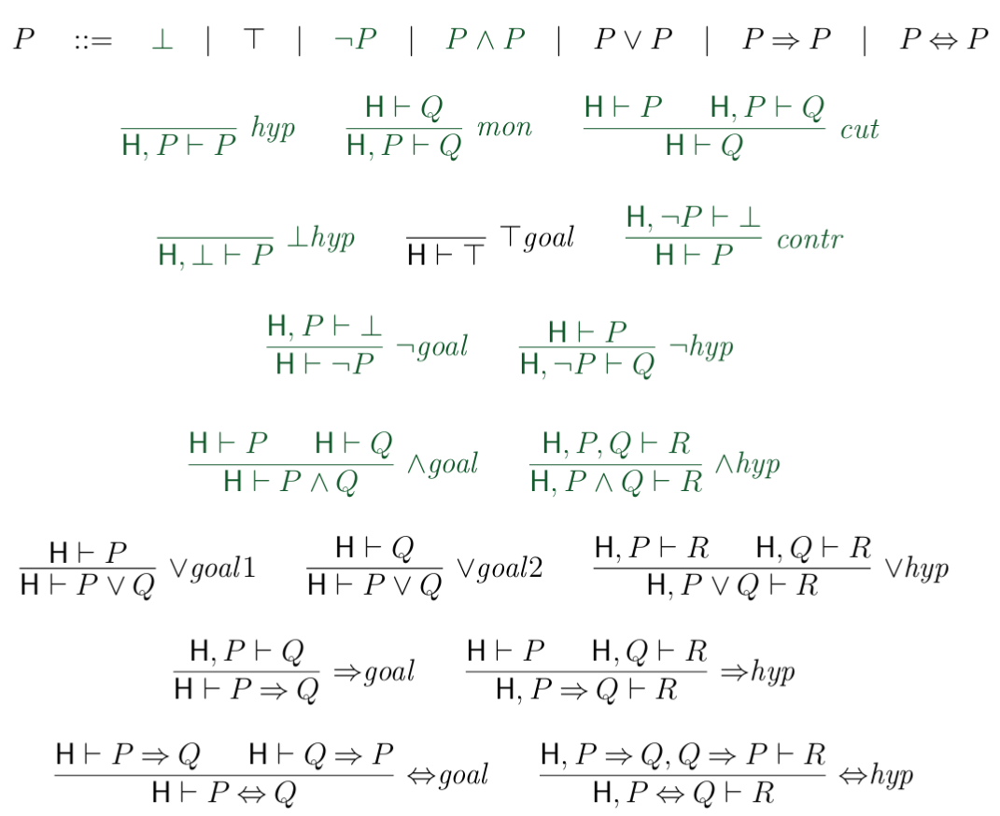

Propositional Calculus (PC)
===========================

Proposition vs. Predicate
--------------------------

**Proposition**
    A proposition is a blackbox with no input and either true or false (Eg. ``B``)

**Predicate**
    The outcome of a Predicate *depends on the input* and can therefore be
    both, true or false. (Eg. ``B(x)`` or ``A ∧ B => B ∧ A``)

.. image:: images/propositional_calc_sequent.png

H is a **set of predicates**.

``H, P``  is basically the same. It's a set of predicates containing all elements of H and P, but
only P is relevant for the proof.

basicPC
-------

``P ::=  ⊥ | ¬ P | P ∧ P``

**False** (⊥) is a predicate
**not** (¬), **and** (∧) are logical Operators

This is the abstract syntax - the concete Syntax does also contain ``(`` and ``)``
eg, ``not (A and B)``

Proof Rule Schemas
------------------
Proof rule schema can be initiated.

**mata variables**
    Variables in the Proof Schames. They can be instantiated with
    any value.

PC
---
PC is basicPC + "syntactic Sugar". It does not provide more power, but convenience.

``P ::=  ⊥ | T | ¬ P | P ∧ P | P ∨ P | P ⇒ P | P ⇔ P``

``T ≙ ¬⊥`` (True is defined as not False)

``P ∨ Q ≙ ¬(¬P ∧ ¬Q)`` (And)

``P ⇒ Q ≙ ¬P ∨ Q`` (Implication)

``P ⇔ Q ≙ (P ⇒ Q) ∧ (Q ⇒ P)`` (equivalence)

**binding strength**: ``¬``, ``∧``, ``∨``, ``⇒``, ``⇔``

.. note::

    Quantification cannot be expressed in PC

Proof Rules of PC
-----------------

(BasicPC in Green)

Approach well-formated predicate
---------------------------------
#. Operators OK? (not is unary!)
#. is it ambiguous? - operator precedence OK?
   -> Can I draw a parse tree

Approach
---------

#. Model argument as sequent in PC
#. construct a proof sequent #16 -> Pattern matching + syntactic rewriting

.. seealso::

    Levels of Reasoning, Skript #10
