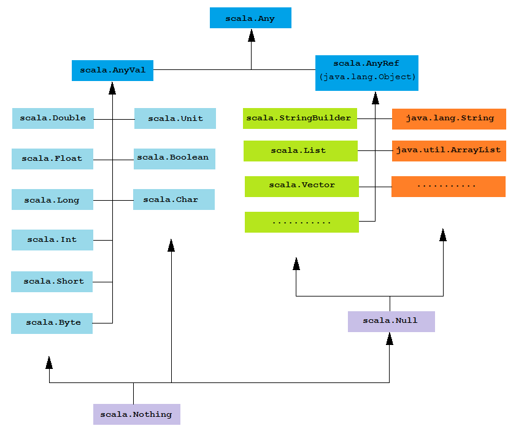

# Scala

* Verschiedene Backends - typ. Java
* Wenn auf JVM mit Java interoperabel.
* "Scalable" mit Problem und Entwickler
* OO + Funktional
* Statisch typisiert
* Sparsame Syntax (Typ-Inferenz)
* Keine Semikolons
* Mehrheitlich Expressions (F20)
* Letzte Expression = automatisch Rückgabewert.
* Tail-Recursion optimiert Compiler weg :tada:
* Composable - Sprachelemente flexibel kombinieren wie bsp. Funktionen in Funktionen definieren.


Recap: Expression gibt Wert zurück
Statement - Seiteneffekt

## OO vs. funktional

OO:

* Alles ist ein Objekt (Klassen, Funktionen)
* Objekte kommunizieren miteinander
* Objekte sind Instanzen von Klassen (Klassen repräsentieren Gruppierungen)
* Klasse definiert das Verhalten des Objekts & Vererbung
* Objekt beinhalten Daten und Verhalten
* Expression Problem: Neue Klassen einfach, neue Methoden schwierig
* Viele Statements

Funktional

* execute & evaluate expressions
* avoid mutable state
* first-class functions
* Daten und Funktion getrennt
* Expression Problem: Neue Datentypen schwierig, neue Funktionen einfach.
* (fast) nur Expressions

(evtl. F13)

Wann was F17 - ist aber kein entweder-oder F18

## Strict vs. lazy evaluation


## Crashkurs
> Sie können Programme in Scala schreiben die ADTs konstruieren und mit Pattern-Matching ...

Grundsätzlich viel gleich wie in Java...

### Datentypen

* Keine primitiven Datentypen (`1.toFloat`)
* Erweitertes API (Bsp. `"42".toInt`)
* Mehrzeilige Strings mit `"""` und String-Interpolation `s"my ${foo(10)}"`
* Kein `void` - sondern Typ Unit (`()` = "Leeres Tupel")

### Typhierarchie



Null & Nothing (Wenn bsp. Methode immer Exception wirft) - relevant für Typ Inferenz.
### Listen, Tupel und andere Datenstrukturen

* Liste ist konkrete Implementation
* immutable -> Ermöglicht gute Performance

```scala
val list1 = "Willkommen" :: "zu" :: "Scala" :: Nil
val list2 = List("Willkommen", "zu", "Scala")
list1.head            evaluiert zu            "Willkommen"
list1.tail             evaluiert zu            "zu" :: "Scala" :: Nil
list1(2)             evaluiert zu            "Scala"

val tupel2 = (1, "String")
val triple = ("key", "value", "?")
val pair = "key" -> "value"
```

Viel mehr (Map, Set, Range, Vector, Trees, Queues, ...)

### Variablen
* `val` vs. `var` (`val` = `final`)
* Typangabe ist optional
* `lazy` Keyword  (`lazy val foo = complexComputation()`)

### Kontrollstrukturen
* `val max = if (a >= b) a else b `
* for-Comprehensions
* Keine Checked-Exceptions

### Methoden


### Pattern Matching
* Etwas wie "Switch-Case" aber mit beliebigen Typen und eigenen Extraktoren
* Kein Fall-through
* Reihenfolge relevant!


```scala
// Basic Example
def patternMatching(i: Int) = {
  i match {
    case 0 => "Null"
    case 1 => "Eins"
    case _ => "?" // Default case
  }
}

// With Types & Conditions
def patternMatching(any: Any) = {
    any match {
     case i: Int               => "Int: " + i
     case f: Float if f > 10.0 => "Float: " + f
     case "s"                  => "String: s"
     case (s: String, _)       => "String: " + s
     case head :: tail         => "Non-empty list"
     case any                  => any.toString
    }
}

// with Classes
case class Person(name: String, alter: Int)

def matchAPerson(person: Person) = {
  person match {
    case Person("Mirko", 32)           => "Found Mirko!"
    case Person(name, age) if age < 18 => s"Minor: $name"
    case Person(name, _)               => s"Adult: $name"
  }
}

// Regex
val Chf = new Regex("""([0-9]+)\.([0-9][05])""") // Mit """ kein doppeltes escaping
"1.50" match {
  case Chf(franken, rappen) => // Regex Gruppen extrahieren
    println(s"$franken Franken und $rappen Rappen")
  case _ =>
    println("Ungültiger Betrag")
}
```

### Methoden
* Named Parameter
* Default-Werte
* Methoden mit mehreren Parameterlisten - ermöglicht Partial Application (Currying)

    ```scala
    def add(m: Int)(n: Int) = m + n

    val addToTen = add(10) _
    addToTen(5)
    ```

* Alles Pass-By-Value
* Kann by-name übergeben werden - Lazy (wenn bsp. sehr teuer). Wird jedes Mal neu ausgewertet. Könnte auch mit Funktionen abgebildet werden.

    ```scala
    def unless(condition: Boolean, then: => Any) = {
        if (!condition) {
            then
        }
    }

    unless(1 + 2 == 3, throw new RuntimeException("VM Kaputt!"))
    ```
### Funktionen

* Funktionen sind Values, also Objekt-Instanzen (Aus Sicht der VML)
* Methoden werden zu Funktionen umgewandelt falls nötig

```scala
val add = (m: Int, n: Int) => m + n

val people = List(new Person( ... ))
val istVolljährig = (p: Person) => p.age >= 18

people.filter(istVolljährig)
people.filter((p: Person) => p.age >= 18)
people.filter(p => p.age >= 18)
```

### Operatoren


* Kein spezielles Konzept von Operatoren - Eigentlich Methodenaufrufe
    * `10 / 2` ist eigentlich `10./(2)`
    * `p.age >= 18` ist eigentlich `p.age.>=(18)`
* `.` und Klammern können auch so weggelassen werden (`0 to 200 by 5` = `0.to(1000).by(5)`) **NUR** wenn expliziter Empfänger und ein Argument.
* Bsl. `->` ist auch Methodenname.

### Klassen

* Objektmodell sehr ähndlich wie in Java.
    * Abstrakte Klassen, Finale Klassen, Einfachvererbung usw., Instantiierung mit new, Verschachtelungen usw.
* Primärkonstruktor wird immer aufgerufen.
* Arten von Membern:
    * `val`, `var` Werte
    * Methoden mit `def`
    * Typ-Aliase mit `type`
* Alle Member können auch abstract sein.
* Alle Member wird Dynamisch gebunden & können überschrieben werden
    * Vgl. Java: Nur überdecken von Werten möglich - nicht aber überschreiben.
* `static` gibts nicht.

```scala
class Person(no_member:String,  val name: String, var age : Int) {
    // Weiterer Konstruktor
    def this(name: String) = this(name, 0)
    val readOnlyAttr = 0;
    private val privateVal : String = ...
    protected val protectedVal2 : String = ...

    type MyMap = Map[Int, String] // Andere Notation für Generics!

    def methode() = ..
}
```

* Keine public Datenfelder - Zugriff immer über Getter/Setter. (Uniform Access Principle)
    * Für `var` wird getter/setter erstellt
    * Für `val` wird nur getter erstellt.
* Sichtbarkeit wie n Java (public, private usw.)
    * Wenn nicht explizit angegeben: `public`!
* Abstract optional: Wenn implementierung Fehlt, automatisch abstract
* Überschreiben explizit mit `override`-Keyword

### Funktion-Klassen
* Funktionen sind Objekte - leiten von FunctionN ab.
    * Apply-Methode enspricht aufruf mit `(...)` - Analog zu Funktionen in C++
    * Folgich gibt es auch Methoden auf Funktionen
        * `andThen` und `compose` zur Verkenden
        * `toString`

```scala
val istVolljährig: Function1[Person, Boolean] =
  (p: Person) => p.age >= 18
val istVolljährig2 = new Function1[Person, Boolean] {
  def apply(p: Person): Boolean = p.age >= 18
}
```

### Case-Klassen

* Hat zusätzliche Eigenschaften (vom Compiler generiert)
    * Getter für alle Konstruktorparameter (kein `val` nötig)
    * `toString`, `equals`, `hashCode` anhand der Parameter (structural Equality)
    * copy Methode (`val newPerson = person.copy(age = person.age + 1)`)
    * Beim Instanzieren ist kein new nötig `val person = Person("Mirko", 32)`
    * Können im Pattern-Matching verwendet werden (daher auch der Name)
    * Haben Companion-Object
        * Singleton Object als "Factory"

        ```Scala
        object Person {
          def apply(name: String, age: Int) = new Person(name, age)
        }
        Person("Mirko", 32) ist eigentlich Person.apply("Mirko", 32)
        ```

### Objekte

* Singleton Objects
    * Als alternative zu statischen Methoden/Attribute
    * Werden vom Compiler automatisch instanziert.

    ```scala
    object Main {
      def main(args: Array[String]) = {
        println(args.mkString())
      }
    }
    ```

### Algebraische Datentypen

Bereits bekannt aus Haskell: `data Lst a = Nil | Cons a (Lst a)`

```scala
sealed class Lst[T]
case class Nil[T]() extends Lst[T]
case class Cons[T](t: T, tail: Lst[T]) extends Lst[T]
val myList = Cons(1, Cons(2, Cons(3, Nil())))

object Lst {
  def length[T](lst: Lst[T]): Int = lst match {
    case Nil() => 0
    case Cons(_, tail) => 1 + length(tail)
  }
}
```

* Sealed:
    * Alle Unterklassen müssen in der gleichen Datei deklariert werden
    * Wichtig für Pattern-Matching, wo man ja möchte, dass der Compiler hilft

## Traits
* Scala kennt keine Interfaces - dafür traits (Merkmal)
* Traits sind fast analog zu Java9 Interfaces mit Default-Methoden

    ```scala
    trait Equal[T] {
      def isEqual(t: T): Boolean
      def isNotEqual(t: T) = !isEqual(t)
    }
    ```
* Abstrakte Klassen haben Konstruktor und Typparameter
* Traits haben nur Typparameter
* Abstrakte Klassen nur wenn Konstruktorparameter nötig oder Java Interoparabilität
* Ermöglicht "Mehrfachvererbung" - geht nur mit Traits! (Nicht mit Klassen!)

    ```scala
    case class User(name: String) extends Named with Equal[User]{ ... }
    ```

    * Problem: Diamand
        * Wird von Scala mit `Trait Linearization` gelöst:
            * Reihenfolge wird anhand der Defintion festgelegt, wobei bereits bekannte Traits ignoriert werden. Ein `super` -Aufruf folgt genau dieser Reihenfolge.
## Generics
* Werden auch zur Laufzeit vergessen
* Enschränkungen (Type-Bounds) mit `<:` (extends in Java) und `>:` (super)

```scala
case class Node[T <: Comparable[T]](
  value: T,
  left: Option[Node[T]],
  right: Option[Node[T]])
```

Beispiel `try-with-resource` mit Scala implementieren:

```scala
def using[T <: Closeable](resource: => T)(fun: T => Unit) = {
  try {
    fun(resource)
  } finally {
    resource.close()
  }
}

// Funktion wird der zweiten Parameterliste übergeben
using(new BufferedReader(...)) { reader =>
  println(reader.readLine)
}
```
## Varianz
* Ivariant: Nur der angegebene Typ ist erlaubt (Keine Sub-/Super-Klassen)
* Covariant: Es sind auch Subtypen erlaubt (Gleiche Richtung wie Spezialisierung)
* Contravariant: Es sind auch Supertypen erlaubt (Selbe Richtung wie UML-Vererbungspfeil)

* Rückgabetypen sind **Covariant**
* Parameter sind **Contravariant**
* -> Parameter/Rückgabetypen können in Subklassen nicht spezialisert bzw. generalisiert werden.

Gererics sind by default in Scala invariant. Mit einem `+` können diese Covariant und mit `-` Contravariant gemacht werden.

Problem: Wenn Generic Covariant gehen Setter Kaputt (analog zu Java!)


## Implizite Typkonvertierung
-> Prüfungsrelevant?!

* Scala sucht nach einem Weg, eine implizite Typenkonverierung zu machen. Wird kein Weg gefunden, wird eine Exception geworfen.
* Eine Methode kann mit dem Keyword `implicit` fetstgelegt werden - welcher vom Compiler immer aufgerufen wird.

```scala
implicit class Duration(i: Int) {
  def seconds = java.time.Duration.ofSeconds(i)
  def minutes = java.time.Duration.ofMinutes(i)
}

new Duration(5).seconds


10.minutes
// Integer hat keine `minutes`-Methode.
// Compiler sicht nach Klasse, die `minutes`-Methode hat.
// Compiler sucht nach implizitem Converter - und fügt diesen ein
```

## Weiters
* `def` kann auch mit `val` implementiert werden - wenn möglich & gewünscht
* Implizite Parameter (Prüfungsrelevant?)

    ```scala
    sender ! workItemResult

    trait ScalaActorRef {
      def !(message: Any)(implicit sender: ActorRef)
    }
    ```
