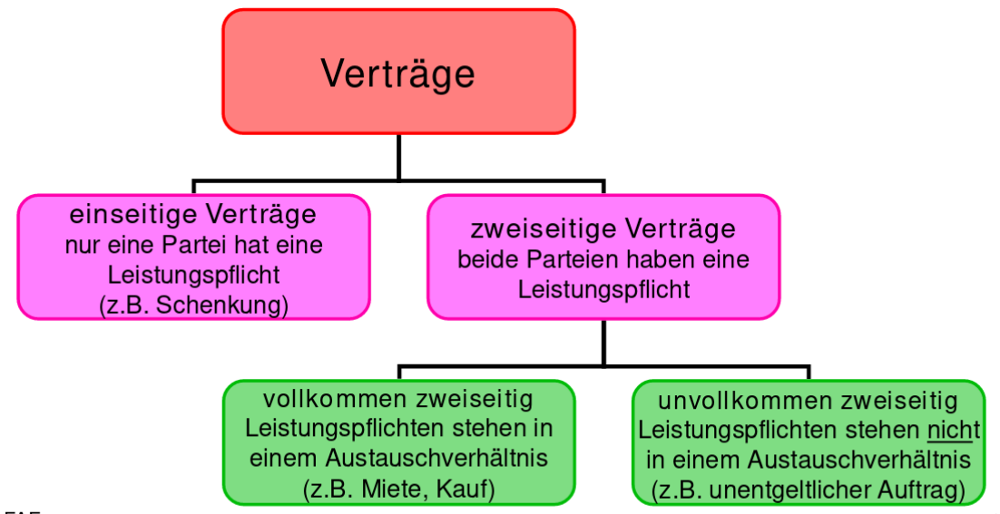

# Vertragsrecht

* Obligation = Schuldverhältnis
* Geregelt im Öffentlichen Recht(auf einer Seite ist der Staat)
* Obligation != Vertrag!
* Vertrag ist immer Rechtsgeschäft aber nicht zwingend umgekehrt

## Schuldverhältnis
* Schuldverhältnis = Leistungspflicht / Forderungsrecht

Entstehung durch Gesetz:

* Bsp. Haftpflicht bei Unfall
* unerlaubte Handlung: Bsp. Verschuldungshaftung (Beispiel Eiszapfen Gehweg)
* ungerechtfertigte Bereicherung (wenn einfach Geld auf dem Konto)
* Sonstiges wie Unterhaltsforderungen usw.

Entstehung durch Rechtsgeschäft:

* Willensäusserung - beispielsweise Testament
* zwei oder mehrseitige Rechtsgeschäfte wie Kaufverträge, Werkverträge oder Aufträge.

Willensäusserung:

* ausdrücklich: Bsp. mündlich anpreisen
* stillschweigend: Preisschild
* mittelbar: Antragssteller in der Regel länger gebunden als wenn unmittelbar.
* unmittelbar:

## Rechtsgeschäft

!!! todo

    ?!

## Vertrag

* Vertragsabschluss erfolgt, wenn sich zwei Parteien auf eine Willensäusserung einigen
* Antrag + Annahm = Vertragsabschluss
* Widerrufsrecht (7 Tage) bei Haustürgeschäft, auf der Strass, Telefonanrufe
* Folge von Vertragsabschluss: Rechte und Pflichten werden geregelt.

Voraussetzungen:

* 2 Handlungsfähige Parteien = Mündig(ab 18) und Urteilsfähig (unter Drogeneinfluss, geistige Krankheit usw.)
* übereinstimmende gegenseitige Willensäusserung (Antrag/Annahme)
* Einigung über alle wesentlichen Punkte - Bsp. Kaufvertrag Produkt/Preis

Arten von Verträgen

: vertragsarten

* Einseitig: Nur eine Partei hat Leistungspflicht (bsp. Erbe)
* Zweiseitig: Beide haben pflicht.
* Vollkommen zweiseitig: Leistungspflichten sind etwa "gleichwertig"
* Nominativerträge, wie Kaufvertrag(gesetzlich - im OR - geregelt)
* Innominatverträge, wie Leasing (nicht gesetzlich geregelt)

Werkvertrag = "individuelles Werk" (bsp. Schreiner, Torte für die Hochzeit)

Schranken:

* Widerrechtlich (Kokain verkaufen)
* Sittenwidrigkeit (Verstoss gegen Anstand)
* öffentliche Ordnung?
* Verstoss gegen das Persönlichkeitsrecht (Eheversprechen, Organe verkaufen, übermässige Bindung)
    * Übermässig grosse Bindung (Bsp. 50 Jahre Exklusivvertrag für Bier)
    * Auch Unternehmen hat Persönlichkeit
* Unmöglichkeit (Grundstück auf dem Mond)

➪ Vertrag ist nichtig!

2 Gültige Kaufverträge sind nicht wiederrechtlich es
kann aber Entschädigung geltend gemacht werden.

Grundsatz (Art 19 Abs1 OR)

* Abschlussfreiheit
* Partnerwahlfreiheit
* Formfreiheit
* Inhaltsfreiheit
* Typenfreiheit
* Änderungsfreiheit
* Aufhebungsfreiheit

Die Konditionen / Rechte, welche beim Vertragsabschluss gelten
kommen aus 3 möglichen Quellen zur Anwendung:

* zwingende Bestimmungen - keine Abweichung möglich (Bsp. mind. Anzahl Ferien)
* Vertragliche Vereinbarung
* Nicht zwingende ("dispositive") Bestimmungen - Abweichung möglich

Bsp. Vertrag zwischen Bauherr und Bauingenieur:

* Zwingende Bestimmungen des Auftragsrechts
* Vertragliche Vereinbarung - bsp. SIA-Norm
* dispositive Bestimmungen des Auftragsrechts

## Formvorschriften

Grundsätzlich formlos bsp. Auftrag, Arbeitsvertrag, Mietvertrag
Ausnahme: bsp. Grundstückkauf oder nach Vereinbarung

Formen:

* Einfache Schriftlichkeit
  Schriftliche Erklärung + Unterschrift
* qualifizierte Schriftlichkeit
  Zusätzliche Anforderungen zur Schriftlichkeit - bsp. Bürgschaft (mit maximalem Betrag)
* öffentliche Beurkundung
  von Beurkundungsperson festgehalten z.Bsp. Notar
  Beispiel: Güterstand beid der Ehe, Erbvertrag (Vorbezug)

## Vertragserfüllung

Verträge sind einzuhalten - einseitige Lösung nur selten möglich.
Ausnahme: Streitfall

Geldschuld: Bringschult
➪ Müssen überbracht werden
Sonst: Holschuld

Zeitpunkt: Vertraglich vereinbart - sonst je nach Rechtsverhältnis

## Leistungsstörung

* Nichtleistung: Nichterfüllung wegen Unmöglichkeit (bsp. Bilder abgebrannt)
* Schlechtleistung: Nicht das oder nicht alles, was vertraglich vereinbart
* Spätleistung: Nicht rechtzeitig

## Verzugsfolgen

Mahnung ➪ Mahnfrist.
Mahngebüren können erhoben werden (wenn in AGB vorgesehen)

Klage auf Erfüllung + Schadenersatz vordern
Verzicht auf Leistung mit Schadenersatz oder Rücktritt (als wäre nie geschehen)

## Durchsetzung  von Vorderungen

Geldleistungspflichten: immer über Betreibung

Am Wohnsitz (Gemeinde, Kreis usw.) des Schuldners beim
Betreibungsamt - bei Zügeln muss erneut Betreibung eingereicht werden.
Zahlungsbefehl vom Betreibungsamt. Falls Forderung nicht OK - Rechtsvorschlag
erhoben. Dann muss der Gläubiger beweisen!
➪ im Extremfall Verpfändungen möglich

Andere Leistungspflichten: Zivilprozessverfahren

## Verjährung von Forderungen

Verjährung = Forderung ist nicht durchsetzbar (besteht aber Theoretisch noch weiter)
Frist 10 Jahre und 5 Jahre bei regelmässigen Forderungen wie Lohn, Miete etc.
Ab: Fälligkeit (bsp. wenn Uhr erhalten)

Zweck: Verschleppung / Verzöglerung vermeiden

!!! todo

    * Öffentliches Recht vs. Privatrecht (OR/ZGB) - OR Teil des ZGB usw.
