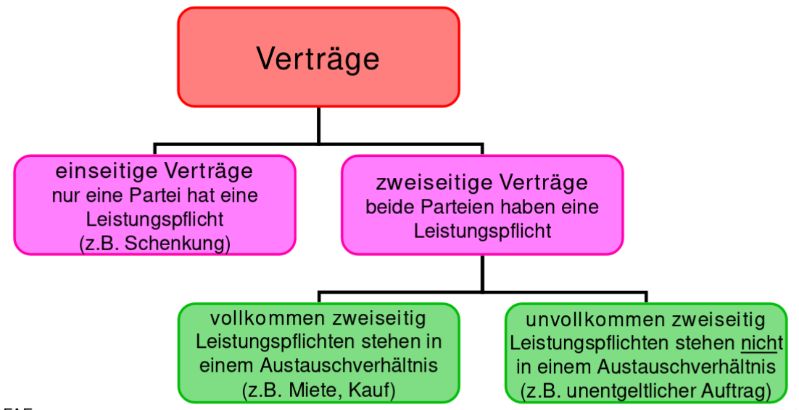

Grundlagen
==========
* Obligation = Schuldverhältnis

Vertragsrecht
=============

* Geregelt im Öffentlichen Recht(auf einer Seite ist der Staat)
* Obligation != Vertrag!
* Vertrag ist immer Rechtsgeschäft aber nicht zwingend umgekehrt

Schuldverhältnis
----------------
* Schuldverhältnis = Leistungspflicht / Forderungsrecht

Entstehung durch Gesetz:

* Bsp. Haftpflicht bei Unfall
* unerlaubte Handlung: Bsp. Verschuldungshaftung (Beispiel Eiszapfen Gehweg)
* ungerechtfertigte Bereicherung (wenn einfach Geld auf dem Konto)
* Sonstiges wie Unterhaltsforderungen usw.

Entstehung durch Rechtsgeschäft:

* Willensäusserung - beispielsweise Testament
* zwei oder mehrseitige Rechtsgeschäfte wie Kaufverträge, Werkverträge oder Aufträge.

Willensäusserung:
* ausdrücklich: Bsp. mündlich anpreisen
* stillschweigend: Preisschild
* mittelbar: Antragssteller in der Regel länger gebunden als wenn unmittelbar.
* unmittelbar: 

Rechtsgeschäft
--------------

Vertrag
-------

* Vertragsabschluss erfolgt, wenn sich zwei Parteien auf eine Willensäusserung einigen
* Antrag + Annahm = Vertragsabschluss
* Widerrufsrecht (7 Tage) bei Haustürgeschäft, auf der Strass, Telefonanrufe
* Folge von Vertragsabschluss: Rechte und Pflichten werden geregelt.

Voraussetzungen:

* 2 Handlungsfähige Parteien = Mündig(ab 18) und Urteilsfähig (unter Drogeneinfluss, geistige Krankheit usw.)
* übereinstimmende gegenseitige Willensäusserung (Antrag/Annahme)
* Einigung über alle wesentlichen Punkte - Bsp. Kaufvertrag Produkt/Preis

Arten von Verträgen

* Einseitig: Nur eine Partei hat Leistungspflicht (bsp. Erbe)
* Zweiseitig: Beide haben pflicht.
* Vollkommen zweiseitig: Leistungspflichten sind etwa "gleichwertig"
* Nominativerträge, wie Kaufvertrag(gesetzlich - im OR - geregelt)
* Innominatverträge, wie Leasing (nicht gesetzlich geregelt)

Werkvertrag = "individuelles Werk" (bsp. Schreiner, Torte für die Hochzeit)

Schranken:

* Widerrechtlich (Kokain verkaufen)
* Sittenwidrigkeit (Verstoss gegen Anstand)
* öffentliche Ordnung?
* Verstoss gegen das Persönlichkeitsrecht (Organe verkaufen, übermässige Bindung)
* Unmöglichkeit (Grundstück auf dem Mond)

=> Vertrag ist nichtig!

Auch Unternehmen hat Persönlichkeit

.. todo::

    * Öffentliches Recht vs. Privatrecht (OR/ZGB) - OR Teil des ZGB usw.
    * 

