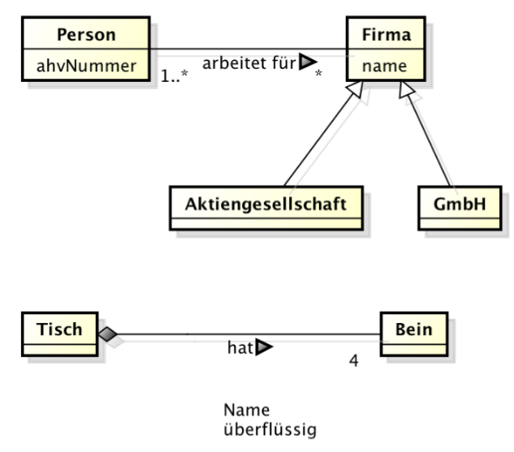

Objektorientierte Domain - Analyse
===================================

Überblick
--------------
Analyse = Abklärung / Konzept ≠ Lösung
*"do the right thing"*

Design = konzeptionelle Lösung, Erfüllt die Anforderungen
 *"do the thing right"*

* Methodische Analyse des Problembereichs
* Blackbox- und Whitebox-Sicht

**Statisches Domain-Modell** (Klassendiagramm)

    * Zerlegung in verständliche Teile: *Konzeptionelle* Klassen
    * Visueller Glossar
    * Basis für OO- und DB-Entwurf

**Dynamisches Domain-Modell** Use Case Szenarien / Interaktionsdiagramm

    * Gegenprobe zwischen UseCases und Domain-Modell

OOA nach Larman
---------------

**Statisches Modell**

    * als Klassendiagramm
    * Klassen mit Attributen *ohne Operationen*
    * Klassendiagramme mit Beziehungen

**Dynamisches Modell**

    * *Blackbox Interaktionsdiagramme* für Systemoperationen
    * Contracts für Systemoperationen
    * Eventuell Zustands- und Aktivitätsdiagramme

(Die *kursiven* Punkte unterscheiden sich von der "klassischen" OOA)

Abgrenzung: Anforderungsanalyse
--------------------------------
* Festlegen der Anforderungen
* Blackbox-Sicht (nicht Wie)
* Auftraggeber zusammen mit Auftragnehmer

Resultat:

    * Vision
    * Use-Cases / User Stories (UC-Diagramm, Textuelle beschreibung)
    * Supplementary Specification
    * Glossary

Domain Modell
-------------

Anforderungen
.............

* Die richtige Form (beschränktes UML Klassendiagramm)
* Nur Elemente, die sinngemäss benutzt werden
* Einen passenden Abstraktionsgrad (gemäss Problem)

Ziel: Verständlich und Ziel!

"Wie ein Witz" - beim ersten Mal verständlich

Checkliste
...........

* Vererbung oder Komposition?
  * 100% Regel - 100% des Parents gilt für Kind
  * Wenn overlapping -> Komposition (Rolle)
  * Zustänmde immer als Komposition
* Gibt es Redundanzen?
* Führt das Löschen gleichartiger Objekte zu Informationsverlust?
* Evtl. Glossar / Begriffserklärung
* Gibt es Attribute, die Konzeptionelle Klassen sei müssten?
  typischerweise, wenn nicht einfacher Text oder Zahl
* Keine Foregin-Keys
* Fragen / Annahmen notiert?
* Verständlich?
* Leserichtung bei Assoziation nötig?
* Multiplizitäten bei Assoziation angegeben?
* m-n Assoziation? (typischerweise falsch)

Als Hilfsmittel mit Sätzen überprüfen:

**Store** *contains* one or more **Register**

.. seealso::

    * Larman, Kapitel 9
    * Larman, Kapitel 31

.. note::

    Klassen können so sortiert werden, dass n über 1 Multiplizitäten
    sind.

    -> Komplexere Objekte oben, einfachere unten

UML-Notation
''''''''''''

Abstrakte Klassen *kursiv*
