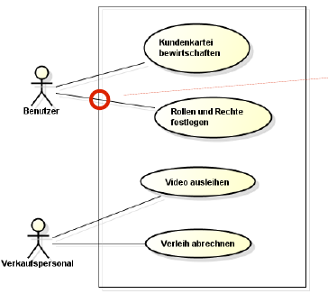

# Software Architektur
In Diagramm sollte nur das rein, wass auch Sinn macht - Typischerweise Interfaces nach oben. Muss **kommunizierbar** sein! (Bsp. nur 4 von 5 Layern, nur 24 von 125 Klassen)

Wenn die Zuständigkeiten gut zugeteilt sind, ist die Kohäsion - wie gewünscht - hoch. Beispiel: "Visuelle Darstellung, (UC) Controllers, Game Logic, Domain Objects, Storage usw."

## Designziele

* **Hohe Kohäsion**: Gute Zusammenarbeit innerhalb der Klasse
* **Tiefe Kopplung**: Minimierte Abhängigkeiten von anderen Klassen
    * Ermöglicht Testing
    * Debugging geht einfacher
    * Austauschbar

Tiefe Kopplung wird erreicht durch

* Abhängigkeiten von oben nach Unten (Asymentrisch)
* Je weiter nach oben, umso Anwendungsspezifisch.
* Je weiter unten, umso eher wird das wiederverwendet.

## Schichten / Layer

Vorteile:

* Schichten austauschbar
* Strukturierung
    * Eingrenzen von Problemen
    * Aufteilen der Arbeit

Sinnvolle Aufteilung in mehrere Schichten anhand von

* Kohäsion: Zusammengehörigkeit
* Zuständigkeit / Arbeitsteilung (Single Responsibility)

Je höher die Schicht, desto eher eignen sich Integration Tests. Je tiefer die Schicht, desto eher eignen sich Micro Tests.

Das Layer Konzept kann auch für besser lesbare UML-Diagramme angewant werden. Beispielsweise Vererbung von oben nach Unten aufzeichen. Auch die Kardinalitäten (n oben, 1 unten) machen so notiert mehr Sinn, denn so Greiffen obere Schichten nur auf Untere zu und nicht umgekehrt.

<figure>
    
    <figcaption>Vererbung sinnvoller Notiert</figcaption>
</figure>

<figure>
    
    <figcaption>Kardinalitäten - Stichwort Primary Key, Foregin Key</figcaption>
</figure>

### 3 Schichten-Modell

* GUI, Presentation, View
* Geschäftslogik, domain layer, problem domain, Model
* Bibliotheken, Services, Libraries

!!! warning

    Die Namen der Schichten sind nicht standardisiert.

## Partitionen
Partitionierung beschreibt die _vertikale_ Unterteilung -  also gleiche Höhe aber möglichst unabhängige Zuständigkeiten.

Layering allein genügt nicht.

* Änderungen können unerwartet weitreichende Folgen haben: verlängerte Entwicklungszeiten.
* Updates der asissifotware
* Fehlersuche schwehr
* ALLEs muss getest werden nach Fehlerbehebung

Beheben von gemeinsamen Funktionen derselben Schicht:

1. Gemeinsamer Code isolieren
2. Gemeinsamer Code extrahieren
3. Code auf tieferen Layer verscheieben
4. (Optional) Weiterleitungen aufrufen um Refactoring zu mimimieren (redirecting stub)

## Regeln für Abhängigkeiten

1. ... von oben auf die nächste darunterliegende Schicht sind immer OK
2. ... nach unten, die eine Schicht überhüpfen sind manchmal auch OK
3. ... innerhalb einer Schicht und Partition sind OK, sollten aber minimiert werden
4. ... in einer Schicht quer zu einer anderen Partition sollten dringend vermieden werden
5. ... NIE von unten nach oben, ausser callbacks (z.B. Observer pattern)

## Layers vs. Tiers

In einem System werden n Schichten üblicherweise auf n-x Tiers abgebildet.

Layer
: "Wie der Code strukturiert ist" hierarchische Abhängigkeiten, klar, wer den Takt angibt  → Horizontal. AUfrufe sind typischerweise **synchron**.

Tiers
: "Wo welcher Teil läuft" i.d.R. gleichberechtigte Partner, kein diktierter Takt → Vertikal. Aufrufe sind immer **asynchron**.

Geteilter Code kann auch auf mehreren Tiers laufen - bsp. Domainmodel.

Selbst Partitionen können teileweise in eigenen Tier ausgelagert werden.

Während Layers mit Klassendiagrammen bzw. Packages dargestellt werden werden Tiers mit Deployment-Diagrammen visualisiert.

## Datenmodell Ordnen

* Übersichtlich
* Schichten absehbar
* Implementierungs-Reihenfolge

## Deployment Diagramme

>Verteilungsdiagramme zeigen, welche Software (Komponenten, Objekte) auf welcher Hardware (Knoten) laufen, d.h. wie diese konfiguriert sind und welche Kommunikationsbeziehungen dort bestehen.
>
><cite>Bernd Oestereich "Analyse und Design mit UML 2.1", Oldenbourg 2006</cite>

Knoten
: Konten sind "Hardware" (meist Virtualisiert) und können etwas ausführen

Assotiationen
: Verbindungen mit ANgaben zum Protokoll und eventuell Multiplizitäten.

Verschiedene Ausführungs-Umgebungen werden in einander geschachtelt. Dabei werden typischerweise Stereotypen wie `<<OS>>`, `<<web server>>`, `<<web browser>>` usw. angegeben.

<figure>
    
    <figcaption>Beispiel eines Deployment Diagramms - Quelle www.uml-diagrams.org</figcaption>
</figure>

Mit Deployment Diagrammen können Unterschiedliche Varianten eines Deployments disskutiert werden. Die Abstraktion ermöglicht auch Performance-Diskussionen, Visualisierungen von möglichen Angriffsvektoren oder komplexe Docker Setups zu verstehen.

Deployment Diagramme können bereits relativ früh gezeichnet werden - inklusive verschiedenen Variationen.

!!! todo

    Screenshots aus Lösung aus Übungen W11 ergänzen

# Sequenzdiagramme

In Sequenzdiagrammen verläuft die Zeitlinie von oben nach unten. Sie dienen der Visualisierung von Abhängigkeiten und wie diese Zusammenspielen. Oft sind Sequenzdiagrammen nahe am Code, was nicht (immer) Sinn macht. Beispielsweise veralten soche Diagramme sehr schnell und bringen Dazu keinen effektiven Mehrwert, da ein Sequenzdiagramm schnell aus einem Codefragment generiert werden kann.

Sequenzdiagramme können auf einer gewissen Abstraktionsebene verwendet werden (Beispiel Facebook-Authentisierung) oder aber um stabile Konzepte/Algorithmen zu visualisieren (Bsp. `java.io`)

Auch für Sequenzdiagramme gil, dass sie kommunizierbar sein müssen (A3-Regel)!

## Syntax-Elemente
3,4
alt(if then else)
ref unterprogramm (wiederverwendbar..)
interfaces, types, threads

## System-Sequenzdiagramm

System-Sequenzdiagramm sind eine Erfindung von Larman. Dabei gibt es genau 2 Akteure: Der Benutzer und ein Blackbox-System.

Mit System-Sequenzdiagramm wird quasi die oberste testbare Schnittstelle dokumentiert.

!!! todo

    Screenshots aus Lösung aus Übungen W11 ergänzen

    Nachlesen in Larman

!!! seealso

    [developerWorks - The sequence diagram](http://www.ibm.com/developerworks/rational/library/3101.html)

## Vom Domainmodell zu Datenmodell

Domainmodell (Was machen wir im Idealfall)
Datenmodell (Was wir machen können - pragmatisch)

Einflussfaktoren

* Art der Applikation: Web/Mobile - online/offline usw.
* Performance (NF)
* Security (NF)
* Erweiterbarkeit (NF)
* Anwendungsschwerpunkt:
* Usability (NF)

Vorsicht: Nicht-Funktionale Anforderungen haben grossen Einfluss
