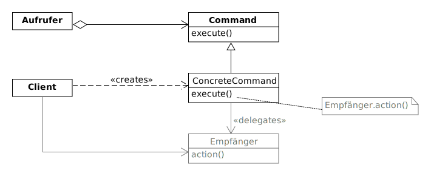
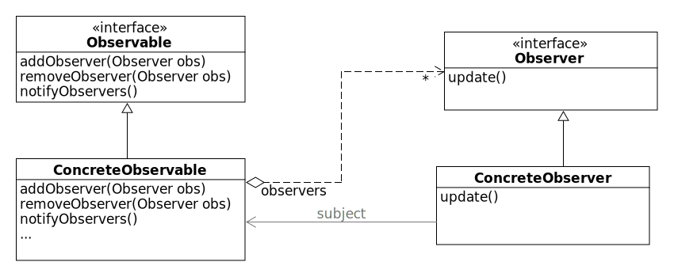
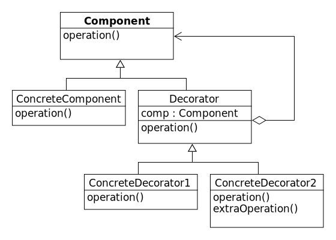
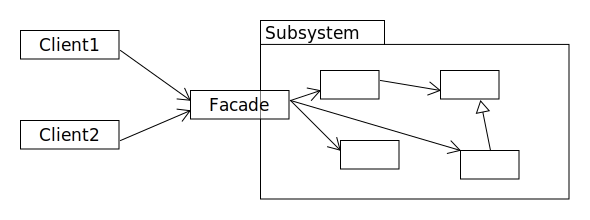
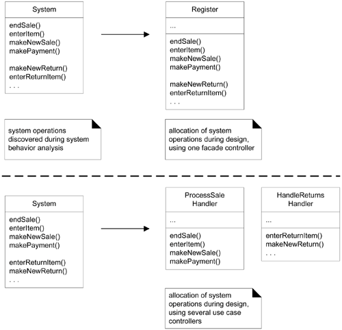

# Design Patterns

Zweck: Kummunikation & Best Practices

## Factory Method


* Schnittstelle zur Erzeugung von Objekten
* Welche konkrete Klasse mit welcher Konfiguration erzeugt bzw. zurückgegeben wird, ist zentral in der Erzeugermethode definiert.
* Konkrete Implementierung noch nicht klar oder variierbar.
* `+` Creator ist austauschbar
* `+` Default implementierung in abstrakten Creator möglich → ConcreteCreator muss nicht zwingend eine eigene Implementation bereitstellen
* `+` Zentrale Konfiguration
* `-` Enge Koplung an Produkte, die hergestellt werden.

Es gibt diverse Varationen, wo bsp. die Basis-Creator-Klasse nicht abstrakt ist oder parameterisierte Factory Methoden.

## Abstract Factory (optional)


* Schnitstelle, um Familien verbundener/abhängiger Objekte zu erstellen
* Konkrete Klassen noch nicht spezifiziert
* `+` Client ist nur an Schnittstellen gebunden
* `+` Factory kann bsp. via Reflection & Konfigurationsdatei erzeugt werden (Plugin-Architektur)
* `+` Ermöglicht / Vereinfacht Testing
* `-` Erweiterbarkeit sehr aufwändig

Variation: Siehe Factory Method.

## Singleton

```java
public final class Singleton {
    private static Singleton theInstance = null;
    private Singleton(){}
    public static Singleton getInstance(){
        if(theInstance == null){
            theInstance = new Singleton();
        }
        return theInstance;
    }
}
```

* Genau eine Instanz
* `+` Einfach anwendbar
* `-` Probleme mit Multithreading.
* `-` Kann Performance Flaschenhals software-testing.
* `-` Kann nur schwer zerstört werden.

## Command



* Kapselung eines Befehls
* Aufruf von Ausführung entkopeln
* Delegation an empfänger Optional - `KonkretesCommand` kann auch selbst ausführen.
* Objekt-Orientiertes "Callback"

* `+` Flexibilität & Wartbarkeit
* `+` undo/redo möglich
* `+` Zeitliche Entkoplung (Queue) möglich

## Composite


* Einheitliche behandlung von Elementen (Tree), so dass keine Unterscheidung nötig ist
* Composite leitet alle "atomaren" Aufrufe (Methoden der Blattknoten) weiter.
* 100% Regel sollte für Komposite Interface beachtet werden
Variation: Komponente kann Abstrakte Klasse oder Interface sein.
* `+` leicht erweiterbar
* `-` Namensfindung schwer (Bsp. File für Dateien und Verzeichnisse)
* Beispiele: Dateisystem, GUI (Swing)


## Strategy


* Kapselt einen Algorithmus in einer Klasse
* Verhalten austauschbar auslagern.
* Abstraktion mit Interfaces/Abstrakter Klasse
* Spezifische Implementation in Subklassen
* `+` Loose Koppelung: Clients nur von Abstraktion abhängig
* `+` Implementationsdetails in abgeleitete Klassen
* `-` Clients müssen unterschiedliche Strategien kennen bzw. auswählen
* Beispiel: Sortierung einer Collection (Bubble Sort, Selection Sort usw.)
* Variation
    * Mehrere Operationen → Policy
    * Interface statt abstrakte Klasse

## State


* Zustandsabhängiges Verhalten
* Analog zu Strategy
* Zustandswechsel tauscht Stateobjekt aus

## Template Method


* Struktur eines Algorithmus in abstrakter Klasse definiert
* Einzelne konkrete Schritte in Unterklasse verlagert (oder überschreiben)
* `+` Inversion of control

## Observer



* Mehrere Objekte (Views) können automatisch auf Zustandsänderungen eines bestimmten Objekts (Data) reagieren
* Observers = "interessierte" Objekte
* `+` egal wie viele Beobachter und egal wann sich diese Registrieren
* `+` Loose kopplung
* `-` Zirkuläre updates möglich

!!! warning

    4 Klassen sind Involviert!

## Adapter


* Passt Schnittstelle einer existierenden Klasse an eine andere (vom Client erwartete) Schnittstelle an
* Adapter "wrappt" & delegiert
* Ermöglicht, dass Klassen zusammenarbeiten, die die ohne nicht dazu in der lage wären
* `+` Entkopelung
* `+` Hohe flexibilitat, da Aufrufe zur Laufzeit austauschbar
* `-` Grosser Aufwand bei grossen Interfaces
* Beispiel: Legacy Komponente in neuem System verwenden

(→ Proxy ist ein Adapter, der caching kann.)

## Decorator Pattern



* Dynamisches Hinzufügen von Funktionallität an Komponente, ohne die Komponente zu verändern
* `+` Komposition statt Vererbung
* `+` Komponenten kennen Dekoriere nicht
* `-` Alle varianten gibt extren viele Klassen
* Beispiel Kaffee
    * Konkrete Komponenten: Espresso, DeCaf und Mocca
    * Decorator: Heisse Milch, Rahm, Eis, Schokolade
* Beispiel: Java I/O (FileInputStream, BufferedStream...)

## Facade



* Vereinfacht den Zugriff auf komplexes Subsystem oder Zusammengehörige Objekte
* Facade kapselt komplexe aufrufe, so dass diese einfach von Clients verwendet werden können.
* Können weitere Aufgaben wie Zugangskontrolle, Transaktionsmanagement usw. übernehmen
* `+` Entkopelt clients von Details des Subsystems
* `+` Gut testbar!
* `+` Implementierung in der Facade und dem Subsystem können leicht geändert werden
* `-` Aufwändig, wenn sich Schnittstellen oft ändern.

## MVC - Model-View-Controller


* Rollenaufteilung, um mehrere Views zu ermöglichen
* Entkopplung der Benutzerschnitstele und der Anwendungsfunktionalität.
* Verschiedene Varianten:
    * Mit Observer: View registriert sich auf das Model und setzt Aktionen auf den Controller ab. Controller aktuallisiert das Model, welches wiederum die View notifiziert. Der Controller kennt die Views nicht.
    * Passive View: View kennt Modell nicht. Der Controller ist exklusiv für UI-Updates zuständig - muss also die View kennen. Geht nur, wenn niemand anders als der Controller (und nur ein User) die Daten ändern kann.

## Null Object


* "Nichts"-Tun, anstelle von `null`, um bsp. Exceptions zu vermeiden oder die Lesbarkeit zu vereinfachen
* `+` Weniger null-checks erhöhen die Lesbarkeit
* `-` Nachträgliches Einfügen in ein System ist aufwändig


## Use Case/Session/Application Controller



* Erstes Objekt, welches nach dem UI-Layer Systemoperationen empfängt und koordiniert.
* Controller auf Applikations, Session oder Use-Case-Ebene (`*Handler`, `*Coordinator`, `*Session`).
* Nur für Delegation zuständig
* "kind of facade into the domain layer from the UI Layer"
