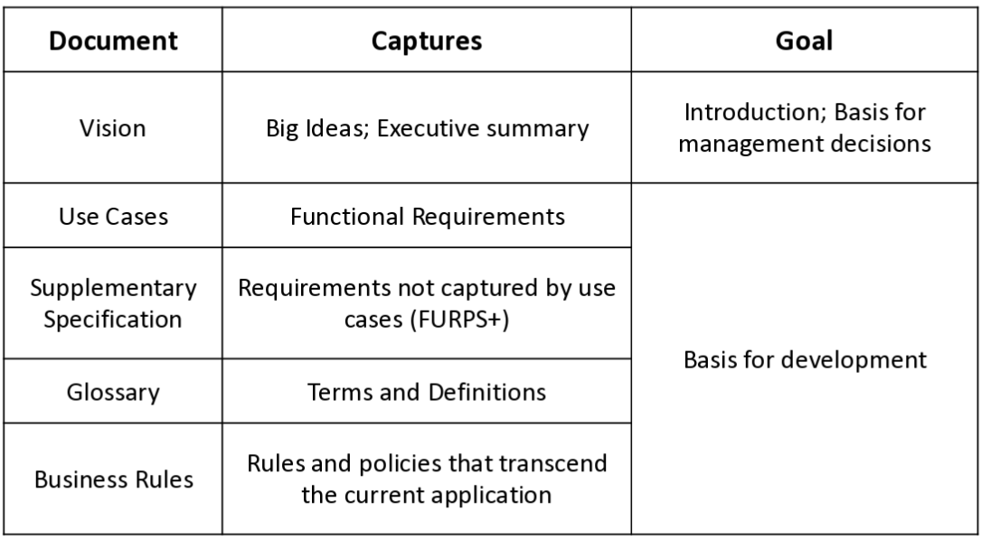
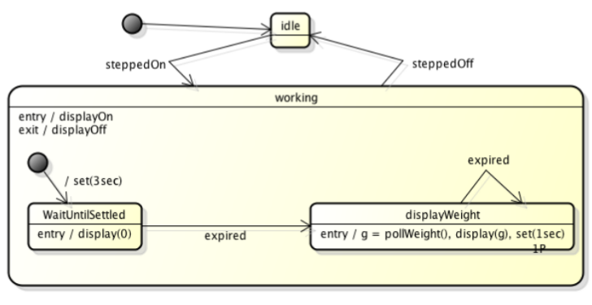
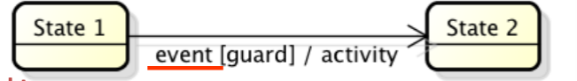
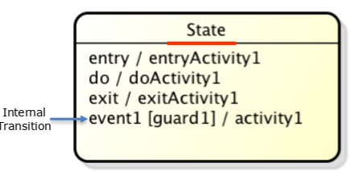
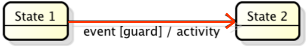
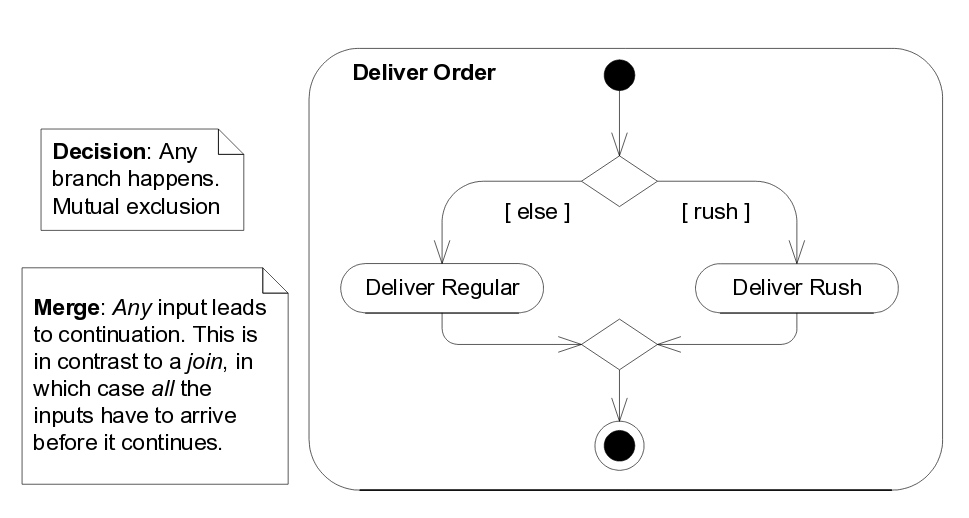
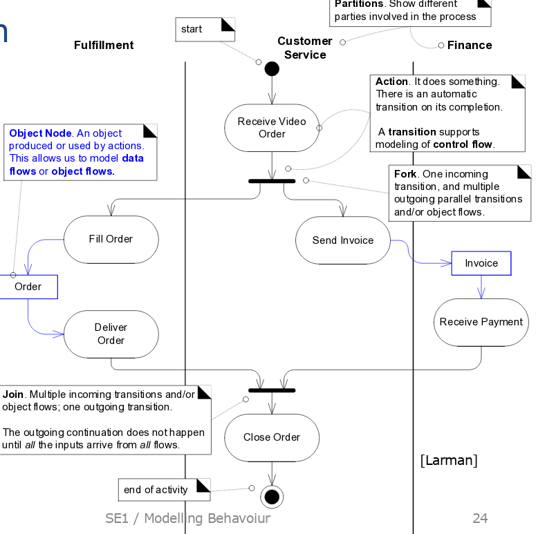

# Einführung in Requirements Engineering

Funktional
: "**WAS** soll das System machen" → Use Cases

Nicht-Funktional
: "**WIE gut**  soll das System etwas machen"

Unterscheidung der Anforderungen an das **Projekt**  (Project Management) und an das **Produkt** (Requirements).

Requirements Working Product: Software Requirements Specification (SRS)

Problem: Anforderungen ändern sich! Die Anforderungen können nicht am Anfang im Detail erfasst werden → Iteratives vorgehen. Vorsicht: Systematische Erfassung und Verwaltung wichtig → Requirements Management

## Use Cases

Use Cases ist eine Ablaufbeschreibung mit **Ziel** und **Zweck**. Geschrieben aus Benutzersicht ("Actor tut das, dann macht das System das...")

Es gibt verschiedene Detailstufen: "brief" (Idee), "casual" (Was gehört dazu), "fully dressed" (alles)

Vorteile:

* Überblick
* Prüfen auf Vollständigkeit
* Grundlage für Tests ("Use Cases are Test Cases")

**Actor** Person oder System, *ausserhalb* des zu entwickelnden
Systems

**Primary Actor** Löst ein Use-Case aus

**Supporting Actors** Stellen einen Service für das System zur Verfügung
**Offstage Actors** Haben Interesse an Use Case, aber nicht direkt involviert

**Use Case Instanz / Szenario** Eine geschlossene Sequenz/Pfad durch die Geschichte: Main Success Scenario und Alternative Scenarios.

**System** Das zu entwickelnde System

**Umsystem** Ist vorgegeben

Use Casses sollen auf der ebene von **Elementary Business Process (EBP)** sein. Ein EBP ist eine Aufgabe, die durch eine Person an einem Ort zu einem Zeitpunkt durchgeführt wird, bsp. "Bestellung aufgeben", "Rechnung bezahlen"

!!! seealso

    Beispiel "Casual Style" Folie #4
    Beispiel "fully dressed" Larman S. 68 - 72

### Aufbau

!!! seealso

    Vorlage `UseCaseTemplate.odt`

### Vorgehen

Grad der Ausarbeitung: #31t

1. Systemgrenzen festlegen
2. Primäre Aktoren identifizieren und Ziele jedes Aktoren identifizieren

    | Actor | Goal |
    |---------|--------------------------------------------------------------|
    | Cashier | process sales    process rentals     handle returns     cash in     ... |
    | Manager | start up     shut down     ... |

3. Use Cases schreiben
    * Müssen *elementare Aktionen* sein, als nicht zu spezifisch!
    * zuerst im "brief"-Format
    * Ein UC pro Benutzerziel - muss Benutzerziel erfüllen
    * Gute Namensgebung, meist "objekt verb" (Velo zurückgeben, process sale)
4. "Versteckte" Aktoren suchen
    * wer macht Security oder Benutzerverwaltung?
    * Systemüberwachung?
    * Cronjobs?
    * ...

### Stil

* Auf Ziel ausgerichtet
* Losgelöst von Realisierung
    * ohne GUI
    * WAS nicht WIE!

### Diagramme

``<<include>>`` "Sub function" (authentifiziere Benutzer)

``<<extend>>``: "Erweiterung" - extension points müssen definiert werden (vermeinden wenn möglich!). Dann Sinnvoll, wenn Basis Case später nicht verändert werden darf
    → Muss de-fakto nie verwendet werden..

## Nichfunktionale Anforderungen

Nichtfunktionale Anforderungen gehen oft vergessen?

* Informatiker denken in erster Linie an Implementation - nicht an Qualität
* Betrachtung aus kundensicht um NFA überhaupt zu shene...

Softwarequalität
: Unter Softwarequalität versteht man die Gesamtheit der Merkmale und  Merkmalswerte eines Softwareprodukts, die sich auf dessen Eignung  beziehen, festgelegte oder vorausgesetzte Erfordernisse zu erfüllen
: [ISO9126d]

Warum sind nichtfunktionale wichtig?

* Hat hoher Einfluss auf Architektur und Benutzerzufriedenheit
    * Bsp. Sicherheit, Performance

NFA sind typischerwiese..

* Leistungsanforderungen wie Antwortzeiten, Durchsatzraten usw.
* Mengenanforderungen wie Anzahl Kundendatensätze, Anzahl gleichzeitige Benutzer
* Randbedingungen wie bsp. vorgeschriebene Programmiersprache, Versionen, DBs uws.

Nach Larman: **FURPS+** (Other Requirements in Use Cases)

* **F** unctinality
* **U** sability
* **R** eliability
* **P** erformance
* **S** upportability
* **+** Others: Hardware & Software Constraints, Packaging, Licencing, Development Process

Alle Anforderungen sollen so formuliert werden, dass *messbare Checkliste*
Bsp: *Text visible from 1m, Colors used with symbols* oder *Authorization takes < 500ms*

## Anforderungsspezifikation

## Zustandsdiagramme

<figure>
    
    <figcaption>SE1: Testat 2 Musterlösung</figcaption>
</figure>

UC-Zustandsdiagramm
: Systemereignisse, Zustände und Übergänge für UCs.

System-Zustandsdiagramm
: Alle Systemereignisse, Zustände und Übergänge des Systems. Enthält alle UC-Zustandsdiagramme

Ereignis
Event
: passiert zu einem Zeitpunkt - typischerweise von Aussen. Das System wird darüber benachrichtigt und reagiert darauf.

Zustand
State
: Zustand eines Objektes, wobei nur Zustände unterschieden werden sollten, die unterschiedliches Verhalten aufweisen (100FR oder 20000FR auf Sparkonto sind kein unterschied - 100Fr und -1'000 FR dagegen schon!)

Zustandübergang
Transition
: Übergang von einem Zustand in einen andere, ausgelöst durch Ereignisse. Zustandsübergänge erfolgen augenblicklich - wobei beim Übergang Aktivitäten ausgeführt werden können.

Guard
: Vorbedingung für Transition - muss eine boolesche Bedinnung sien.

!!! warning

    * Anfangszustand muss vorhanden sein
    * Alle Zustände müssen erreichbar sein
    * Endzustand kann u.U weggelassen werden

## Aktivitätsdiagramme
Aktivitätsdiagramme zeigen sequentielle und parallele Aktivitäten (Flussdiagramme). Anwendung in Analyse und Design für Modellierung von Geschäftsprozessen und Use Cases.

<figure>
    
    <figcaption>Zusätzliche Notation für Aktivitätsdiagramme</figcaption>
</figure>

<figure>
    
    <figcaption>Basisnotation für Aktivitätsdiagramme</figcaption>
</figure>
